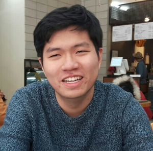

I am a **Software Engineer** at Nexon Korea, to be more specific, a gameplay and engine programmer for MapleStory. Before joining Nexon Korea, I worked as an intern at NCSoft in the Vision AI Lab. My major disciplines are video game development and computer graphics. I got my bachelor's degree at Seoul National University, where I double-majored in geography and computer science. 

## Career

