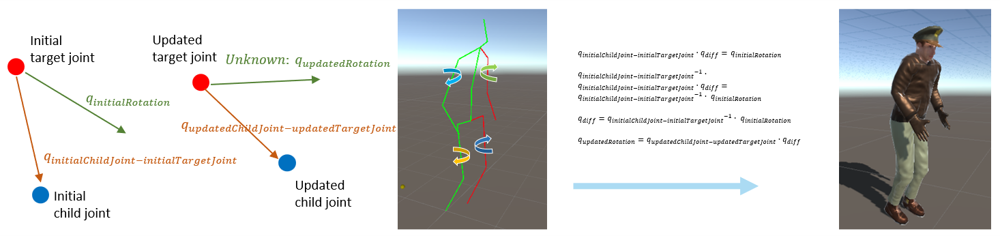

For two months, from July to August 2021, I worked at the human pose estimation team, vision AI lab, [NCSoft](https://kr.ncsoft.com/kr/index.do), as an Intern AI Engineer. I would like to introduce the internship project and the lessons I learned from there in this article.

*Note: The company approved bringing out materials in this article.*

# **Introduction**

The project was titled 'Developing a Virtual Streamer Platform With AR Features'. The objective was a desktop application that runs on a CPU with over ten frames per second, unlike the preexisting ones that execute mainly relying on the GPU. The development tools were Unity and C#, along with ONNX and Barracuda for AI components. 

# **Human Pose Estimation**

**Human Pose Estimation** is a computer vision technique that involves identifying and locating key points on the human body, such as joints and limbs, from images or videos. The human pose estimation module in the project consists of two steps: [OpenPose](https://github.com/CMU-Perceptual-Computing-Lab/openpose) [1] for extracting 2D keypoints and VideoPose3D [2] for lifting keypoints into 3D ones. The ONNX file needed for deep-learning inference was prepared by the team in advance. Before I started implementation, I spent time reading related papers and discussing with my mentor for a while.

## General Flow

The flow in the Unity application first begins by accepting input from a webcam in a texture format. The texture is fed to the OpenPose powered by an ONNX network on [Barracuda](https://docs.unity3d.com/Packages/com.unity.barracuda@1.0/manual/index.html). The inference, as previously stated, ran on the CPU. The 2D network eventually yields a set of keypoints belonging to a human body structure (COCO).

We are not done with the 2D keypoints. Since the target avatar resides in the three-dimensional space, keypoints must be placed in the 3D space as well. For this purpose, we input the OpenPose outputs to the VideoPose3D network. The pass reconstructs a set of 3D joint positions (Human 3.6M) after scanning consecutive frames with 2D pose estimation results.

Finally, we adjust the avatar bones to the 3D joint positions. The method is quite simple: rotate each joint, aligning all the avatar joints with the results from the VideoPose3D pass. Unity provides a handy `Quaternion.LookRotation` method for this purpose. Given two points, we can align the bones to connect them. This process consists of a few quaternion equations.

{: width="1000"}{: .align-center} 

Are we done...? Not really. Check out the picture below.

{: width="500"}{: .align-center}

## Deciding *Up* of Bones 

The problem is that there is one degree of freedom (DOF) left: the rotation along the bone. Some bones are arbitrarily rotated along the z-axis, resulting in twisted looks. To resolve this, the rotation along the z-axis must be chosen manually out of many possibilities. From now on, our primary mission turns into deciding the upwards for each bone. We need to configure the bones' upward direction so that the avatar's posture looks natural.

Unity provides an `upwards` parameter for `Quaternion.LookRotation` to let users specify the upper direction when rotating. Since the y-axis is considered *up* in Unity, this is tantamount to setting the local y-axis of each bone.

{: width="500"}{: .align-center} `joint.rotation = Quaternion.LookRotation(greenBox.position - joint.position);`
{: .text-center}

{: width="500"}{: .align-center} `joint.rotation = Quaternion.LookRotation(greenBox.position - joint.position, redBox.position - joint.position);`
{: .text-center}

The `upward` direction differs from joint to joint. Two examples that best demonstrate this difference are the elbow and the knee. An elbow bends *inward*. Hence, the local y-axis of the lower arm should be directed toward the elbow. On the other hand, a knee bends *outward*. Therefore, the local y-axis of the shin should point away from the hip.

{: width="500"}{: .align-center} `elbow.rotation = Quaternion.LookRotation(wrist.position - elbow.position, shoulder.position - elbow.position);`
{: .text-center}

{: width="500"}{: .align-center} `knee.rotation = Quaternion.LookRotation(ankle.position - knee.position, knee.position - hip.position);`
{: .text-center}

There is discord between bone structures (Human 3.6M and Unity avatar) when translating the VideoPose3D result into the Unity avatar. One issue arises when deciding the rotation of the head; the 'Nose' joint in Human 3.6M dataset is absent in the Unity humanoid rig. As an alternative, we find the rotation of the Unity 'head' rig using the relationships between Human3.6M 'Head', 'Nose', and 'Neck'.

```
Vector3 neckToNose = nose.position - neck.position;
Vector3 noseToHead = head.position - nose.position;
Vector3 headLeft = Vector3.Cross(neckToNose, noseToHead);
Vector3 headForward = Vector3.Cross(noseToHead, headLeft);
head.rotation = Quaternion.LookRotation(headForward);
```

{: width="500"}{: .align-center}

Another issue occurs on the spine. In a Human 3.6M humanoid structure, there is no guarantee that the center hip is located higher than the two hips on the side. When calculating the hip rotation, we should rely on the spine's position rather than the center hip's.

{: width="600"}{: .align-center}

# Augmented Reality

## Constraints Posed by Webcams

Aside from the human pose estimation component, I also developed the AR components. For the avatar to harmonize with an AR scene, we have to establish the plane on which the avatar will be placed. I encountered hardships related to the webcam as an input device no sooner than I began to develop the augmented reality part.

Webcams have several demerits as input to an augmented reality compared to smart devices. Smartphone applications with AR depend mostly on gravity sensors embedded inside for plane detection. However, as a gravity sensor is not available on webcams, estimating a webcam's pose is a challenge as we have to rely solely on visual clues. Moreover, webcams generally have a narrow field of view, so even the visual clues are insufficient.

## Homography Solution

There are no other ways than to present a straightforward UI to overcome the limitations of webcams. The first idea I came up with was to let users determine their AR planes as follows.

1. A user selects four points that determine a plane, one by one, in clockwise order.
2. Calculate a homography between a square's four points and vertices using RANdom SAmple Consensus (RANSAC).
3. According to the homography matrix, place a plane in the Unity scene.

Initially, this appeared to be an effective way to decide an AR ground despite being facilitated by a relatively simple implementation with OpenCV. However, RANSAC failed to infer the homography matrix as the camera angle to the plane became steeper. This was a critical flaw, because in general, the plane is likely to be flat when viewed from the camera, in which case this method performs poorly.

{: width="600"}{: .align-center} Homography inference failure. As the angle becomes steeper, the plane marked with an arrow starts to deviate from the blue plane.
{: .text-center}

## Vanishing Point Solution

An alternative option is having users adjust a **Vanishing Point** to the scene, from which the application reasons the camera pose (pan, tilt). I assumed that the roll was zero for ease of calculation.

{: width="600"}{: .align-center}

{: width="600"}{: .align-center}

**Automatic Vanishing Point Detection** assists the aforementioned `vanishing point tactic.' It automatically detects where the vanishing point is by analyzing scenes with OpenCV functions.

{: width="500"}{: .align-center} 1. Detect edges using Canny edge detection and Hough line transform.
{: .text-center}

{: width="500"}{: .align-center} Find intersection points of the edges.
{: .text-center}

{: width="500"}{: .align-center} The grid where the most intersection points emerge becomes the vanishing point.
{: .text-center}

# Result

# Quantitative Evaluation

{: width="600"}{: .align-center}

As to the human pose estimation process, robustness to occlusions during pose estimation enhances reliability, demonstrating resilience in scenarios where the motion of a human body may be partially or fully obscured. The integration of a Kalman filter and a low-pass filter effectively filters out noisy movements, allowing only dominant movements to be reflected. This filtering process results in a smoother and more controlled user experience.

Accurate AR ground detection has been a significant feature, exhibiting precision in seamlessly integrating virtual elements with real-world ground. This enhancement significantly contributes to the overall user experience, ensuring a more cohesive and immersive interaction with the augmented environment. Virtual shadow powered by a custom shader and precise camera calibration present users with more immersion in the AR.

# Qualitative Evaluation

{: width="500"}{: .align-center} Performance comparison on different environments
{: .text-center}

Our GPU version slightly lagged behind its Python counterpart in performance. However, the difference is negligible with all the additional components, including augmented reality. It also exhibits a decent framerate on a CPU setup, operating normally despite falling short of the specified CPU performance goal.

# Conclusion

The internship project was a series of difficulties and subsequent strives to resolve them. There were a few abandoned trials, like the homography solution, with which I spent much time studying and elaborating—the hasty reflection on avatars led to tricky issues like twisted bones that were extremely hard to debug. Eventually, I learned that the development process would have been more efficient if there had been a well-established specification from the beginning.

Nonetheless, the internship period proved to be technically productive, providing exposure to advanced AI technologies. Beyond technical skills, the experience enhanced my communication and presentation abilities through seminars. I also learned to decipher and discuss research papers, engaging in valuable conversations with the team. This internship significantly impacted my understanding of AI, equipping me with essential skills for future endeavors in the game industry.

# References

- [1] Cao, Z., Hidalgo, G., Simon, T., Wei, S.-E., and Sheikh, Y. (2021). "OpenPose: Real-time Multi-Person 2D Pose Estimation Using Part Affinity Fields." IEEE Transactions on Pattern Analysis and Machine Intelligence, 43(1), 172-186.

- [2] Osokin, D. (2018). "Real-time 2D Multi-Person Pose Estimation on CPU: Lightweight OpenPose." arXiv:1811.12004.

- [3] Pavllo, D., Feichtenhofer, C., Grangier, D., & Auli, M. (2019). "3D Human Pose Estimation in Video With Temporal Convolutions and Semi-Supervised Training." In Proceedings of the IEEE Conference on Computer Vision and Pattern Recognition (CVPR), pp. 7745-7754.

- [4] https://github.com/CMU-Perceptual-Computing-Lab/openpose


