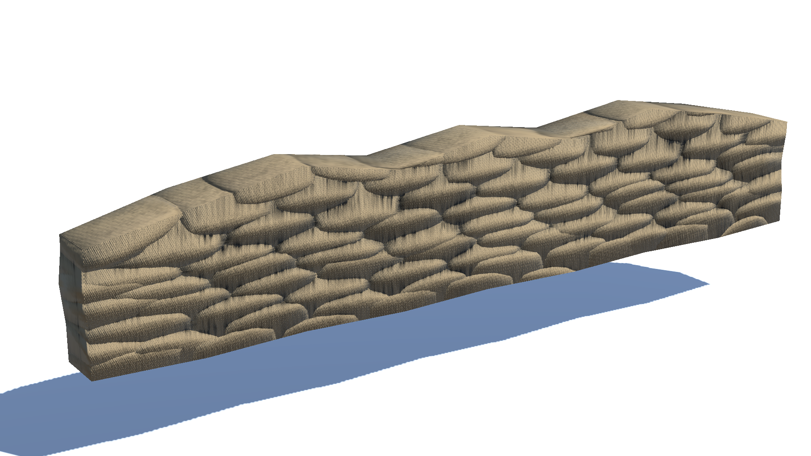
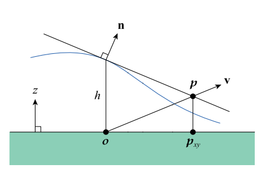
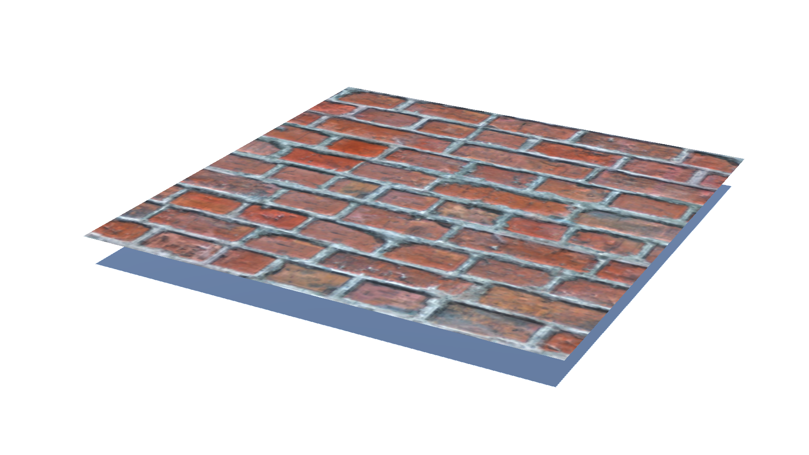
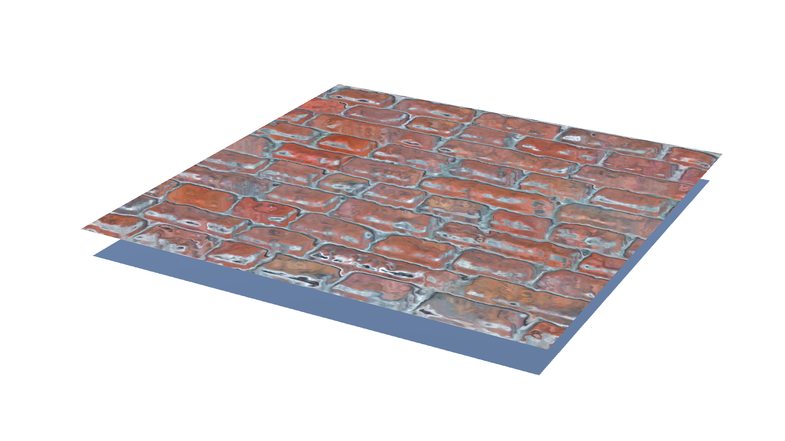
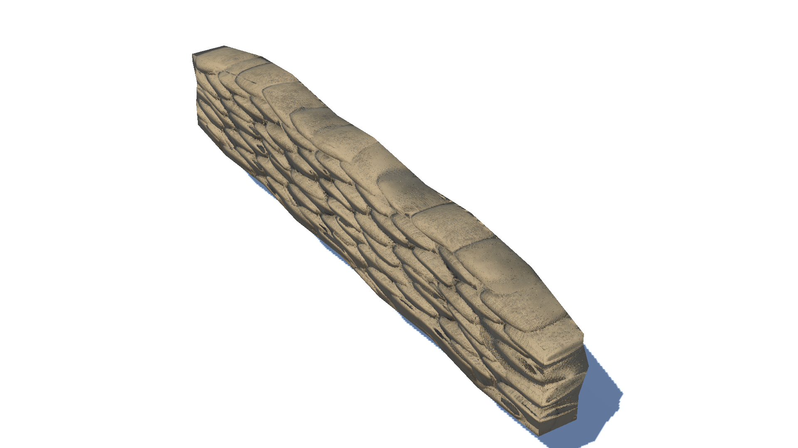
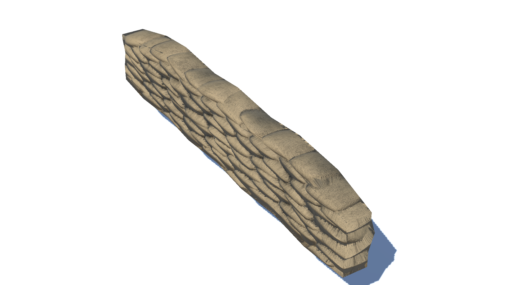

# Introduction

Had it not been for normal mapping, game developers would have been forced to choose between two unsatisfactory options; to subdivide to add 'real' details and get millions of billions of vertex count, or to just give up any details, leaving only tedious low-poly surfaces. Thanks to bumpiness simulated by normal mapping, we can keep details without pressing the 'subdivision' button three or more times.

{: width="500"}{: .align-center} Sandbags fortification with a normal map applied.
{: .text-center}

{: width="500"}{: .align-center} Same sandbags viewed from the side.
{: .text-center}

Normal mapping does yield outstanding results. However as you might have expected, normal mapping is not perfect either. If it were, why would high-poly models be so popular in AAA games? A problematic situation for a plane with a normal map applied happens when you view the plane from a steep angle(that is, the normal vector ***n*** and the view vector ***v*** are diverged by a large amount) as in [Fig. 2]. As the angle between ***n*** and ***v*** gets larger, the normal map rapidly loses its 'bump power' and starts to look planar.

I found this trouble in my sandbags fortification model. Look at the flat surface of the stacked sandbags when viewed from the side! I couldn't stand the poor quality of bumps and began to find out if there were any ways to mitigate the artifacts.

# Parallax Mapping

## What is **Parallax Mapping**?

**Parallax mapping** is a mapping technique to create the illusion of depth on a flat surface introduced by [1]. It is a form of displacement mapping that simulates the effect of parallax, which is an apparent shift in the position of an object when viewed from different angles. In parallax mapping, a texture applied to a surface is displaced in a way that simulates bumps of the surface.

## How Does it Work? 

Parallax mapping shifts the texture coordinate to approximate 'the real height' as below. For simplicity, let's assume that $o$ is located at the origin.

{: width="400"}{: .align-center} Calculating a parallax offset cited from [2].
{: .text-center}

1. We are given;
    * $o = (0, 0, 0)$ : Texture coordinate that would be sampled if we didn't use parallax mapping
    * $h$: Height found by sampling the height map at $o$
    * $v$: View vector
2. Get the plane $f$ with the normal vector $n$ that is tangent to the surface of the height map.
3. The point $p$ where $v$ and $f$ intersects is  approximation of the real intersecting point of $v$ and the height map surface.
4. Sample the texture at $p_{xy}$.

Then, how can we get the point $p$, assuming we know plane equations?

1. We can easily figure out the plane equation $f = n_xx + n_yy + n_zz + d$.

2. Since $o + (0, 0, h)$ is on $f$, we can figure out $d = -n_zh$

3. Let $p = o + tv$. Now we have to figure out what the value of $t$ is.

4. Beware that  $p = o + tv$ is also a point on $f$. Therefore the following mathematical expressions hold.
   $$
   tn_xv_x + tn_yv_y + tn_zv_z - n_zh = 0 \\
   t(n_xv_x + n_yv_y + n_zv_z) = n_zh \\
   t = \frac{n_zh}{n_xv_x + n_yv_y + n_zv_z} = \frac{n_zh}{n \cdot v}
   $$

5. We now have $p = o + tv = o + \frac{n_zh}{n \cdot v}v$

Here is the conclusion! We just offset the initial coordinate by $\frac{n_zh}{n \cdot v}$ along $v$ to get the point over the adjusted sampling coordinate that we intended before.

# Adjustments

## Removing the Denominator

When $n$ and $v$ are almost perpendicular, $n \cdot v$ gets very close to zero, in which case the offset $t$ can grow arbitrarily large. [2] multiplies $t$ by $n \cdot v$ to remove the denominator in order to avoid artifacts.

## Storing $n_zh$ in a Separate Texture

For each pair of a height map and a normal map, we can create a new texture and store the $n_zh$ values. Doing this can save a single multiplication during the shader pass. However, at this moment, there is no sufficient reason to bother to write another script for a texture setup interface to save a single multiplication. So let's hold off setting up another texture to store precalculated information for mapping until the [horizon mapping](../HorizonMapping).

## Scale Factor

[2] also suggests a scale value $u = (\frac{s}{2kr_x}, \frac{s}{2kr_y})$, in which $s$ is the height scale, the value 2 in the denominator is the compensation for the heightmap remapping, $k$ is the number of the iteration steps, $r_x$ and $r_y$ are for normalizing the offset value to the actual dimensions of the heightmap. Nontheless, I only left $s$ and $k$ in the shader since there is no heightmap adjustment in our scenario and the texture coordinate has already been normalized. Personally, I found these adjusting factors to be trivial as I will add a slider that controls the scale factor and it will account for fine-tuning the 'real' appearances.

## Iteration

When bumps get too steep, offsets from parallax mapping often become too far from the actual sampling point. To mitigate this, the sampling point is chosen after multiple iteration steps.

1. Define the iteration count $k$. We divide the scale factor by $k$. 
2. Calculate a sampling point $p = o + tv$.
3. Now $p$ becomes the new origin. Calculate another sampling point, not from $o$ this time, but from $p$. 
4. Repeat 2 and 3 $k$ times.

We can reduce artifacts by repeating these steps multiple times. The higher the iteration count, the better the result, but the higher the calculation cost.

# Unity Shader

## Surface Shader

Unity provides a simple and convenient way called a 'surface shader' to implement shading effects. Although it has some limitations, the surface shader makes it handy to write simple shaders in Unity. It provides several useful hands-on values including tangent-space view direction, normal, and texture coordinate in an input structure, which are necessary for the parallax shader. Below is the parallax mapping shader written under the Unity surface shader grammar.

## Code

```c++
Shader "Custom/DiffuseNormalParallax" 
{
	Properties 
	{
		_Color ("Color", Color) = (1,1,1,1)
		_MainTex ("Albedo (RGB)", 2D) = "white" {}
		_BumpMap("Normal Map", 2D) = "bump" {}
		_HeightMap ("Height Map", 2D) = "bump" {}
		_BumpPower ("Normal Power", Range(0, 20)) = 1
		_ExtrudePower ("Extrude Power", Range(0, 1.0)) = 0.2
		_Glossiness ("Smoothness", Range(0,1)) = 0.5
		_Metallic ("Metallic", Range(0,1)) = 0.0
	}

	SubShader 
	{
		Tags { "RenderType"="Opaque" }
		LOD 200
		
		CGPROGRAM

		#pragma surface surf Standard fullforwardshadows
		#pragma target 3.0

		fixed4 _Color;
		sampler2D _MainTex;
		sampler2D _BumpMap;
		sampler2D _HeightMap;
		fixed _BumpPower;
		fixed _ExtrudePower;
		half _Glossiness;
		half _Metallic;

		static const int NUM_STEPS = 10;

		struct Input 
		{
			float2 uv_MainTex;
			float2 uv_BumpMap;

			float3 viewDir;
		};

		UNITY_INSTANCING_BUFFER_START(Props)
		UNITY_INSTANCING_BUFFER_END(Props)

		// Apply parallax offset to a texture coordinate and return
		float2 GetParallaxCoord(float2 texCoord, float3 vDir, float2 scale)
		{
			float2 pDir = vDir.xy * scale;

			for (int i = 0; i < NUM_STEPS; ++i) // Iteration for a better approximation
			{
				float nz = UnpackNormal(tex2D(_BumpMap, texCoord)).z;
				float h = tex2D(_HeightMap, texCoord).g * 2.0 - 1.0; // Scale to [-1, 1]
				float nzh = nz * h;

				texCoord += pDir * nzh;
			}

			return texCoord;
		}

		void surf(Input IN, inout SurfaceOutputStandard o) 
		{
			// Sample values from the properties
			o.Metallic = _Metallic;
			o.Smoothness = _Glossiness;

			// Get a texture coordinate with a parallax offset applied
			float2 u = _ExtrudePower / NUM_STEPS;
			float2 parallaxCoord = GetParallaxCoord(IN.uv_MainTex, IN.viewDir, u);

			// Sample and apply the main texture
			fixed4 c = tex2D(_MainTex, parallaxCoord) * _Color;
			o.Albedo = c.rgb;
			o.Alpha = c.a;

			// Sample and apply the normal map
			fixed3 normal = UnpackNormal(tex2D(_BumpMap, parallaxCoord));
			normal.z = normal.z / _BumpPower;
			o.Normal = normalize(normal);
		}

		ENDCG
	}
	FallBack "Diffuse"
}
```

# Results


|           |                            Bricks                            |                           Sandbags                           |
| :-------: | :----------------------------------------------------------: | :----------------------------------------------------------: |
|  $k = 0$  |  |  |
|  $k = 1$  |  |  |
| $k = 10$  |  |  |
| $k = 100$ |  |  |

Let's test the parallax mapping shader for the two models. One is a simple plane with a bricks texture on it, and the other one is the sandbags texture that motivated me to dig into this subject. Both models look flat when parallax mapping was not applied. Sandbags below are not occluded by sandbags above, so the flank looks like a patterned wall rather than stacked sandbags.

Once parallax mapping is applied, each bump looks 'extruded' even though no actual vertices were added. Where $k$ is only one, meaning that we are selecting the initial offset without iteration in the shader, we can observe some artifacts, especially  in the case of the bricks. These artifacts dramatically diminish as we use more iteration count($k = 10$). Nonetheless, differences can hardly be seen between $k=10$ and $k=100$. Therefore, I chose $k = 10$ for iteration count as more iteration count would only harm performance.

 

# References

* [1] Kaneko, Tomomichi & Takahei, Toshiyuki & Inami, Masahiko & Kawakami, Naoki & Yanagida, Yasuyuki & Maeda, Taro & Tachi, Susumu. (2001). Detailed shape representation with parallax mapping. In Proceedings of the ICAT. 2001. 
* [2] Lengyel, E. (2019). Foundations of game engine development (2nd ed.). Terathon Press.
