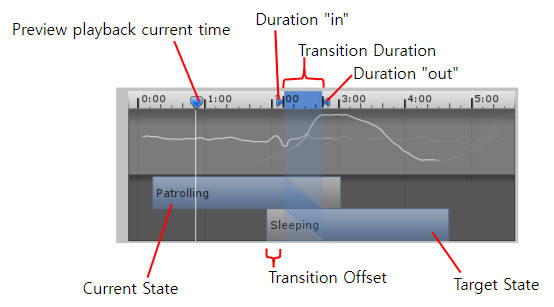

Although an avid game player, I hardly ever paid attention to human-like humanoid animations featured by prominent AAA game studios in recent games. When I started to develop my own game, it took little time to realize that imitating human motions in a game is extremely difficult. I noticed that the realistic animations are not given for free, but are fruits achieved by investing time and money. 

One of the hardship for implementing realistic humanoid animations was to make a humanoid model interact with objects; picking, grabbing, and releasing things with hands. The interactions are not done as simply as in reality. The most problematic situation in my game project emerged when I was trying to implement a reloading motion of a rifle. The reloading procedure looked much more complicated than I initially expected.

1. Split the entire reloading motion into three separate clips; grabbing the magazine, changing the magazine, and pulling the bolt.
2. Normally, the rifle is a child of the right hand and the magazine is a child of the rifle. 
3. Once a soldier grabs the magazine, the magazine moves to his grip. That is, the magazine that was previously a child of the rifle has now become a child of the left hand.
4. Play the magazine switching motion. Once the clip finishes, put the magazine back in its original position. The magazine now has become a child of the rifle once again.
5. Now, grab the rifle with the left hand and pull the bolt with the right hand.
6. Finally, grab the rifle with the right hand and the initial state has been restored.

The point here is that transfers of the magazine and the rifle take place at the start or at the end of each clip. How can we move the magazine on time?

# Alternatives
## 'yield return' Method

One immediate idea is to write a code like this.

```c#
animator = GetComponent<Animator>();
AnimatorStateInfo stateInfo = animator.GetCurrentAnimatorStateInfo(0);
...
// (1) Play the grabbing motion
yield return new WaitUntil(() => !stateInfo.IsName("Grabbing magazine")); // (2) Wait until the grabbing clip ends
// (3) Transfer the magazine here
```

 This `yield return` method works for this purpose in a coroutine block. However, the control flow can pass by the yield statement whenever the animator is not in the "Grabbing magazine" state. There is no guarantee that the grabbing motion has been played even though the control has already arrived at (3). So one more yield statement should take place to prevent this kind of trespassing.

```c#
animator = GetComponent<Animator>();
AnimatorStateInfo stateInfo = animator.GetCurrentAnimatorStateInfo(0);
...
// (1) Play the grabbing motion
yield return new WaitUntil(() => stateInfo.IsName("Grabbing magazine")); // (2) Wait until the grabbing clip starts
yield return new WaitUntil(() => !stateInfo.IsName("Grabbing magazine")); // (3) Wait until the grabbing clip ends
// (4) Transfer the magazine here
```

Now the grabbing motion is guaranteed to play and the migration of the magazine happens at the moment the clip ends. But doing this for all the complicated states that a human can perform 'yields' a bunch of mistakes. The 'yield return' is often unblocked inadvertently and following lines are shot at unwanted timing.

## StateMachineBehaviour

`StateMachineBehaviour` is a Unity script that can be attached to a state in an animator controller to define custom behaviors that are executed when a transition happens between states. When attached to a state in a state machine, a `StateMachineBehaviour` script provides a set of methods that are called at specific points in the state machine's lifecycle; `OnStateEnter`, `OnStateUpdate`, `OnStateExit`, `OnStateMove`, and `OnStateIK`. The [Unity manual](https://docs.unity3d.com/ScriptReference/StateMachineBehaviour.html) contains a perfect description of when they are called. One example of using `StateMachineBehaviour` from that reference looks like this.

```c#
using UnityEngine;

public class AttackBehaviour : StateMachineBehaviour
{
    public GameObject particle;
    public float radius;
    public float power;

    protected GameObject clone;

    override public void OnStateEnter(Animator animator, AnimatorStateInfo stateInfo, int layerIndex)
    {
    }

    override public void OnStateExit(Animator animator, AnimatorStateInfo stateInfo, int layerIndex)
    {
        Destroy(clone);
    }

    override public void OnStateUpdate(Animator animator, AnimatorStateInfo stateInfo, int layerIndex)
    {
        Debug.Log("On Attack Update ");
    }

    override public void OnStateMove(Animator animator, AnimatorStateInfo stateInfo, int layerIndex)
    {
        Debug.Log("On Attack Move ");
    }

    override public void OnStateIK(Animator animator, AnimatorStateInfo stateInfo, int layerIndex)
    {
        Debug.Log("On Attack IK ");
    }
}
```

We could write some codes inside those function bodies, and certainly, they will be executed on time. This time, we can be certain that each callback will be executed at the beginning or end of each state.

However, I decided not to make do something directly in these callbacks for the following reason; stateInfo only includes the hash of the target state, not its name. It is not possible to retrieve a state name directly from its stateInfo. If we want to track the name of the state this animator controller is on, a series of if-statements are required like below.

```c#
override public void OnStateEnter(Animator animator, AnimatorStateInfo stateInfo, int layerIndex)
{
    // Track which state we are entering
    if (stateInfo.IsName("Grabbing magazine")) // Check if the state has name "Grabbing magazine"
    {
        // Behaviours when "Grabbing magazine" starts
    }
    else if (stateInfo.IsName("Switching magazine")) // Check if the state has name "Switching magazine"
    {
        // Behaviours when "Switching magazine" starts
    }
    ...
    else if (stateInfo.IsName("Walking"))
    {
        // Behaviours when "Walking" starts
    }
}
```

Whenever I add a new state to the animator controller, I have to add an `else if` to each callback. Definitely a nonsense.

What makes doing something inside the `StateMachineBehaviour` worse is that each component attached to a state is reset once the `Animator` is disabled, then is enabled again. This makes it difficult for `StateMachineBehaviour` to manage internal states.

# StateEvent and AnimatorEvent

 To complement the weaknesses of `StateMachineBehaviour`, another normal `MonoBehaviour` script named is required. Name the class inherited from `StateMachineBehaviour` as `StateEvent` and the usual `Monobehaviour` class as `AnimatorEvent`. Our strategy is to first let `AnimatorEvent` accept listeners for each state and store them in an internal data structure. `StateEvent` does nothing but signal the `AnimatorEvent` class to invoke the registered callbacks.

## StateEvent

```c#
using System;
using System.Collections.Generic;
using UnityEngine;
using UnityEngine.Events;
using System.Linq;

public enum EventType { Enter, Exit, Update, Move, IK }

public class StateEvent : StateMachineBehaviour
{
	private AnimatorEvent animatorEvent;

	public override void OnStateEnter(Animator animator, AnimatorStateInfo stateInfo, int layerIndex)
	{
		if (animatorEvent == null) animatorEvent = animator.GetComponent<AnimatorEvent>();
		animatorEvent.OnState(animator, stateInfo, layerIndex, EventType.Enter);
	}

	public override void OnStateExit(Animator animator, AnimatorStateInfo stateInfo, int layerIndex)
	{
		if (animatorEvent == null) animatorEvent = animator.GetComponent<AnimatorEvent>();
		animatorEvent.OnState(animator, stateInfo, layerIndex, EventType.Exit);
	}

	public override void OnStateUpdate(Animator animator, AnimatorStateInfo stateInfo, int layerIndex)
	{
		if (animatorEvent == null) animatorEvent = animator.GetComponent<AnimatorEvent>();
		animatorEvent.OnState(animator, stateInfo, layerIndex, EventType.Update);
	}

	public override void OnStateMove(Animator animator, AnimatorStateInfo stateInfo, int layerIndex)
	{
		if (animatorEvent == null) animatorEvent = animator.GetComponent<AnimatorEvent>();
		animatorEvent.OnState(animator, stateInfo, layerIndex, EventType.Move);
	}

	public override void OnStateIK(Animator animator, AnimatorStateInfo stateInfo, int layerIndex)
	{
		if (animatorEvent == null) animatorEvent = animator.GetComponent<AnimatorEvent>();
		animatorEvent.OnState(animator, stateInfo, layerIndex, EventType.IK);
	}
}
```

`StateEvent` does only two things whenever each `StateMachineBehaviour` callback is executed.

1. It tries to cache `AnimatorEvent` every time each callback is called since the caching field might have been invalidated after disabling and enabling the animator the `StateEvent` is working with.
2. Conveys the parameters to the corresponding method of `AnimatorEvent`.

## AnimatorEvent

```c#
...

[RequireComponent(typeof(Animator))]
public class AnimatorEvent : MonoBehaviour
{
    public class CallbackEvent : UnityEvent<AnimatorStateInfo, EventType, int>
	{ 
	}
	private Animator animator;
	private int layerCount;
	private int[] fullIndices; // Includes all layer indices

	private Dictionary<int, Dictionary<EventType, List<CallbackEvent>>> tagEvents = new Dictionary<int, Dictionary<EventType, List<CallbackEvent>>>(); // tagHash -> eventType -> layerIndex -> event

    ...

	private void Awake()
	{
		animator = GetComponent<Animator>();
		layerCount = animator.layerCount;
		fullIndices = Enumerable.Range(0, layerCount).ToArray();
	}

	// ==================== Handle listeners with a tag ====================
	public void AddListenerWithTypeAndTag(UnityAction<Animator, AnimatorStateInfo, int, EventType> action, EventType eventType, string tag, params int[] layerIndices)
	{
		layerIndices = layerIndices.Length == 0 ? fullIndices : layerIndices;
		int tagHash = Animator.StringToHash(tag);

		if (!tagEvents.ContainsKey(tagHash))
		{
			IEnumerable<CallbackEvent> unityEvents = Enumerable.Range(0, layerCount).Select(i => new CallbackEvent());
			tagEvents[tagHash] = new Dictionary<EventType, List<CallbackEvent>>()
			{
				{ EventType.Enter, unityEvents.ToList() },
				{ EventType.Exit, unityEvents.ToList() },
				{ EventType.Update, unityEvents.ToList() },
				{ EventType.Move, unityEvents.ToList() },
				{ EventType.IK, unityEvents.ToList() },
			};
		}

		foreach (int layerIndex in layerIndices)
		{
			tagEvents[tagHash][eventType][layerIndex].AddListener(action);
		}
	}

	public void ClearListenersWithTypeAndTag(EventType eventType, string tag, params int[] layerIndices)
	{
		layerIndices = layerIndices.Length == 0 ? fullIndices : layerIndices;
		int tagHash = Animator.StringToHash(tag);

		if (tagEvents.ContainsKey(tagHash))
		{
			foreach (int layerIndex in layerIndices)
			{
				tagEvents[tagHash][eventType][layerIndex].RemoveAllListeners();
			}
		}
	}

	public void ClearAllListenersWithTag(string tag, params int[] layerIndices)
	{
		layerIndices = layerIndices.Length == 0 ? fullIndices : layerIndices;
		int tagHash = Animator.StringToHash(tag);

		if (tagEvents.ContainsKey(tagHash))
		{
			foreach (var kv in tagEvents[tagHash])
			{
				foreach (int layerIndex in layerIndices)
				{
					kv.Value[layerIndex].RemoveAllListeners();
				}
			}
		}
	}
    
    ...
    
	// ==================== StateEvent calls this to invoke an event ====================
	public void OnState(Animator animator, AnimatorStateInfo stateInfo, int layerIndex, EventType eventType)
	{
		if (tagEvents.ContainsKey(stateInfo.tagHash))
		{
			tagEvents[stateInfo.tagHash][eventType][layerIndex].Invoke(animator, stateInfo, layerIndex, eventType);
		}
        
        ...
	}
}
```

 `AnimatorEvent` carries out the actual work we are trying to achieve.

* `tagEvents` stores and classifies callbacks with the tag and layer of the state and the event type(enter, exit, ...)
* `AddListenerWithTypeAndTag` provides an interface so that clients can subscribe to the state events by registering listener callbacks. It actually adds the listener to `tagEvents`.
* `ClearListenersWithTypeAndTag` and `ClearAllListenersWithTag` provide a way to remove listeners with type and tag, or only with a tag respectively.
* `OnState` is called by `StateEvent` whenever each `StateMachineBehaviour` callback is executed. It invokes a suitable event stored in `tagEvents` with incoming parameters, forwarding the arguments to the event.

Although I omitted here, I also added equivalent methods that designates states to add and remove listeners by their name.

## BeforeTransition and AfterTransition
One pitfall of the state events is the timing of `Exit` and `Enter` events. When transitions with non-zero durations are involved, Unity does not fire them at the moments we expect.

{: .align-center}

From the above figure, an `Enter` event for the `Sleeping` state is triggered on 'Duration in', while an `Exit` event for the `Patrolling` state is triggered on 'Duration out'. There could be a scenario where we want to detect the points where the `Patrolling` clip ends and `Sleeping` clip begins, ruling out the transition period? Let's introduce two new events to indicate those timings; `BeforeTransition` for `Patrolling` and `AfterTransition` for `Sleeping`, respectively.

Implementing those events starts with a simple idea of tweaking `Exit` and `Enter` events. The idea is visualized in the following diagram.

{: .align-center}

This works perfectly fine for most of the scenarios, until we set the transition duration to zero, in which case the state changes instantly. In such cases, an `Exit` event for `Patrolling` is triggered right before an `Enter` event for `Sleeping`. This inconsistency of order disallows our aforementioned naive implementation. 

Tracking the count of overlapped states makes it feasible to distinguish those two cases. The **overlapping count** increments or decrements by the three simple rules.

1. Initialized to 0.
2. Increments by one on `Enter` event.
3. Decrements by one on `Exit` event.

With the overlapping count, we can now handle '`Exit` - `Enter`(transition duration is zero)' and '`Enter` - `Exit`(transition duration is non-zero)' cases separately.

1. On `Exit` for `Patrolling`
   1. **Overlapping count == 1**: `Exit` - `Enter`
   2. **Overlapping count == 2**: `Enter` - `Exit`

2. On `Enter` for `Sleeping`
   1. **Overlapping count == 0**: `Exit` - `Enter`
   2. **Overlapping count == 1**: `Enter` - `Exit`


{: .align-center}

In the `Exit` - `Enter` cases, we may 

* Trigger `BeforeTransition` for `Patrolling` on `Exit` for `Patrolling`. 
* Trigger `AfterTransition` for `Sleeping` on `Enter` for `Sleeping`.

Quite simple, isn't it?

Note that in the real implementation, those overlapping count is tracked independently for each layer. With this in mind, the additional code for `BeforeTransition` and `AfterTransition` sounds straightforward.

```c#
public void OnState(Animator animator, AnimatorStateInfo stateInfo, int layerIndex, EventType eventType)
{
    // ========== Invoke BeforeTransition and AfterTransition events ==========
    if (eventType == EventType.Enter)
    {
        Debug.Assert(0 <= overlappingCounts[layerIndex] && overlappingCounts[layerIndex] <= 2, $"Invalid overlapping count on Enter: {overlappingCounts[layerIndex]}");
        bool ExitBeforeEnter = (overlappingCounts[layerIndex] == 0);
        ++overlappingCounts[layerIndex];

        EventType transitionEventType = ExitBeforeEnter ? EventType.AfterTransition : EventType.BeforeTransition;

        // Invoke BeforeTransition event on the previous transition state
        int? transitionStateTagHash = ExitBeforeEnter ? stateInfo.tagHash : transitionStateTagHashes[layerIndex];
        if (transitionStateTagHash != null && tagEvents.ContainsKey((int)transitionStateTagHash))
        {
            tagEvents[(int)transitionStateTagHash][transitionEventType][layerIndex].Invoke(animator, stateInfo, layerIndex, transitionEventType);
        }
        transitionStateTagHashes[layerIndex] = stateInfo.tagHash; // Update transition state

        // Same for the fullPath
        transitionStateFullPathHash = ExitBeforeEnter ? stateInfo.fullPathHash : transitionStateFullPathHash;
        if (transitionStateFullPathHash != null && fullPathEvents.ContainsKey((int)transitionStateFullPathHash))
        {
            fullPathEvents[(int)transitionStateFullPathHash][transitionEventType].Invoke(animator, stateInfo, layerIndex, transitionEventType);
        }
        transitionStateFullPathHash = stateInfo.fullPathHash;
    }
    else if (eventType == EventType.Exit)
    {
        Debug.Assert(0 <= overlappingCounts[layerIndex] && overlappingCounts[layerIndex] <= 2, $"Invalid overlapping count on Exit: {overlappingCounts[layerIndex]}");
        bool ExitBeforeEnter = (overlappingCounts[layerIndex] == 1);
        --overlappingCounts[layerIndex];

        EventType transitionEventType = ExitBeforeEnter ? EventType.BeforeTransition : EventType.AfterTransition;

        // Invoke BeforeTransition event on the previous transition state
        int? transitionStateTagHash = ExitBeforeEnter ? stateInfo.tagHash : transitionStateTagHashes[layerIndex];
        if (transitionStateTagHash != null && tagEvents.ContainsKey((int)transitionStateTagHash))
        {
            tagEvents[(int)transitionStateTagHash][transitionEventType][layerIndex].Invoke(animator, stateInfo, layerIndex, transitionEventType);
        }

        // Same for the fullPath
        transitionStateFullPathHash = ExitBeforeEnter ? stateInfo.fullPathHash : transitionStateFullPathHash;
        if (transitionStateFullPathHash != null && fullPathEvents.ContainsKey((int)transitionStateFullPathHash))
        {
            fullPathEvents[(int)transitionStateFullPathHash][transitionEventType].Invoke(animator, stateInfo, layerIndex, transitionEventType);
        }
    }
    
    // As before
    ...
}
```


## Using AnimatorEvent

Before using `AnimatorEvent`, we have to make sure that `StateEvent` has been added to every single state belonging to the animator controller we are using, otherwise, there is no way to be signaled by the animator controller through the `StateMachineBehaviour` callbacks. So, I added a custom editor window that makes it easy to add and remove `StateEvent` components to the entire states inside an `AnimatorController`.

{: .align-center}

After adding `StateEvent`s, we can now use `AnimatorEvent` in our game scripts. Let's go back to the 'grabbing a magazine' task. Our objective was to wait until the magazine-grabbing animation ends and grab the magazine. We can achieve this by using `AddListenerWithTypeAndTag` method of `AnimatorEvent`.

```c#
AnimatorEvent animatorEvent = GetComponent<AnimatorEvent>();

...

animatorEvent.AddListenerWithTypeAndTag
(
    () => 
    {
        // Grab the magazine here
    },
    EventType.Exit, 
    ArmMotionType.grabMagazine.ToString()
);
```

## Result

These reloading motions were implemented using `AnimatorEvent`.

{: .align-center}

{: .align-center}

{: .align-center}

{: .align-center}

{: .align-center}

{: .align-center}

{: .align-center}

# Conclusion

The combination of `StateEvent` and `AnimatorEvent` does not suffer accidental unblocking anymore. We can also easily add listeners to each state during the runtime through an ordinary `Monobehaviour` game script. But the best thing about using them is that we don't have to write a separate coroutine that tracks animator states and handles behaviors to do. We merely add a callback function that will listen from the `AnimatorEvent` object at the initialization step of the character class, and later leave out the control flows. What a fire-and-forget.

Being a reliable and efficient way to synchronize code and animator states, it can be put to use not only for making reloading motions but also for other tasks, such as playing a stepping sound when the character starts to walk and stopping it when a character halts.

```c#
animatorEvent.AddListenerWithTypeAndTag(PlaySound, EventType.Enter, MotionType.run.ToString());
animatorEvent.AddListenerWithTypeAndTag(StopSound, EventType.Exit, MotionType.run.ToString());
```

# References
[1] https://docs.unity3d.com/ScriptReference/StateMachineBehaviour.html
[2] https://docs.unity3d.com/Manual/class-Transition.html

