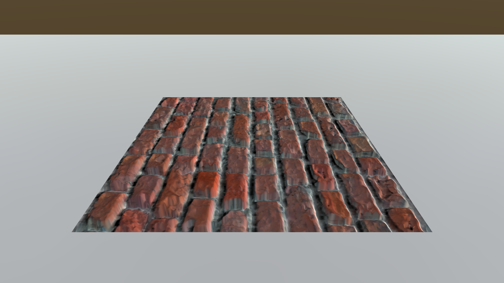

Yes, normal mapping and parallax mapping are satisfactory enough. The simulated extrusions look decent. But carefully looking at the surface below, we can realize that there is one thing that parallax mapping and horizon mapping lack; where are all the shadows that the bumps should have cast? Actually, it is natural that they don't cast shadow since the bumps are faked by manipulating normals or texture sampling coordinates. For shadows to appear, we need additional processes to simulate shadow casters.

{: width="500"}{: .align-center} The sandbags from the parallax mapping post. 
{: .text-center}

# What is **Horizon Mapping**?

**Horizon mapping** simulates shadows with height information stored in a height map, similar to parallax mapping. Horizon mapping precalculates where the nearby horizon is, which is the criterion for deciding whether the point is in a shadow, and stores the results in a separate texture map. Later, the texture map is sampled by the shader and is used for multiplying a pixel color by a shadow factor. 

It was first introduced in [1]. However, this post is largely based on the explanations in [2].

# Horizon Map
## How Horizon Map Works

First of all, let's think about at which points on a surface shadows should take place.

{: width="500"}{: .align-center}

Before we start to discuss the processes, please note that all the points and vectors are provided in the tangent space.

Given a pixel point $p(x, y)$, we decide whether $p$ is in a shadow or not by looking at if there is any occluder between the light source and $p$. Since the surface is continuous, a possible occluder can be searched for by considering only the elevation sampled from the height map. If there is at least one higher surface point that intersects with $l$, there is a blocking surface between $p$ and the light; thus $p$ is in a shadow; if not, $p$ is being lit directly by the light and not in a shadow. Let the angle $\alpha$ be the elevation angle between the horizontal plane at the height $h_0$ and the direction toward the adjacent higher point $p'(x + i, x + j)$. If the angle made by $l$ and the horizontal plane is greater than $\alpha$, $p$ is in a shadow; otherwise, $p$ is not in a shadow. 

What is clever with horizon mapping is how it precalculates and stores the criteria for decision. Horizon mapping generates a separate texture map with the RGBA format called **horizon map**. Horizon mapping first utilizes four channels of the horizon map to handle possible directions projected on the tangent space x-y plane. The horizon map also uses $\sin\alpha$ as the proxy for $\alpha$, which eventually represents an elevation. Since the sine function monotonically increases in $[-\frac{\pi}{2}, \frac{\pi}{2}]$, it can be used for comparing heights between pixels.

Now, let's step onto the real implementation of the generation of a horizon map. To fill in a texel $p(x, y)$ which has height of $h$, adjacent pixels within the range $r$ are investigated. Keep an array of maximum $\tan^2$ values that will be tracked for 32 equally-spaced directions on the x-y plane. For one of such texel $p'(x + i, x + j)$, which has a height of $h'$ and forms a horizontal angle $\alpha$, we calculate $\tan^2\alpha$ with the following trigonometric identity.

$$
\tan^2\alpha = \frac{(h_0 - h)^2}{i^2 + j^2}
$$

When a texel with a relatively higher elevation is found, we have to decide in which entries of the maximum array the squared tangent value computed with the $p'$ will affect. Assuming that each texel has a radius of $\frac{\sqrt2}{2}$, the angular size $\delta$ is computed as

$$
\delta = \tan^{-1}\frac{\sqrt2}{2\|(i, j)\|}
$$

and the angle to the texel $p'$ itself is

$$
\theta = \tan^{-1}\frac{j}{i}
$$

{: width="600"}{: .align-center} Angular range $[\theta - \delta, \theta + \delta]$ that a texel with a radius $\frac{\sqrt2}{2}$ will affect. 
{: .text-center}

Directions out of the 32 equally-spaced directions that fall in the angular range $[\theta - \delta, \theta + \delta]$ are all updated if the new $tan^2$ value is greater than the maximum value that was previously stored in the array. Since we need $\sin\alpha$, not $\tan\alpha$, the following trigonometric identity is deployed to find $\sin\alpha$.

$$
\sin\alpha = \sqrt{\frac{\tan^2\alpha}{\tan^2\alpha + 1}}
$$

Once the 32 directional entries are fully filled in, it's time to produce eight values that will eventually stored in each channel of the two layers of horizon map. Each final result is computed by taking the average of five nearby entries out of the 32 candidates, as the following figure shows. Finally, the averages are stored in the total eight RGBA channels of the two horizon maps.

{: width="400"}{: .align-center} $G_{0}$ is computed by averaging five nearest directional values. 
{: .text-center}

## Code for Horizon Map Generator

```c#
	public static bool CreateHorizonMap(Texture2D heightMap, string path, string fileName, int searchRadius, bool useMultithreading, UnityAction<int, int> progressAction) // ANGLE_COUNT must be at lest 16 and a power of 2
	{
		// Basic checks
		bool checkPassed = true;

		if (heightMap == null)
		{
			Debug.LogError("No normal map has been assigned.");
			checkPassed = false;
		}

		if (heightMap == null)
		{
			Debug.LogError("No height map has been assigned.");
			checkPassed = false;
		}

		if (path.IsNullOrEmpty() || fileName.IsNullOrEmpty())
		{
			Debug.LogError("Either path or file name have not been assigned.");
			checkPassed = false;
		}

		if (progressAction == null)
		{
			Debug.LogError("progressAction must be assigned.");
			checkPassed = false;
		}

		if (!checkPassed) return false;

		// Time measurement
		float startTime = Time.realtimeSinceStartup;

		// Create a horizon map
		const int ANGLE_COUNT = 32;

		Color[] heightMapTexels = heightMap.GetPixels();
		int searchRadius2 = searchRadius * searchRadius;
		float angleIndex = ANGLE_COUNT / (2.0f * Mathf.PI);

		int width = heightMap.width;
		int height = heightMap.height;
		Color[][] horizonMapTexels = new Color[2][] { new Color[height * width], new Color[height * width] }; // Simulate two layers

		if (useMultithreading)
		{
			for (int v = 0; v < height; ++v)
			{
				Parallel.For
				(
					0,
					width,
					(u) =>
					{
						ProcessRow(v, u);
					}
				);

				progressAction.Invoke(v, height);
			}
			
		}
		else
		{
			for (int v = 0; v < height; ++v)
			{
				for (int u = 0; u < width; ++u)
				{
					ProcessRow(v, u);
				}

				progressAction.Invoke(v, height);
			}
		}

		// Save the horizon map
		bool isSaveSuccessful = true;
		for (int layer = 0; layer < 2; ++layer)
		{
			Texture2D horizonMap = new Texture2D(width, height);
			horizonMap.SetPixels(horizonMapTexels[layer]);
			horizonMap.Apply();

			isSaveSuccessful &= SaveAsPNG(horizonMap, path, fileName + layer.ToString());
		}

		// Time measurement
		float endTime = Time.realtimeSinceStartup;
		print($"Time taken: {endTime - startTime}");

		// Return the result
		return isSaveSuccessful;
		
		// Local function that fill in a single row of the horizon map
		void ProcessRow(int v, int u)
		{
			Color centerHeight = heightMapTexels[v * width + u]; // Target pixel(height at the center)
			float[] maxTan2 = new float[ANGLE_COUNT];

			// Search for neighborhood pixels with larger heights where (i, j) is the center coordinate
			for (int j = -searchRadius + 1; j < searchRadius; ++j)
			{
				for (int i = -searchRadius + 1; i < searchRadius; ++i)
				{
					int r2 = j * j + i * i;
					int nearbyY = (v + j) & (height - 1);
					int nearbyX = (u + i) & (width - 1);

					if (r2 < searchRadius2 && r2 != 0) // If this texel is in the range and not the center
					{
						Color nearbyHeight = heightMapTexels[nearbyY * width + nearbyX];
						float heightDiff = nearbyHeight.grayscale - centerHeight.grayscale;
						if (heightDiff >= 0.0f) // Larger height found
						{
							float direction = Mathf.Atan2(j, i); // Angle from the starting line
							float delta = Mathf.Atan(Mathf.Sqrt(2.0f) / (2.0f * Mathf.Sqrt(r2))); // Angular range from the direction assuming that each texel has a radius of (sqrt(2) / 2)

							int minIndex = Mathf.FloorToInt((direction - delta) * angleIndex); // From which angle to affect
							int maxIndex = Mathf.CeilToInt((direction + delta) * angleIndex); // To which angle to affect

							// Calculate squared tangent
							float tan2 = heightDiff * heightDiff / (float)r2;
							for (int n = minIndex; n <= maxIndex; ++n)
							{
								int m = n & (ANGLE_COUNT - 1);
								if (tan2 > maxTan2[m])
								{
									maxTan2[m] = tan2;
								}
							}
						}
					}
				}
			}

			// Generate eight channels of the horizon map for two layers
			for (int layer = 0; layer < 2; ++layer)
			{
				Color horizonMapTexel = new Color();
				int firstIndex = ANGLE_COUNT / 16 + layer * (ANGLE_COUNT / 2); // Starts from 2 in layer one, 18 in layer two where ANGLE_COUNT == 32
				int lastIndex = firstIndex + ANGLE_COUNT / 8; // Starts from 6 in layer one, 22 in layer two where ANGLE_COUNT == 32

				for (int index = firstIndex; index <= lastIndex; ++index)
				{
					float tr = maxTan2[(index - ANGLE_COUNT / 8) & (ANGLE_COUNT - 1)];
					float tg = maxTan2[index];
					float tb = maxTan2[index + ANGLE_COUNT / 8];
					float ta = maxTan2[((index) + ANGLE_COUNT / 4) & (ANGLE_COUNT - 1)];

					// Find sine values from tangent values
					horizonMapTexel.r += Mathf.Sqrt(tr / (tr + 1.0f));
					horizonMapTexel.g += Mathf.Sqrt(tg / (tg + 1.0f));
					horizonMapTexel.b += Mathf.Sqrt(tb / (tb + 1.0f));
					horizonMapTexel.a += Mathf.Sqrt(ta / (ta + 1.0f));
				}

				horizonMapTexels[layer][v * width + u] = horizonMapTexel / (ANGLE_COUNT / 8 + 1); // Take average of five adjacent vectors
			}
		}
	}
```

Here is the C# function that generates and saves a horizon map. It hires multithreading for the following reasons.

* Single-threaded horizon map generation takes too much time. It has the time complexity of just $O(n^2)$ with regard to a dimension of a horizon map(or interchangeably of a heightmap, because they have the same size) because the procedure iterates through each pixel and searches for an approximately constant amount of adjacent pixels. As the texture size doubles up, the time taken increases by four times. The execution time goes up unendurably.
* Image processing is one of the tasks that benefit from multithreading the most. Each pixel entry does not depend on the other and can be accessed independently. Thus, mutex is not required, resulting in a considerable performance improvement.
* Unity generally does not allow the execution of Unity features on threads other than the main thread. Fortunately, `Color` class was able to elude such restrictions.

Here is the chart of comparison of times taken between single-threaded and multi-threaded horizon map generation. I ran the process on a system with AMD Ryzen 5800H processor with eight cores and 16GB of memory.

{: width="700"}{: .align-center}

You can clearly see how multithreading is competitive compared to a sigle-threaded execution.

## Constructed Horizon Map

These textures are the target height map, the first horizon map, and the second horizon map, respectively.

{: width="400"}{: .align-center}
{: width="800"}{: .align-center}

# Horizon Cubemap

## Interpolating Directions with Horizon Cubemap

In the horizon mapping pixel shader, given a light direction $l$, deciding whether a pixel is in a shadow is achieved by sampling the corresponding horizon map, retrieving two suitable vectors stored in color channels between which $l$ exists. Then, the two vectors are interpolated according to the angle of $l$. The idea is that instead of finding an interpolation weight every time, make a cubemap containing those weights that can be sampled with the 3D light vector.

Even though we have eight directions in two textures, we can use only one cubemap to indicate all the eight directions. We know that  use positive weights for $(R_0, G_0, B_0, A_0)$ and negative ones for $(R_1, G_1, B_1, A_1)$. For example, a cubemap texel $(0.5, 0.0, 0.0, -0.5)$ results in a directional vector $0.5R_0 + 0.5A_1$, which is directed toward $-22.5^\circ$. At most two channels in the cubemap can be nonzero because at most two directional values can participate in the interpolation.

In the pixel shader, the cubemap is sampled using $l$, and we calculate the dot product with a value sampled from the horizon map. We have to choose which horizon map to sample here. Actually, we don't really have to 'choose' with an `if` statement. Considering that we made the decision to utilize positive values for the initial horizon map and negative values for the subsequent horizon map, the following expressions successfully interpolates two channels without a conditional branch. Saturating $v_{cubemap}$  sorts out only positive weights while saturating $-v_{cubemap}$ does so only for negative weights, and multiplying each extracted weight and summing them up covers all the cases.

$s_{horizonmapN}$ : Color($\sin \alpha$) sampled from the horizon map N(0 or 1).

$w_{cubemap}$ : Color(weight) sampled from the horizon cubemap.
$$
s_0 = saturate(w_{cubemap}) \cdot s_{horizonmap0} \\
s_1 = saturate(-w_{cubemap}) \cdot s_{horizonmap1} \\
s_{final} = s_0 + s_1
$$

The result is an estimated $\sin \alpha$, where, to remind, $\alpha$ is a horizontal angle made by a higher point lying in the direction.

Constructing a cubemap is tricky. First, we must remind ourselves how our cubemap should work; when sampled with the tangent-space 3D light direction vector, it returns an interpolation weight on the T-B plane. In order to make up each face of the cubemap, we have to find the mapping from a uv coordinate of a face to the projected point on the T-B plane. What makes it very tricky is the difference between coordinate systems. Unity default scene features a Y-up coordinate system, while the shader tangent features a Z-up coordinate system. Never mind, just go for the Y-up and replace T with X, B with Y, and N with Z.

{: width="900"}{: .align-center} We have to find the mapping from $p_{uv}$ to $p_{projected}$.
{: .text-center}

Assume we have given an unnormalized light direction $l(3, 2, 1)$. The sampled face has an index of 0, and the texture UV coordinate that we are targeting is $p_{uv}(\frac{2}{3}, \frac{1}{3})$. It is projected to $p_{projected}(1,\frac{1}{3}, 0)$ on the X-Y(T-B) plane. From this case, we know that a UV coordinate $(u, v)$ of the face 0 is mapped to a projected point $(1, v)$. The same idea can be applied to construct remaining five faces of the cubemap.

 Once a cubemap is generated, it can be used to sample any horizon map, since the cubemap just indicates the relationship between a light direction and an interpolation weight and does not accept any texture parameter in its generator.

## Code for the Horizon Cubemap Generator

```c#
	public static bool CreateHorizonCubemap(int size, string path, string fileName)
	{
		// Basic checks
		bool checkPassed = true;
		if (path.IsNullOrEmpty() || fileName.IsNullOrEmpty())
		{
			Debug.LogError("Either path or file name have not been assigned.");
			checkPassed = false;
		}

		if (size < 16)
		{
			Debug.LogError("Size must be at least 16.");
			checkPassed = false;
		}

		if (!checkPassed)
		{
			return false;
		}

		// Generate a cubemap
		bool isSaveSuccessful = true;
		string[] axisSuffices = new string[] { "0(+X)", "1(-X)", "2(+Y)", "3(-Y)", "4(+Z)", "5(-Z)" }; // Suffices for texture file names
		for (int face = 0; face < 6; ++face)
		{
			Color[] cubemapTexels = new Color[size * size];
			int texelIndex = 0;
			for (float v = -1.0f + 1.0f / size; v < 1.0f; v += 2.0f / size)
			{
				for (float u = -1.0f + 1.0f / size; u < 1.0f; u += 2.0f / size)
				{
					// Which projected point in the T-B plane does the light direction corresponds to?
					Vector2 dir = Vector2.zero;
					switch (face)
					{
						case 0: // +x
						{
							dir.Set(1, v);
							break;
						}
						case 1: // -x
						{
							dir.Set(-1, v);
							break;
						}
						case 2: // +y
						{
							dir.Set(-u, 1);
							break;
						}
						case 3: // -y
						{
							dir.Set(-u, -1);
							break;
						}
						case 4: // +z
						{
							dir.Set(-u, v);
							break;
						}
						case 5: // -z
						{
							dir.Set(u, v);
							break;
						}
					}

					float t = Mathf.Atan2(dir.y, dir.x) / (Mathf.PI / 4.0f); // Which range does the direction belong to?

					// Evaluate two nonzero channels according to the range that (dir.x, dir.y) belongs to
					// For example, a uv coordinate with an angle (pi / 8) results in (red = 0.5, green = 0.5)
					float red = 0.0f;
					float green = 0.0f;
					float blue = 0.0f;
					float alpha = 0.0f;
					if (t < -3.0f)
					{
						red = t + 3.0f;
						green = -t - 4.0f;
					}
					else if (t < -2.0f)
					{
						green = t + 2.0f;
						blue = -t - 3.0f;
					}
					else if (t < -1.0f)
					{
						blue = t + 1.0f;
						alpha = -t - 2.0f;
					}
					else if (t < 0.0f)
					{
						alpha = t;
						red = t + 1.0f;
					}
					else if (t < 1.0f)
					{
						red = -t + 1.0f;
						green = t;
					}
					else if (t < 2.0f)
					{
						green = -t + 2.0f;
						blue = t - 1.0f;
					}
					else if (t < 3.0f)
					{
						blue = -t + 3.0f;
						alpha = t - 2.0f;
					}
					else
					{
						alpha = -t + 4.0f;
						red = -t + 3.0f;
					}

					cubemapTexels[texelIndex] = new Color(red, green, blue, alpha);
					cubemapTexels[texelIndex] = cubemapTexels[texelIndex] / 2.0f + Color.white / 2.0f; // Remap [-1, 1] to [0, 1]

					++texelIndex;
				}
			}

			// Save
			Texture2D cubemapTexture = new Texture2D(size, size);
			cubemapTexture.SetPixels(cubemapTexels);
			cubemapTexture.Apply();

			isSaveSuccessful &= SaveAsPNG(cubemapTexture, path, fileName + axisSuffices[face]);
		}

		return isSaveSuccessful;
	}
```

## Constructed Horizon Cubemap

| Axis  |                           Texture                            |
| :---: | :----------------------------------------------------------: |
| 0(+X) | .png){: width="300"}{: .align-center} |
| 1(-X) | .png){: width="300"}{: .align-center} |
| 2(+Y) | .png){: width="300"}{: .align-center} |
| 3(-Y) | .png){: width="300"}{: .align-center} |
| 4(+Z) | .png){: width="300"}{: .align-center} |
| 5(-Z) | .png){: width="300"}{: .align-center} |

# Soft Shadows

## Adding Soft Shadows

The components we have seen so far are sufficient for us to proceed to implementing a shader. We can now write a shader in which it samples one texel from the horizon map and one from the cubemap, combines them together to produce a proper $\sin \alpha$, and compares it with $l_z$(it is the sine of the angle made by $l$, since $l$ has a unit-length), and decides whether the pixel is in a shadow. Below is a brick texture with horizon mapping applied.

{: width="500"}{: .align-center} $\eta = 100$
{: .text-center}

The bumps are shadowing itself, but the shadow boundary is too sharp. Light sources in the real world, including the Sun, have some amount of volume and produces soft gradients on the edges of shadows. Considering this nature,  just one subtle adjustment could yield an even better result. Instead of the binary classification of if a pixel is in a shadow or not, add a smooth transition function so that the shadowing zone shifts gradually. The transition function looks like this;

$F = \eta(l_z - \sin \alpha) + 1$

$F$ stands for the factor multiplied by a pixel color that leads to the shadowing effect. The higher $\eta$ is, the sharper the shadow boundary gets.

{: width="500"}{: .align-center} $\eta = 5$
{: .text-center}

{: width="500"}{: .align-center} $\eta = 10$
{: .text-center}

{: width="500"}{: .align-center} $\eta = 50$
{: .text-center}

{: width="500"}{: .align-center} $\eta = 100$
{: .text-center}

# Shader

```c++
Shader "Custom/DiffuseNormalParallaxHorizon" 
{
	Properties 
	{
		_Color("Color", Color) = (1,1,1,1)
		_MainTex("Albedo (RGB)", 2D) = "white" {}
		_BumpMap("Normal Map", 2D) = "bump" {}
		_HeightMap("Height Map", 2D) = "bump" {}
		_BumpPower("Normal Power", Range(0, 20)) = 1
		_ExtrudePower("Extrude Power", Range(0, 1.0)) = 0.2
		_Glossiness("Smoothness", Range(0,1)) = 0.5
		_Metallic("Metallic", Range(0,1)) = 0.0
		_HorizonMap0("Horizon Map0", 2D) = "white" {}
		_HorizonMap1("Horizon Map1", 2D) = "white" {}
		_HorizonCubemap("Horizon Cubemap", Cube) = "" {}
		_ShadowHardness("Shadow Hardness", Range(0, 20.0)) = 5.0
	}

	SubShader 
	{
		Tags { "RenderType"="Opaque" }
		LOD 200
		
		CGPROGRAM

		#pragma surface surf Horizon fullforwardshadows vertex:vert
		#pragma target 3.0
		#include "UnityPBSLighting.cginc"

		fixed4 _Color;
		sampler2D _MainTex;
		sampler2D _BumpMap;
		sampler2D _HeightMap;
		fixed _BumpPower;
		fixed _ExtrudePower;
		half _Glossiness;
		half _Metallic;
		sampler2D _HorizonMap0;
		sampler2D _HorizonMap1;
		samplerCUBE _HorizonCubemap;
		half _ShadowHardness;

		static const int NUM_STEPS = 5;

		struct Input 
		{
			float2 uv_MainTex;
			float2 uv_BumpMap;

			float3 viewDir;
			float3 tangentLightDir;
		};

		struct SurfaceOutputHorizon
		{
			fixed3 Albedo;
			float3 Normal;
			half3 Emission;
			half Metallic;
			half Smoothness;
			half Occlusion;
			half Alpha;
			half horizonFactor;
		};

		UNITY_INSTANCING_BUFFER_START(Props)
		UNITY_INSTANCING_BUFFER_END(Props)

		// Apply parallax offset to a texture coordinate and return
		float2 GetParallaxCoord(float2 texCoord, float3 vDir, float2 scale)
		{
			float2 pDir = vDir.xy * scale;

			for (int i = 0; i < NUM_STEPS; ++i) // Iteration for a better approximation
			{
				float nz = UnpackNormal(tex2D(_BumpMap, texCoord)).z;
				float h = tex2D(_HeightMap, texCoord).g * 2.0 - 1.0; // Scale to [-1, 1]
				float nzh = nz * h;

				texCoord += pDir * nzh;
			}

			return texCoord;
		}

		float ApplyHorizonMap(float2 texCoord, half3 lightDir)
		{
			// Sample horizon channel factors from the cubemap
			float4 weights = texCUBE(_HorizonCubemap, lightDir);
			weights = weights * 2.0 - 1.0;

			// Extract positive and negative weights for horizon map layers 0 and 1
			float4 w0 = saturate(weights);
			float4 w1 = saturate(-weights);

			// Sample the horizon map sine values and multiply by weights for each layer
			float s0 = dot(tex2D(_HorizonMap0, texCoord), w0);
			float s1 = dot(tex2D(_HorizonMap1, texCoord), w1);
			float sinAlpha = s0 + s1;

			return saturate(_ShadowHardness * (lightDir.z - sinAlpha) + 1.0);
		}

		// Custom lighting
		half4 LightingHorizon(SurfaceOutputHorizon s, half3 lightDir, UnityGI gi) 
		{
			// Apply standard lighting first
			SurfaceOutputStandard ss;
			ss.Albedo = s.Albedo;
			ss.Normal = s.Normal;
			ss.Emission = s.Emission;
			ss.Metallic = s.Metallic;
			ss.Smoothness = s.Smoothness;
			ss.Occlusion = s.Occlusion;
			ss.Alpha = s.Alpha;
			half4 standardLighting = LightingStandard(ss, lightDir, gi);

			// Then apply horizon mapping
			return s.horizonFactor * standardLighting;
		}

		void LightingHorizon_GI(SurfaceOutputHorizon s, UnityGIInput data, inout UnityGI gi)
		{
			SurfaceOutputStandard ss;
			ss.Albedo = s.Albedo;
			ss.Normal = s.Normal;
			ss.Emission = s.Emission;
			ss.Metallic = s.Metallic;
			ss.Smoothness = s.Smoothness;
			ss.Occlusion = s.Occlusion;
			ss.Alpha = s.Alpha;

			LightingStandard_GI(ss, data, gi);
		}

		void vert(inout appdata_full v, out Input o)
		{
			UNITY_INITIALIZE_OUTPUT(Input,o);

			// Get a tangent space light direction
			TANGENT_SPACE_ROTATION;
			o.tangentLightDir = mul(rotation, ObjSpaceLightDir(v.vertex));
		}

		// Standard surface shader
		void surf(Input IN, inout SurfaceOutputHorizon o) 
		{
			// Sample values from the properties
			o.Metallic = _Metallic;
			o.Smoothness = _Glossiness;

			// Get a texture coordinate with a parallax offset applied
			float2 u = _ExtrudePower / NUM_STEPS;
			float2 parallaxCoord = GetParallaxCoord(IN.uv_MainTex, IN.viewDir, u);

			// Sample and apply the main texture
			fixed4 c = tex2D(_MainTex, parallaxCoord) * _Color;
			o.Albedo = c.rgb;
			o.Alpha = c.a;

			// Sample and apply the normal map
			fixed3 normal = UnpackNormal(tex2D(_BumpMap, parallaxCoord));
			normal.z = normal.z / _BumpPower;
			o.Normal = normalize(normal);

			// To use in horizon mapping
			o.horizonFactor = ApplyHorizonMap(IN.uv_MainTex, IN.tangentLightDir);
		}

		ENDCG
	}
	FallBack "Diffuse"
}
```
The shader is written upon the parallax shader that was previously introduced.

# Editor Window

Although I am omitting the code here(you can check it out at the repository), I wrote an editor to facilitate the generation of horizon maps. A user can easily create a variety of horizon maps and a cubemap by adjusting parameters and save those assets to any location they intend.

{: .align-center}

{: .align-center}

# Results

{: width="450"}{: .align-center} Test witha a circle-shaped bump
{: .text-center}

{: width="450"}{: .align-center} Brick with the horizon map applied
{: .text-center}

Horizon allows bumps to cast shadows onto itself. The range of the shadows varies according to the horizontal and vertical direction of the light source. This adds some reality to the bumped surfaces.

# Conclusion

In spite of the extra reality made by horizon mapping, I am not going to use it for my game project for several  reasons.

1. Visually unsatisfactory. The shadow boundary is noisy and the shadow itself is too dark. Fine-tuning the shadow color requires extra work.
2. Performance issue. The shader needs to sample a horizon map and a cubemap, after applying a normal map and a parallax offset.
3. Need a separate texture map. It takes a lot of time to generate a horizon map, and the time increases rapidly as its size becomes larger, even though we hired multithreading. Furthermore, the increased number of texture maps to manage puts some burden on developers!

However useful horizon mapping itself is, the reason I am introducing this technique is it contains a handful of graphics techniques and inspired me to design a new sight system. You can check it out on [this post](../FOVMapping1).

 

# References

* [1] Max, N.L. (1988). Horizon mapping: shadows for bump-mapped surfaces. *The Visual Computer, 4*, 109-117.
* [2] Lengyel, E. (2019). Foundations of game engine development (2nd ed.). Terathon Press.