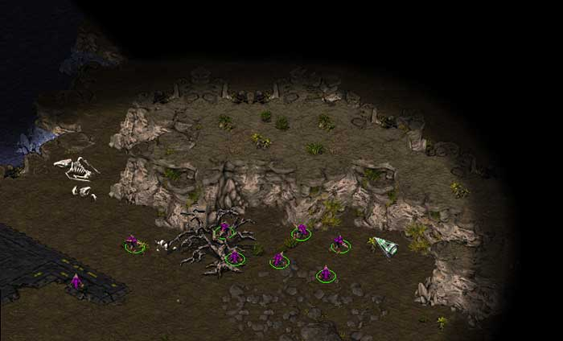
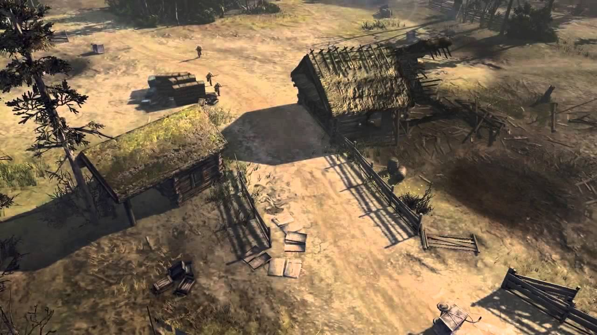

# Fog of War

## What is Fog of War?

**Fog of war(FOW)** is a game mechanic commonly used in real-time strategy (RTS) games to simulate limited visibility and uncertainty on the battlefield. It adds a strategic element by obscuring parts of the game map that are not within the player's immediate view or line of sight.

In an RTS game with fog of war, the map is initially covered in darkness or a shrouded veil, and the player's vision is limited to the areas explored or units present on the battlefield. As the player's units move or perform actions, the fog of war lifts in those areas, revealing the terrain, enemy units, structures, and other relevant information.

The fog of war serves several purposes:

1. **Strategic Planning**: It forces players to gather information and make decisions based on incomplete knowledge. They must scout the map, control key points, and anticipate enemy movements to gain an advantage.
2. **Surprise and Ambush**: Since players can't see what's happening beyond their line of sight, it allows for tactical surprises and ambushes. Players must be cautious not to be raided by enemies.
3. **Hidden Objectives**: Fog of war can hide important objectives or resources, encouraging players to explore and uncover hidden advantages on the map.

Overall, the fog of war in RTS games adds an element of uncertainty and strategic depth, requiring players to gather information, make informed decisions, and adapt their strategies based on the changing battlefield conditions.

## FOW Policies

Each game employs its own FOW policy which eventually leads players to use different strategies. In Starcraft(1998), unexplored areas are veiled with complete darkness. Apparent elevations can block sight while map objects cannot. Players tend to prefer reconnaissance over a broad area rather than taking precautions about enemy ambushing behind obstacles.

Company of Heroes 2(2013), on the other hand, features a sight system called 'true sight' in which units' visibility is blocked not only by topography but also by obstacles including buildings, trees, and even abandoned vehicles. A good commander prevents abrupt encounter with adverseries by keeping a sniper away from corners or take advantage of bushes with an assault troop armed with machine pistols.

{: .align-center} Fog of War in Starcraft I(1998)
{: .text-center}{: width="600"}

{: .align-center} 'True sight' system in Company of Heroes 2(2013)
{: .text-center}{: width="5\600"}

As I wanted to imbue my game more tactical possibilities, I chose the latter one; obstacle-sensitive sight system. Trying to implement field of vision, I started to search for a field of vision technique that satisfies one condition critical for the project; **high performance**. In the game, there are eight players for each side, and each player control a squad consists of five members. Since each infantryman has their own vision and the sight is shared among squads, 40 units contribute to the sight of a single game client. The FOW policy should be able to handle these large number of sight contributors.

# Methods

##  Shadowcasting

**Shadowcasting** is a common technique for calculating field of vision in Roguelike games. It iterates through adjacent virtual FOW cells of the unit's position, and checks whether each cell is visible from a unit. There is a post [1] that describes perfectly how shadowcasting works step-by-step. It focuses on classifying veiled areas and the others accurately, which is often a key of gameplay in Roguelike games.

[2] demonstrates a great implementation of shadowcasting. It is precise, easy-to-use, and performant when there is one eye toward a map. However, as we increase the number of units each of which has an independent sight, or the range of sight, the required amount of calculation skyrockets; given a sight of range $r$ and $n$ units, the time complexity for computing the sight for a scene is $O(nr^2)$. The FPS dropped to 1-2 when I tested with ten units(which is much less than the 40 mentioned above!) with 50 meters of sight. Unfortunately, shadowcasting was completely ineligible for my project. 

## Utilizing Raycasting

**Raycasting** might be the first thing that comes into the mind of programmers constructing a sight system. It is as intuitive as follows.

1. Fire rays toward the surrounding arc with a constant angular interval.
2. The ray marches until it encounters any obstacle.
3. Let the tip point of each ray be $t_0, t_1, t_2, ...t_n$  and the center be $c$. Construct a set of triangular faces whose vertices are $(c, t_0, t_1), (c, t_1, t_2), (c, t_2, t_3),...(c, t_n, t_0)$. The faces compose a fan-shaped field of vision(FOV) mesh.
4. In Unity, we render the FOV mesh onto a `RenderTexture`, which can finally be projected on the map using a `Projector`.

The more rays are casted, the denser the obstacle detection is. However, this also leads to more overhead, of course. But we can enhance performance dramatically by hiring the binary search technique. *Sebastian Lague* [3] uploaded such a kind tutorial demonstrating how to all these steps are done.

1. As we have done before, check obstacles at all directions, but with fewer number of rays this time.
2. If two neighboring rays differ in their resulting raycast object(for example, one ray hit a wall and the other didn't hit anything), binary-search the range formed by the rays as many times as you desired.
3. The binary search is achieved by sequentially casting rays that divide each range.

Unfortunately, even this advanced method can't help with increasing number of rays to form an accurate FOV mesh. Empirically, a decent FOV plane required at least 30 rays to be inspected. Assuming 30 units this time, an entire sight system processes $30 \cdot 30 = 900$ raycasts, which puts a heavy burden on the CPU. Still, we are eager for a better performance.

# FOV Mapping

## Motivation

Although both shadowcasting and raycasting method have their own suitable applications, it was not the case for my game project. Nonetheless, the discussions about them were not in vein since we have learned lessons from it.

1. Processing pixels one by one on a **CPU** results in a formidable overhead.
2. Raycasting **during a playtime** does not depend on sight ranges but still cannot afford a large number of eyes.

What is going to save us are ideas from **[Horizon Mapping](/game)**. The way horizon mapping simulate shadows is to inspect bumps around each surface position and store the information about the shadow casters in a texture map, finally sampling it for shading in the pixel shader. It is brilliant that it tries to calculate data in advance and fully utilizes each channel of a texture map. By doing so, a CPU can do its own works other than evaluating shadow casters at playtime.

Inspired by horizon mapping, we can now envision our novel idea that will facilitate a massive FOV system by negating the above statements.

1. Modern computers(even mobile devices) are outfitted with a **Graphics Processing Unit(GPU)** one of whose main purposes is processing pixels in parallel. It provides us with an extremely efficient way to achieve our goal.
2. It is not necessary to cast rays at runtime. We can detect neighboring obstacles prematurely **before a playtime** and store the data in a texture for a later use.

The amount of storage occupied by the data is often negligible, considering the abundant memory resources(RAM and VRAM).

## Generating an FOV Map Array

One crucial difference between horizon mapping and FOV mapping is that accuracy matters unlike the horizon mapping case. We can't sample a large number of directions and store only a few averaged values. It is mandatory that record every single direction is recorded without omitting or taking average. In order to achieve a decent field of vision, the angular resolution of raycasting should be at least $10\degree$ and optimally, under than $1\degree$. A single RGBA32-format texture is insufficient to record all those directional information, of course. 

Don't worry, **Texture array** [4] can fix them all. Texture array is literally a sequence of textures that behaves just similar to textures. What makes it special is that it can contain several textures in it, and is sampled with a 3D UVW coordinate instead of a 2D UV coordinate in a shader. By embedding multiple textures into a texture array, we can make a room for huge directional information.

Let's proceed to the implementation of the FOV map generation. The first step is to set variables and constants that will be used later.

```c#
int CHANNELS_PER_TEXEL = 4;
float MAX_HEIGHT = 5000.0f;
int SAMPLES_PER_DIRECTION = 5;

float projectorSizeX = projector.orthographicSize * projector.aspectRatio * 2.0f;
float projectorSizeZ = projector.orthographicSize * 2.0f;

float squareSizeX = projectorSizeX / genParam.FOWMapWidth;
float squareSizeZ = projectorSizeZ / genParam.FOWMapHeight;

int directionsPerSquare = CHANNELS_PER_TEXEL * genParam.layerCount;

float anglePerDirection = 360.0f / directionsPerSquare;
```

**Squares** compose a virtual grid of projector area. Higher number of squares(=higher FOW map resolution) guarantee better spatial resolution. If you want a FOW map that changes rapidly as units move, `genParam.FOWMapWidth` and `genParam.FOWMapHeight` must be set to high numbers. `directionsPerSquare` holds the number of directions whose data can be stored in texels that belong to a square. The higher `genParam.layerCount` becomes, the higher `directionsPerSquare` is, the more accurately a field of vision looks at a position.

Next, create a [jagged array](https://learn.microsoft.com/en-us/dotnet/csharp/programming-guide/arrays/jagged-arrays) of `Color`s. Each entry array of the jagged array will compose color elements of a layer.

```c#
Color[][] FOVMapTexels = Enumerable.Range(0, genParam.layerCount).Select(_ => new Color[genParam.FOWMapWidth * genParam.FOWMapHeight]).ToArray();
```

Now, It's time to process grids with a nested for-loop. `aboveCenterPosition`

```c#
for (int squareZ = 0; squareZ < genParam.FOWMapHeight; ++squareZ)
{
    for (int squareX = 0; squareX < genParam.FOWMapWidth; ++squareX)
    {
        Vector3 aboveCenterPosition =
            projector.transform.position -
            new Vector3(projectorSizeX / 2.0f, 0.0f, projectorSizeZ / 2.0f) +
            (squareZ + 0.5f) * projector.transform.up * squareSizeZ +
            (squareX + 0.5f) * projector.transform.right * squareSizeX;
        aboveCenterPosition.y = MAX_HEIGHT;
```

```c#
        RaycastHit hitLevel;
        if (Physics.Raycast(aboveCenterPosition, Vector3.down, out hitLevel, 2 * MAX_HEIGHT, genParam.levelLayer))
        {
            // For all possible directions at this square
            Vector3 centerPosition = hitLevel.point + genParam.centerHeight * Vector3.up;
            for (int directionIdx = 0; directionIdx < directionsPerSquare; ++directionIdx)
            {
                // Sample a distance to an obstacle
                float angleToward = directionIdx * anglePerDirection;

                float distanceRatio = 1.0f;
                RaycastHit hitObstacle;
                if (Physics.Raycast(centerPosition, DirectionFromAngle(angleToward), out hitObstacle, genParam.samplingRange, genParam.levelLayer))
                {
                    distanceRatio = hitObstacle.distance / genParam.samplingRange;
                }
```

```
                float distanceRatio = maxSight / genParam.samplingRange;

                // Find the location to store
                int layerIdx = directionIdx / CHANNELS_PER_TEXEL;
                int channelIdx = directionIdx % CHANNELS_PER_TEXEL;

                // Store
                FOVMapTexels[layerIdx][squareZ * genParam.FOWMapWidth + squareX][channelIdx] = distanceRatio;
            }
        }
```

## FOV Agent and Manager

## Shading Using an FOV Map

# Result

# References

[1] https://www.albertford.com/shadowcasting/

[2] https://www.youtube.com/watch?v=MnER3bD7LbA

[3] https://www.youtube.com/watch?v=rQG9aUWarwE

[4] https://docs.unity3d.com/Manual/class-Texture2DArray.html

[5] https://blog.naver.com/PostView.nhn?blogId=daehuck&logNo=221669909687&from=search&redirect=Log&widgetTypeCall=true&directAccess=false

[6] Lengyel, E. (2019). Foundations of game engine development (2nd ed.). Terathon Press.

[7] https://github.com/remibodin/Unity3D-Blur


# Elaboration

## Interpolating Distances

## Obstacle Offset

## Smoothing Boundaries

## Elevation-Adaptive Level Sampling

## Viewing Angle

## Result

# Performance

# Conclusion

# References

