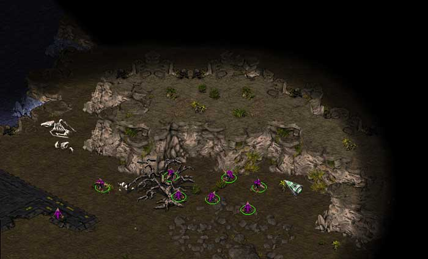
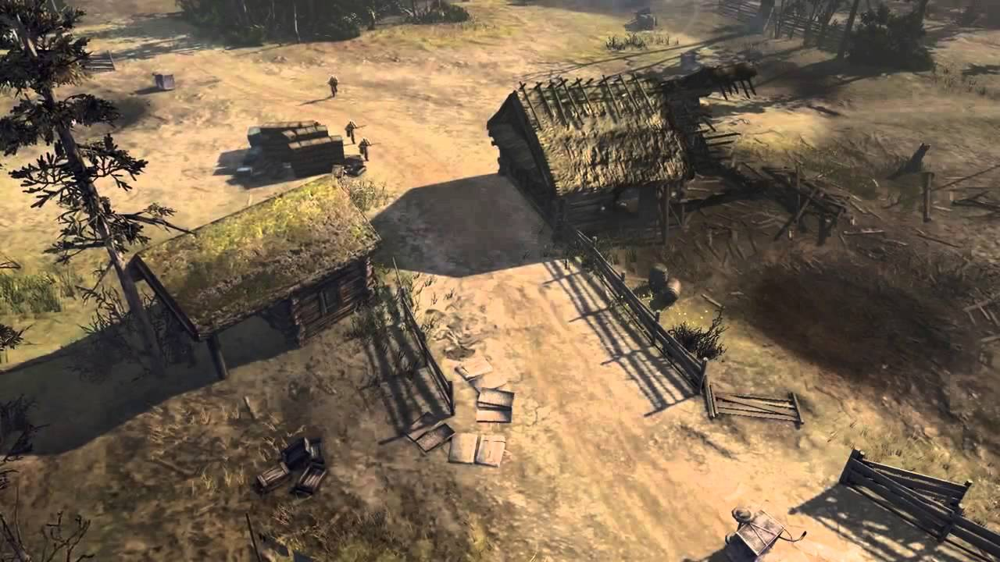
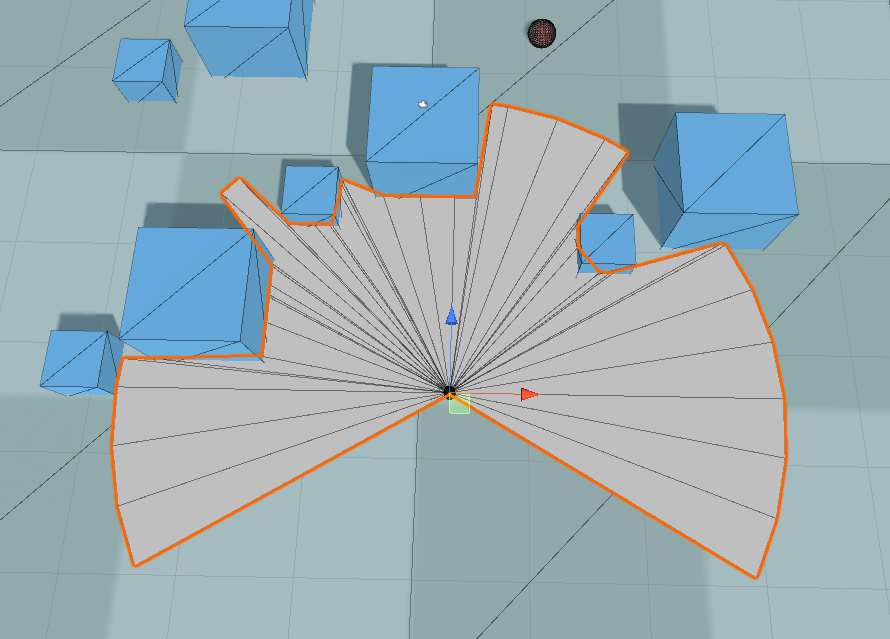
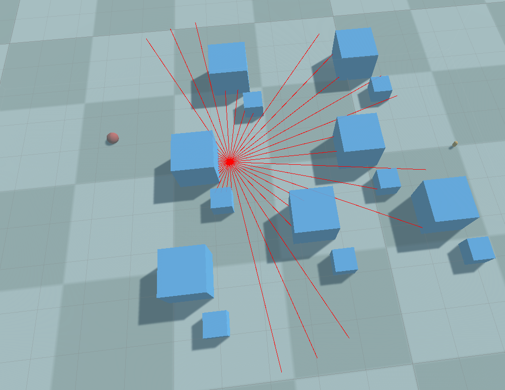
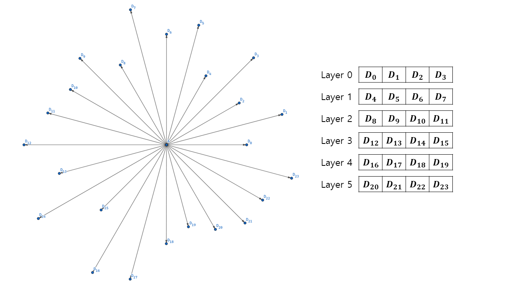
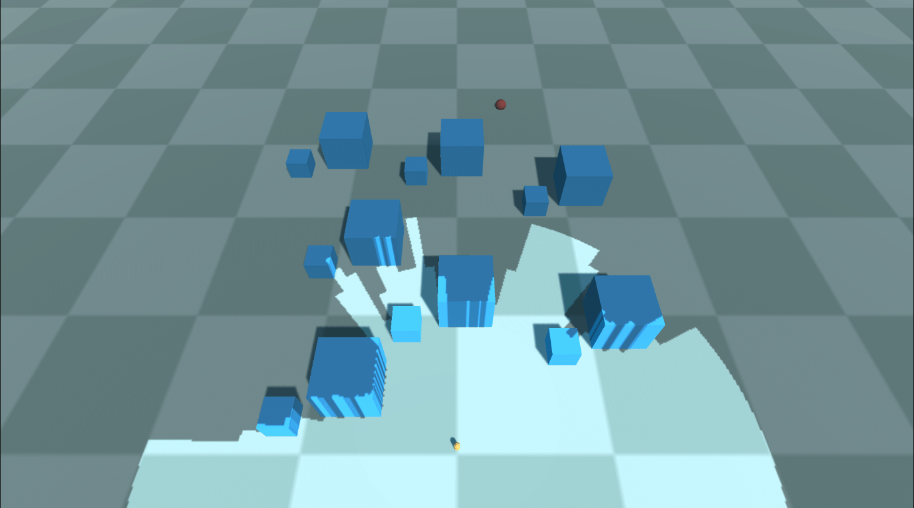
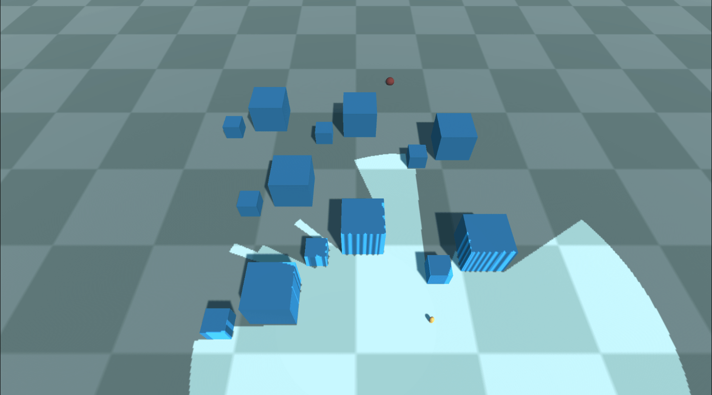
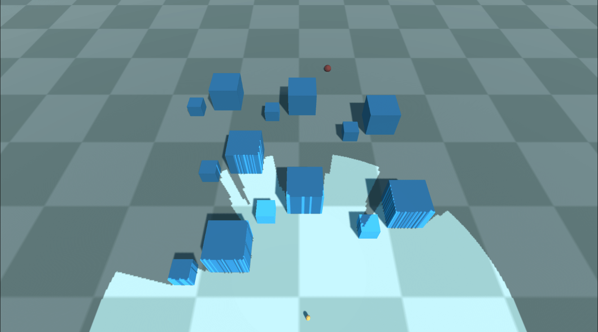

# Fog of War

## What is Fog of War?

**Fog of war(FOW)** is a game mechanic commonly used in real-time strategy (RTS) games to simulate limited visibility and uncertainty on the battlefield. It adds a strategic element by obscuring parts of the game map that are not within the player's immediate view or line of sight.

In an RTS game with fog of war, the map is initially covered in darkness or a shrouded veil, and the player's vision is limited to the areas explored or units present on the battlefield. As the player's units move or perform actions, the fog of war lifts in those areas, revealing the terrain, enemy units, structures, and other relevant information.

The fog of war serves several purposes:

1. **Strategic Planning**: It forces players to gather information and make decisions based on incomplete knowledge. They must scout the map, control key points, and anticipate enemy movements to gain an advantage.
2. **Surprise and Ambush**: Since players can't see what's happening beyond their line of sight, it allows for tactical surprises and ambushes. Players must be cautious not to be raided by enemies.
3. **Hidden Objectives**: The fog of war can hide important objectives or resources, encouraging players to explore and uncover hidden advantages on the map.

Overall, the fog of war in RTS games adds an element of uncertainty and strategic depth, requiring players to gather information, make informed decisions, and adapt their strategies based on the changing battlefield conditions.

## FOW Policies

Each game employs its own FOW policy, which eventually leads players to use different strategies. In Starcraft(1998), unexplored areas are veiled with complete darkness. Apparent elevations can block sight , while map objects cannot. Players tend to prefer reconnaissance over a broad area rather than taking precautions about the enemy ambushing behind obstacles.

Company of Heroes 2(2013), on the other hand, features a sight system called 'true sight' with which units' visibility is blocked not only by topography but also by obstacles, including buildings, trees, and even abandoned vehicles. A good commander prevents abrupt encounters with adversaries by keeping a sniper away from corners or takes advantage of bushes with an assault troop armed with machine pistols.

{: width="500"}{: .align-center}  Fog of War in Starcraft I(1998)
{: .text-center}

{: width="500"}{: .align-center}  'True sight' system in Company of Heroes 2(2013)
{: .text-center}

Among the two choices, I chose the latter one; the obstacle-sensitive sight system, as I wanted to imbue my game with more tactical possibilities. Trying to implement a field of vision, I started to search for a field of vision technique that satisfies one condition critical for the project; **high performance**. In the game, there are eight players for each side, and each player controls a squad consists of five members. Since each infantryman has their own vision and the sight is shared among squads, 40 units contribute to the sight of a single game client. The FOW policy should be able to handle these large numbers of contributors to a visible area.

# Methods

##  Shadowcasting

**Shadowcasting** is a common technique for calculating the field of vision in Roguelike games. It iterates through adjacent virtual FOW cells of the unit's position and checks whether each cell is visible from a unit. There is a post [1] that describes perfectly how shadowcasting works step-by-step. It focuses on classifying veiled areas and others accurately, which is often a key of gameplay in Roguelike games.

[2] demonstrates a great implementation of shadowcasting. It is precise, easy to use, and performant when there is one eye toward a map. However, as we increase the number of units, each of which has an independent sight or the range of sight, the required amount of calculation skyrockets; given a view of range $r$ and $n$ units, the time complexity for computing the sight for a scene reaches to $O(nr^2)$. The FPS dropped to 1-2 when I tested with ten units(much less than the 40 mentioned above!) with 50 meters of sight. Unfortunately, shadowcasting was entirely ineligible for my project. 

## Utilizing Raycasting

**Raycasting** might be the first thing that comes into the mind of programmers constructing a sight system. It is as intuitive as follows.

1. Fire rays toward the surrounding arc with a constant angular interval.
2. The ray marches until it encounters an obstacle.
3. Let the tipping point of each ray be $t_0, t_1, t_2, ...t_n$,  and the center be $c$. Construct a set of triangular faces whose vertices are $(c, t_0, t_1), (c, t_1, t_2), (c, t_2, t_3),...(c, t_n, t_0)$. The faces compose a fan-shaped field of vision(FOV) mesh.
4. In Unity, we render the FOV mesh onto a `RenderTexture`, which will finally be projected on the level using a `Projector`.

{: width="600"}{: .align-center} Field of view plane made with raycasting
{: .text-center}

The more rays are cast, the denser the obstacle detection is. However, this also leads to more overhead, of course. But we can enhance performance dramatically by hiring the binary search technique. *Sebastian Lague* [3] uploaded such a kind tutorial demonstrating how to all these steps are done.

1. As we have done before, check obstacles in all directions, but with fewer rays this time.
2. If two neighboring rays differ in their resulting raycast object(for example, one ray hit a wall and the other didn't hit anything), binary-search the range formed by the rays as many times as you desire.
3. The binary search is achieved by sequentially casting rays that divide each range.

Unfortunately, even this advanced method can't help with increasing the number of rays to form an accurate FOV mesh. Empirically, a decent FOV plane required at least 30 rays to be inspected. Assuming 30 units this time, an entire sight system processes $30 \cdot 30 = 900$ raycasts, which eventually burdens the CPU heavily. Still, we are eager for a better performance.

# FOV Mapping

## Motivation

Although both shadowcasting and raycasting method have their own suitable applications, it was not the case for my game project. Nonetheless, the discussions about them were not in vain since we have learned lessons from them.

1. Processing pixels one by one on a **CPU** results in a formidable overhead.
2. Raycasting **during playtime** does not depend on sight ranges but still cannot afford a large number of eyes.

What is going to save us are ideas from **[Horizon Mapping](../HorizonMapping)**. The way horizon mapping simulates shadows is to inspect bumps around each surface position and store the information about the shadow casters in a texture map, finally sampling it for shading in the fragment shader. It is brilliant that it tries to calculate data in advance and fully utilizes each channel of a texture map. By doing so, a CPU can do its own work other than evaluating shadow casters during playtime.

Inspired by horizon mapping, we can now envision our novel idea to facilitate a massive FOV system by negating the above statements.

1. Modern computers(even mobile devices) are outfitted with a **Graphics Processing Unit(GPU)** one of whose main purposes is processing pixels in parallel. It provides us with an extremely efficient way to achieve our goal.
2. It is not necessary to cast rays at runtime. We can detect neighboring obstacles prematurely **before playtime** and store the data in a texture for a later use.

The amount of storage occupied by the data is often negligible, considering the abundant memory resources(RAM and VRAM).

## Generating an FOV Map Array

### How to do it

Sampling a level is extremely simple for FOV mapping; it is basically a raycasting done before playtime. First, divide the level into a grid with the dimension the same as the FOV map. At each center of the grid square, shoot rays into a predefined number of rays and find how much distance those beams have traveled.
{: width="600"}{: .align-center} Sampling a level
{: .text-center}

One crucial difference between horizon mapping and FOV mapping is that the accuracy matters, unlike the horizon mapping case. It is mandatory that every single direction is recorded instead of being replaced with a few averages. In order to achieve a decent field of vision, the angular resolution of raycasting should be at least $10^\circ$, optimally under $1^\circ$. A single RGBA32-format texture is insufficient to record all those directional information, of course. 

Don't worry. **Texture array** [4] can fix them all. A texture array is literally a sequence of textures that behaves just similar to textures. What makes it special is that it can contain several textures in it, and is sampled in a shader with a 3D UVW coordinate instead of a 2D UV coordinate. By embedding multiple textures into a texture array, we can make room for huge directional data.

The distance traveled by a ray is stored sequentially in a texture array as the angular index increases. The layout looks like this:

{: width="800"}{: .align-center}

We can also map an angular index to a layer index and a channel index with a function.
$$
i_{channel} = i_{angle} \mod n_{channel} \\
i_{layer} = \frac{i_{angle} - i_{channel}}{n_{channel}}
$$

### Implementation

We now proceed to the implementation of the FOV map generation. The first step is to set variables and constants that the shader will use later.

```c#
const int CHANNELS_PER_TEXEL = 4;
const float MAX_HEIGHT = 5000.0f;

float projectorSizeX = projector.orthographicSize * projector.aspectRatio * 2.0f;
float projectorSizeZ = projector.orthographicSize * 2.0f;

float squareSizeX = projectorSizeX / generationParam.FOWMapWidth;
float squareSizeZ = projectorSizeZ / generationParam.FOWMapHeight;

int directionsPerSquare = CHANNELS_PER_TEXEL * generationParam.layerCount;

float anglePerDirection = 360.0f / directionsPerSquare;
```

**Squares** compose a virtual grid of projector area. The higher number of squares(=higher FOW map resolution) guarantee better spatial resolution. If you want a FOW map that changes rapidly as units move, `generationParam.FOWMapWidth` and `generationParam.FOWMapHeight` must be set to high numbers. `directionsPerSquare` holds the number of directions whose data can be stored in texels that belong to a square. The higher `generationParam.layerCount` becomes, and the higher `directionsPerSquare` is, the more accurately a field of vision looks at a position.

Next, create a [jagged array](https://learn.microsoft.com/en-us/dotnet/csharp/programming-guide/arrays/jagged-arrays) of `Color`s. Each entry array of the jagged array will compose color elements of a layer.

```c#
Color[][] FOVMapTexels = Enumerable.Range(0, generationParam.layerCount).Select(_ => new Color[generationParam.FOWMapWidth * generationParam.FOWMapHeight]).ToArray();
```

Now, It's time to process grids with a nested for-loop. 

```c#
for (int squareZ = 0; squareZ < generationParam.FOWMapHeight; ++squareZ)
{
    for (int squareX = 0; squareX < generationParam.FOWMapWidth; ++squareX)
    {
```

Inside the loop, find `aboveCenterPosition` located above a center. A ray is cast downward to see if there is any collision with the level, and if any, we use the point as the center position where we inspect which value the target texel will have.

```c#
        Vector3 aboveCenterPosition =
        projector.transform.position -
        new Vector3(projectorSizeX / 2.0f, 0.0f, projectorSizeZ / 2.0f) +
        (squareZ + 0.5f) * projector.transform.up * squareSizeZ +
        (squareX + 0.5f) * projector.transform.right * squareSizeX;
        aboveCenterPosition.y = MAX_HEIGHT;
		RaycastHit hitLevel;
        if (Physics.Raycast(aboveCenterPosition, Vector3.down, out hitLevel, 2 * MAX_HEIGHT, generationParam.levelLayer))
        {
            // For all possible directions at this square
            Vector3 centerPosition = hitLevel.point + generationParam.eyeHeight * Vector3.up;
```

We are now ready for sampling! Fire `directionsPerSquare` rays toward surroundings with the angular interval of `anglePerDirection`. A ray can reach as far as `generationParam.samplingRange`. Track each ray's hit distance and calculate a ratio to `generationParam.samplingRange` as a value of a texture channel can be mapped the range $[0, 1]$.

```c#
            for (int directionIdx = 0; directionIdx < directionsPerSquare; ++directionIdx)
            {
                // Sample a distance to an obstacle
                float angleToward = directionIdx * anglePerDirection;

                float distanceRatio = 1.0f;
                RaycastHit hitObstacle;
                if (Physics.Raycast(centerPosition, DirectionFromAngle(angleToward), out hitObstacle, generationParam.samplingRange, generationParam.levelLayer))
                {
                    distanceRatio = hitObstacle.distance / generationParam.samplingRange;
                }

                float distanceRatio = maxSight / generationParam.samplingRange;
```

The last thing to do is to decide in which layer and channel `distanceRatio` is going to be stored.

```c#
                // Find the location to store
                int layerIdx = directionIdx / CHANNELS_PER_TEXEL;
                int channelIdx = directionIdx % CHANNELS_PER_TEXEL;

                // Store
                FOVMapTexels[layerIdx][squareZ * generationParam.FOWMapWidth + squareX][channelIdx] = distanceRatio;
            }
        }
```

## FOV Agent

### Why is it needed?

Another component of FOV mapping is agents who actually have their own sights. In general, a variety of units belong to these kinds of 'eyes'. Usually, they are not static objects but have some dynamic characteristics. Suppose that we are an RTS player and imagine what would happen to the lifetime of our units.

1. We produce units from our base. The deployment of a unit has the effect of *adding* eyes to the fog of war.
2. The units wander the level, revealing surrounding sights. The system turns on and off the fog of war as the positions of the units change.
3. Units can have different sight ranges; a scout can see farther than a stormtrooper can.
4. A unit vanishes as a result of an engagement. As a matter of course, its sight is darkened again.

What makes the FOV system meet these requirements is the **FOV Agent**. Each unit has a component named FOV agent attached to it. The components control the units' sights individually as their unique properties are transferred to a shader. They can also be enabled or disabled to simulate the birth or death of troops.

### Implementation

**FOV Agent** hardly requires any special method. It just has a pair of properties that can represent the vision of a unit. They are transferred to the FOV shader(the next section) for every frame in `FOVManager`, which will be skipped here for brevity. 

```c#
// Attach this component to 'eyes' of the field of view.
// Works only when this component is enabled.
public class FOVAgent : MonoBehaviour
{
	[SerializeField]
	[Range(0.0f, 1000.0f)]
	private float _sightRange = 50.0f;
	public float sightRange { get => _sightRange; set => _sightRange = value; } // How far can a unit see?

	[SerializeField]
	[Range(0.0f, 360.0f)]
	private float _sightAngle = 240.0f;
	public float sightAngle { get => _sightAngle; set => _sightAngle = value; } // How widely can a unit see?
}
```

## FOV Shader

### How does it work?

The prepared FOV map is sampled by the FOV shader to actually decide which part of a map is visible or veiled. The fragment(pixel) shader deals with each pixel of the fog of war projector plane in much a 'GPU manner'; they are processed independently. This is more clearly visible in the implementation, so let's just proceed.

### Implementation

An important role of the vertex shader is to supply the world positions of the grid squares to the fragment shader(`o.worldPos`). The vertex attributes including `o.worldPos` are  computed using uniform values from the script and interpolated inside a face.

```c++
// Vertex shader
v2f vert(float4 pos : POSITION, float2 uv : TEXCOORD0)
{
    v2f o;

    o.uv = uv; // [0, 1]
    o.pos = UnityObjectToClipPos(pos); // Clip-space position
    o.worldPos = _ProjectorPosition + ((uv.x - 0.5f) * _ProjectorSizeX * _ProjectorLeft) + ((uv.y - 0.5f) * _ProjectorSizeY * _ProjectorBackward); // World-space square vertex position - subtract 0.5f to align to the projector center

    return o;
}
```
The next stage is a fragment shader. Basic properties of the pixel are initialized as a start. 

```c++
float4 frag0(v2f input) : COLOR
{
    int directionsPerSquare = CHANNELS_PER_TEXEL * _LayerCount;
    float anglePerDirection =  2.0f * PI / directionsPerSquare;

    float3 FOWPixelPosition = input.worldPos;

    float4 color = _FOWColor;
    float alphaFactor = 1.0f;
```
It then iterates through the array of agent attributes and checks if this pixel is visible to any agent. Find the positional relationship between the pixel and the target agent, involving a distance and an angle, using the formula.
```c++
    for (int i = 0; i < _AgentCount; ++i)
    {
        float3 agentPosition = _Positions[i].xyz;
        float agentSightRange = _Ranges[i];
    
        // Calculate a distance and an angle between this pixel and the agent
        float3 direction = FOWPixelPosition - agentPosition;
        float distanceToAgent = distance(FOWPixelPosition.xz, agentPosition.xz);
        float angle = atan2(direction.z, direction.x); // [-PI, PI]
        angle = fmod(angle + 2 * PI, 2 * PI); // Remap to [0, 2 * PI]
```

We can find which channel of which layer of a texture array using the distance and the angle.

```c++
        // Values used for FOV map sampling
        int directionIdx = floor(angle / anglePerDirection + 0.5f); // Equivalent to round()
    
        int layerIdx = directionIdx / CHANNELS_PER_TEXEL;
        int channelIdx = directionIdx % CHANNELS_PER_TEXEL;
```

Finally, here comes the climax of FOV mapping; checking whether this pixel is visible to the current agent. The FOV texture array includes maximum visible range at a given agent position. Comparing this value with the distance between the agent and pixel yields a binary visibility factor. We shouldn't forget to apply the agent's sight limit. The result is an alpha factor that will be multiplied by the alpha channel of the pixel.

```c++
        // Compare the distance and sampled value of the FOV map 
        float distanceRatio = UNITY_SAMPLE_TEX2DARRAY(_FOVMap, float3(agentPosition.x / _ProjectorSizeX, agentPosition.z / _ProjectorSizeY, layerIdx))[channelIdx];
    
        float distanceToObstacle = distanceRatio * _SamplingRange;
        float agentAlphaFactor = (distanceToAgent > min(distanceToObstacle, agentSightRange)); // Restrict to the agent's sight range
```

Once the sight of an agent is inspected, it is aggregated to the visibility of a commanding player. Note that the sights are *unioned*, which means that a pixel is visible if it is visible to any one of the agents. We take *a minimum* of alpha factors as the lower the alpha factor is, the more visible levels under the pixel are.

```c++
    
        // Memorize
        alphaFactor = min(alphaFactor, agentAlphaFactor);
    }
    
    color.a *= alphaFactor;
    
    return color;
}
```

# Result

The combination of Our **FOV Mapping** works quite well, as shown below. You can see that higher resolution and number of textures lead to a better result.

{: width="600"}{: .align-center} 30 256x256 layers
{: .text-center}

{: width="600"}{: .align-center} 30 512x512 layers
{: .text-center}

{: width="600"}{: .align-center} 90 512x512 layers
{: .text-center}

The happiness of achievement aside, you could be feeling uncomfortable about the artifacts and lacking features. If so, please take a look at the next post to see how the elaboration completes FOV mapping!

You may find the entire source code [here](https://github.com/StupaSoft/FOVMapping)

# References

[1] https://www.albertford.com/shadowcasting/

[2] https://www.youtube.com/watch?v=MnER3bD7LbA

[3] https://www.youtube.com/watch?v=rQG9aUWarwE

[4] https://docs.unity3d.com/Manual/class-Texture2DArray.html

[5] https://blog.naver.com/PostView.nhn?blogId=daehuck&logNo=221669909687&from=search&redirect=Log&widgetTypeCall=true&directAccess=false

[6] Lengyel, E. (2019). Foundations of game engine development (2nd ed.). Terathon Press.

[7] https://github.com/remibodin/Unity3D-Blur

