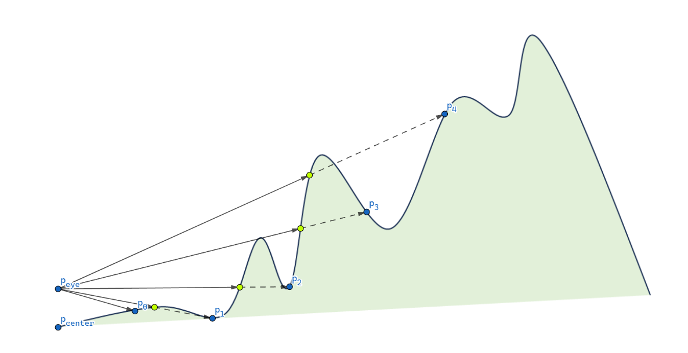

# Motivation

[The recent post](../FOVMapping1) introduced two popular techniques to simulate a field of vision and tracked the motivation and mechanism of FOV mapping as a high-performance way of achieving the same effect. The FOV mapping result demonstrated in the last section proves that it really works; it was not satisfactory, though. In this post, we will look into several methods to amend the flaws of FOV mapping.

Before proceeding to the following sections, let's have time for reviewing what naive FOV mapping looks like.

{: width="600"}{: .align-center} Field of vision featured with 90 512x512 layers
{: .text-center}


# Elaborations

## Interpolating Distances

The first problem is the boundaries are extremely coarse-grained, even with ninety 512x512 layers. The lines of sight lying on the borderlines are not polished either. A player will not be able to distinguish a visible area from an invisible one due to the dizzy stair-shaped patterns. The result cannot be disappointing anymore, considering that the FOV map array occupies about a hundred megabytes of memory. We have to get rid of those artifacts one way or the other before applying FOV mapping to games. 

If you think that Gaussian blur will fix it, that's too rash. It certainly alleviates aliasing. But what if you want a field of vision with sharp edges, just without those artifacts? Blurring effect Rather, we are ought to find out fundamental causes of the aliasing and fix it.

To identify whether a pixel, we have taken one directional distance into account. Depending only on a single directional information leads to the discontinuity between angular ranges like shown in the following figure(used an FOV map with 30 256x256 layers for clarity).

 {: width="600"}{: .align-center} Aliasing appearing on the edge of an obstacle
{: .text-center}

The pixels covered by the red triangle are classified as visible as their distance to the agent is less than $D_{0}$, while the pixels covered by the green triangle are compared to $D_{0}$. The fog of war resulted from discrete angular ranges does not reflect the flat surface of the obstacle properly.

The solution is to apply **linear interpolation**. Actually, linear interpolation will work a little bit inaccurately here, since the relationship between the angle and distance is not linear. Nonetheless, it is cheap and effective and the error is negligible, so let's be happy with simple linear interpolation. Given an angle $\theta$ which belongs to an angular range $[\theta_{i}, \theta_{i + 1}]$, we can calculate interpolated distance $D$ at $\theta$, where $D_{i}$ is the distance to an obstacle sampled at $\theta_{i}$ and $D_{i + 1}$ is the one sampled at $\theta_{i + 1}$.
$$
D = \frac{D_{i} (\theta_{i + 1} - \theta) + D_{i + 1} (\theta - \theta_{i})}{\theta_{i + 1} - \theta_{i}}
$$
For each pixel that forms an angle $\theta$ with the agent, it is visible from the agent if its distance to the agent is less than $D$, and is invisible if its distance is greater than $D$. 

The implementation only involves a small modification of the pixel shader.

```c++
// Same as before
int channelIdx0 = directionIdx0 % CHANNELS_PER_TEXEL;
int channelIdx1 = directionIdx1 % CHANNELS_PER_TEXEL;

float distanceRatio0 = UNITY_SAMPLE_TEX2DARRAY(_FOVMap, float3(agentPosition.x / _ProjectorSizeX, agentPosition.z / _ProjectorSizeY, layerIdx0))[channelIdx0];
float distanceRatio1 = UNITY_SAMPLE_TEX2DARRAY(_FOVMap, float3(agentPosition.x / _ProjectorSizeX, agentPosition.z / _ProjectorSizeY, layerIdx1))[channelIdx1];

// Interpolation part
float interpolationFactor = directionFactor - directionIdx0; // Calculate an interpolation factor
float distanceRatio = distanceRatio0 * (1.0f - interpolationFactor) + distanceRatio1 * interpolationFactor; // Interpolate distances sampled from the FOV maps

// Compare distances - same as before
float distanceToObstacle = distanceRatio * _SamplingRange;
float agentAlphaFactor = (distanceToAgent > min(distanceToObstacle, agentSightRange));
```

There's no anything special, it's just a translation of the above interpolation expression into a shader code.

The revised version looks decent, although not perfect. We still have a long way to go.

{: width="600"}{: .align-center}

## Obstacle Offset

I've noticed that another issue with FOV mapping is that it tends to project a fog of war onto vertical surfaces of obstacles, which can be quite problematic. The surfaces flicker quickly as the agent moves, because the corresponding pixels are on borders and ambiguous(similar to the Z-fighting phenomenon). Moreover, isn't it weird that surfaces facing toward the agent are veiled?

The solution is to apply some **offset** when the shader compares a distance of a pixel to an agent and a distance sampled from an FOV map. This is achieved by slightly modifying the comparison part of the pixel shader.

``` c++
// Compare distances
float distanceToObstacle = distanceRatio * _SamplingRange;

float obstacleAlphaFactor = distanceToAgent >= distanceToObstacle + _LevelOffset; // Sight blocked by obstacles
float rangeAlphaFactor = distanceToAgent >= agentSightRange; // Sight limited by range
float angleAlphaFactor = agentSightAngleCosine >= dot(agentForward, direction); // Sight limited by angle

float agentAlphaFactor = max(max(obstacleAlphaFactor, rangeAlphaFactor), angleAlphaFactor); // Constrain vision
```

Let's test again with the offset set to 0.5. We can see the darkness on the frontal faces are gone.

{: width="600"}{: .align-center}

## Gaussian Blur Effect

Behind the sentence 'it is rash to consider Gaussian blur here' is that we will definitely cover it later. Now is the time for applying the Gaussian blur post-processing to the fog of war. Although it might be contradictory to what I said on [this section](#interpolating-distances), most RTS games have fog of wars be blurry to some extent.  Let's review the instances of Startcraft 2 and Company of Heroes 2 once more.

{: width="500"}{: .align-center}

{: width="500"}{: .align-center}

Adding a blurring effect to the fog of war during the post-processing stage is essential. This will enhance the gameplay experience and make it more immersive for the players than using .

I will not cover how Gaussian smoothing works in deep, as the focus is on how to plug it into our pipeline. If you are interested in its details, please refer to [1]. Instead, [2] introduced a very efficient and robust two-way Gaussian shader; convolving the texture with a horizontal kernel, and with a vertical kernel once more. 

The blurring step begins once the FOV mapping shader has rendered a field of vision on a `RenderTexture`. The `RenderTexture` passes through the Gaussian filter shader, resulting in a final `RenderTexture` that will be used by a `Projector`. To optimize performance, we opt to apply the filter multiple times instead of using a large kernel to achieve the desired effect. The `sigma` and `blurIterationCount` controls give you the ability to fine-tune the blurring effect of the fog of war during the post-processing stage.

```c#
RenderTexture backup = RenderTexture.active;
RenderTexture.active = FOWRenderTexture;
GL.Clear(true, true, Color.clear); // Clear FOWRenderTexture 
RenderTexture.active = backup;

Graphics.Blit(null, FOWRenderTexture, FOVMaterial); // Render FOV to FOWRenderTexture
FOWMaterial.SetTexture("_FOWTexture", FOWRenderTexture); // It will be projected using a Projector.

// Blur
RenderTexture temp = RenderTexture.GetTemporary(FOWRenderTexture.width, FOWRenderTexture.height, 0, FOWRenderTexture.format);
blurMaterial.SetFloat("_Sigma", sigma);

// Apply Gaussian blur shader multiple times
// Render to one another alternately
for (int i = 0; i < blurIterationCount; ++i)
{
    if (i % 2 == 0)
    {
        Graphics.Blit(FOWRenderTexture, temp, blurMaterial);
    }
    else
    {
        Graphics.Blit(temp, FOWRenderTexture, blurMaterial);
    }
}

// If the final result is in temp, copy the content to FOWRenderTexture
if (blurIterationCount % 2 != 0)
{
    Graphics.Blit(temp, FOWRenderTexture);
}

RenderTexture.ReleaseTemporary(temp);
```

It's time to take a look at the outcomes.

{: width="600"}{: .align-center} Sigma = 30, iteration count = 0
{: .text-center}

{: width="600"}{: .align-center} Sigma = 30, iteration count = 1
{: .text-center}

{: width="600"}{: .align-center} Sigma = 30, iteration count = 2
{: .text-center}

{: width="600"}{: .align-center} Sigma = 30, iteration count = 10
{: .text-center}

## Elevation-Adaptive Level Sampling

The outcomes of blurring effect looks good to me. It seems that we can now combine the FOV system into our project. Shall we try? 

Imagine you are dealing with a `Terrain` that features a lot of steep gradient. You decide to use FOV mapping and try to sample the level. You press the 'Create an FOV map' button and after waiting two or three minutes later, you finally get an FOV map array. You click the play button and encounter the result like this:

{: width="600"}{: .align-center} Huh...?
{: .text-center}

This is a terrible result. The sight is unexpectedly narrow as if the agent can't see the topography located higher than his eyes. And yes, he can't actually look up the level, considering our sampling method. To find out the cause, we have to go back to the sampling code again.

```c#
for (int directionIdx = 0; directionIdx < directionsPerSquare; ++directionIdx)
{
    float angleToward = directionIdx * anglePerDirection;

    float distanceRatio = 1.0f;
    RaycastHit hitObstacle;
    if (Physics.Raycast(centerPosition, DirectionFromAngle(angleToward), out hitObstacle, generationParam.samplingRange, generationParam.levelLayer)) // Sampling only on a horizontal plane!
    {
        distanceRatio = hitObstacle.distance / generationParam.samplingRange;
    }

    float distanceRatio = maxSight / generationParam.samplingRange;
```

If you scrutinize the code closely, you might notice that the rays are only projected onto the horizontal plane, precisely at the level of the agent's eye position. Shortly after the departure, a ray will collide with an elevation, restricting the sight toward that direction. By rotating joints, humans can freely look upward or downward to the extent their body flexibility allows. Thus, it is required that the sampling method reflect this own ability possessed by the mankind. 

After multiple attempts, I found multisampling for each direction to be the most suitable. Under the examination that one ray cannot represent the entire visibility toward a line of sight, we can conclude that multiple samples can reflect more various sight toward a direction. The noble way of sampling a direction consists of the following steps.

1. Determine `SAMPLES_PER_DIRECTION`; how many samples will be considered for a direction?
2. Find `SAMPLES_PER_DIRECTION` of sampling points placed right on the terrain.
3. For each sampling point, fire a ray from the center point to the sampling point.
4. The value indicating the direction is determined by the maximum value among the distances traveled by such rays.

​     {: width="600"}{: .align-center} The distance traveled by the ray aimed at $p_4$ as it is the longest one
{: .text-center}

```c#
// Level-sensitive sampling
float maxSight = 0.0f; // Maximum sight viewed from the center
Vector3 samplingDirection = DirectionFromAngle(angleToward);
float samplingInterval = generationParam.samplingRange / SAMPLES_PER_DIRECTION;
for (int sampleIdx = 0; sampleIdx < SAMPLES_PER_DIRECTION; ++sampleIdx) // Sample along the direction
{
    Vector3 aboveSamplingPosition = centerPosition + samplingInterval * (sampleIdx + 1) * samplingDirection + Vector3.up * MAX_HEIGHT;

    RaycastHit hitSamplingPoint;
    if (Physics.Raycast(aboveSamplingPosition, Vector3.down, out hitSamplingPoint, 2 * MAX_HEIGHT, generationParam.levelLayer)) // Sampling point exists
    {
        Vector3 samplingPosition = hitSamplingPoint.point;
        Vector3 samplingLine = samplingPosition - centerPosition;

        Vector3 projectedSamplingLine = Vector3.Project(samplingLine, Vector3.up);
        float rayAngle = Vector3.Angle(samplingLine, projectedSamplingLine) * Mathf.Deg2Rad;
        float rayDistance = generationParam.samplingRange / Mathf.Cos(rayAngle);

        RaycastHit hitBlocked;
        float blockedDistance = 0.0f; // How far did the ray travel until it hit an obstacle?
        if (Physics.Raycast(centerPosition, samplingLine, out hitBlocked, rayDistance, generationParam.levelLayer)) // Blocking level exists
        {
            Vector3 blockedPosition = hitBlocked.point;
            blockedPosition.y = centerPosition.y;
            blockedDistance = (blockedPosition - centerPosition).magnitude;
        }
        else // Open sight - max visibility
        {
            blockedDistance = generationParam.samplingRange;
        }

        if (blockedDistance > maxSight)
        {
            maxSight = blockedDistance;
        }
    }
    else // No sampling point - max visibility
    {
        maxSight = generationParam.samplingRange;
    }
}
float distanceRatio = maxSight / generationParam.samplingRange;
```

When assigning the new terrain-adaptive FOV map, the field of view is working correctly with the bumpy terrain.

{: width="600"}{: .align-center}

## Viewing Angle

**Viewing angle** is similar to the sight range in that it determines how much an agent can see. Instead, it determines to how much *angle* one can see. A scout infantryman may have a wide angle of sight, while a tank may have a very restricted sight so that it can only look forward.

The implementation is not complicated. We just replace an angle with a dot product, so that the pixel shader can make a judgment the visibility of a pixel less costly. The gist is that the following identity holds for the dot product of two unit vectors, where $\theta$ is the angle between them.
$$
v_1 \cdot v_2 = \cos\theta
$$
Bearing both sides of the identity in mind, the pipeline flows as following.

1. For each agent, transfer `transform.forward` and  `Mathf.Cos(agent.sightAngle * 0.5f * Mathf.Deg2Rad)` of  an `agent`, from `FOVManager` to `FOVMappingShader` as a uniform variable.
2. Let the vector directed to the unit's forward be $v_{forward}$ and `Mathf.Cos(agent.sightAngle * 0.5f * Mathf.Deg2Rad)` be $C$. To the agent, a pixel is
   1. visible if $\frac{p_{pixel} - p_{agent}}{|p_{pixel} - p_{agent}|} >= C$,
   2. invisible otherwise.
3. Of course, this visibility is aggregated for all agents to form an entire field of view.

Below shows the implementation and its consequences.

```c++
float obstacleAlphaFactor = distanceToAgent >= distanceToObstacle + _LevelOffset; // Sight blocked by obstacles
float rangeAlphaFactor = distanceToAgent >= agentSightRange; // Sight limited by range
float angleAlphaFactor = agentSightAngleCosine >= dot(agentForward, direction); // Sight limited by angle

float agentAlphaFactor = max(max(obstacleAlphaFactor, rangeAlphaFactor), angleAlphaFactor); // Constrain vision
```

{: width="600"}{: .align-center} Viewing angle = 120 degrees
{: .text-center}

{: width="600"}{: .align-center} Viewing angle = 240 degrees
{: .text-center}

# Conclusion

The long journey of constructing FOV mapping has been finished, and it's time for an evaluation. Our aim is at whether we have achieved our initial goal; high-performance field of view backed by a massive crowd. 

# References

[1] https://en.wikipedia.org/wiki/Gaussian_blur

[2] https://github.com/remibodin/Unity3D-Blur/tree/master/UnityProject/Assets/Blur/GaussianBlur