# Motivation

[The recent post](../FOVMapping1) introduced two popular techniques to simulate a field of vision and tracked the motivation and mechanism of FOV mapping as a high-performance way of achieving the same effect. The FOV mapping result demonstrated in the last section proves that it really works; it was not satisfactory, though. In this post, we will look into several methods to amend the flaws of FOV mapping.

Before proceeding to the following sections, let's have time for reviewing what naive FOV mapping looks like.

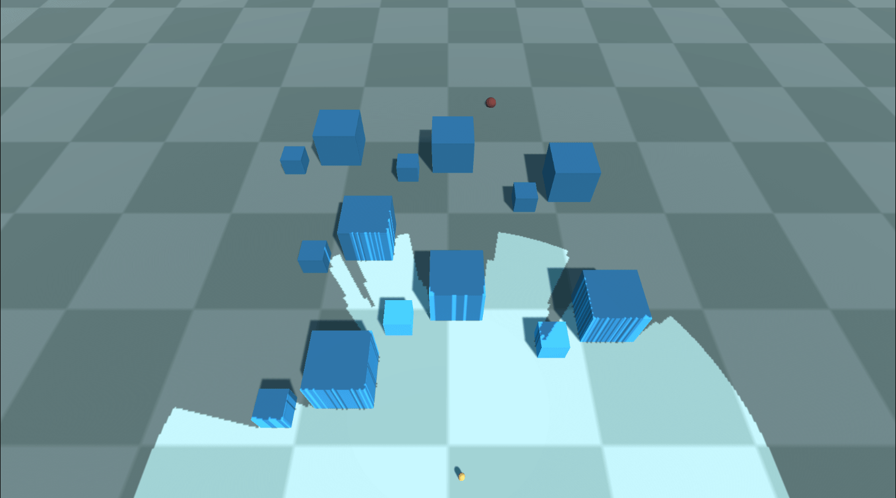{: width="600"}{: .align-center} Field of vision featured with 90 512x512 layers
{: .text-center}


# Elaborations

## Interpolating Distances

The first problem is the boundaries are quite coarse-grained, even with ninety 512x512 layers. The lines of sight lying on the borderlines are not polished either. A player will not be able to distinguish a visible area from an invisible one due to the dizzy stair-shaped patterns. The result cannot be more disappointing, considering that the FOV map array occupies about a hundred megabytes of memory. We have to get rid of those artifacts one way or the other before applying FOV mapping to games. 

If you think that Gaussian blur will fix it, that's too rash. Yes, it certainly alleviates aliasing. But what if you want a field of vision with sharp edges, just without those artifacts? Blurring effect Rather, we ought to find out the fundamental causes of the aliasing and fix it.

To identify whether a pixel, we have taken one directional distance into account. Depending only on a single directional information leads to the discontinuity between angular ranges shown in the following figure(used an FOV map with 30 256x256 layers for clarity).

 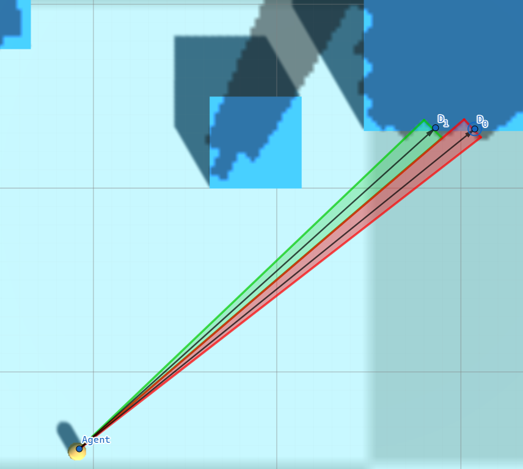{: width="600"}{: .align-center} Aliasing appearing on the edge of an obstacle
{: .text-center}

The pixels covered by the red triangle are classified as visible as their distance to the agent is less than $D_{0}$, while the pixels covered by the green triangle are compared to $D_{0}$. The fog of war resulting from discrete angular ranges does not reflect the flat surface of the obstacle properly.

The solution is to apply **Linear Interpolation**. Actually, linear interpolation will work slightly inaccurately here since the relationship between the angle and distance is not linear. Nonetheless, it is cheap and effective and the error is negligible, so let's be satisfied with simple linear interpolation. Given an angle $\theta$, which belongs to an angular range $[\theta_{i}, \theta_{i + 1}]$, we can calculate interpolated distance $D$ at $\theta$, where $D_{i}$ is the distance to an obstacle sampled at $\theta_{i}$ and $D_{i + 1}$ is the one sampled at $\theta_{i + 1}$.

$$
D = \frac{D_{i} (\theta_{i + 1} - \theta) + D_{i + 1} (\theta - \theta_{i})}{\theta_{i + 1} - \theta_{i}}
$$

For each pixel that forms an angle $\theta$ with the agent, it is visible from the agent if its distance to the agent is less than $D$ and is invisible if its distance is greater than $D$. 

The implementation only involves a minor modification of the pixel shader.

```c++
// Same as before
int channelIdx0 = directionIdx0 % CHANNELS_PER_TEXEL;
int channelIdx1 = directionIdx1 % CHANNELS_PER_TEXEL;

float distanceRatio0 = UNITY_SAMPLE_TEX2DARRAY(_FOVMap, float3(agentPosition.x / _ProjectorSizeX, agentPosition.z / _ProjectorSizeY, layerIdx0))[channelIdx0];
float distanceRatio1 = UNITY_SAMPLE_TEX2DARRAY(_FOVMap, float3(agentPosition.x / _ProjectorSizeX, agentPosition.z / _ProjectorSizeY, layerIdx1))[channelIdx1];

// Interpolation
float interpolationFactor = directionFactor - directionIdx0; // Calculate an interpolation factor
float distanceRatio = distanceRatio0 * (1.0f - interpolationFactor) + distanceRatio1 * interpolationFactor; // Interpolate distances sampled from the FOV maps

// Compare distances - same as before
float distanceToObstacle = distanceRatio * _SamplingRange;
float agentAlphaFactor = (distanceToAgent > min(distanceToObstacle, agentSightRange));
```

There's nothing special. It's just a translation of the above interpolation expression into a shader code.

The revised version looks decent, although not perfect. We still have a long way to go.

{: width="600"}{: .align-center}

## Obstacle Offset

I've noticed that another issue with FOV mapping is that it tends to project a fog of war onto vertical surfaces of obstacles, which can be quite problematic. The surfaces flicker quickly as the agent moves because the corresponding pixels are on borders and ambiguous(similar to the Z-fighting phenomenon). Moreover, isn't it weird that surfaces facing toward the agent are veiled?

The solution is to apply some **Offset** when the shader compares a distance of a pixel to an agent and a distance sampled from an FOV map. It then has an effect of pushing the fog of war backward behind the surface. This is achieved by slightly modifying the comparison part of the pixel shader.

``` c++
// Compare distances
float distanceToObstacle = distanceRatio * _SamplingRange;

float obstacleAlphaFactor = distanceToAgent >= distanceToObstacle + _BlockOffset; // Sight blocked by obstacles
float rangeAlphaFactor = distanceToAgent >= agentSightRange; // Sight limited by range
float angleAlphaFactor = agentSightAngleCosine >= dot(agentForward, direction); // Sight limited by angle

float agentAlphaFactor = max(max(obstacleAlphaFactor, rangeAlphaFactor), angleAlphaFactor); // Constrain vision
```

Let's test again with the offset set to 0.5. We can see the darkness on the frontal faces are gone.

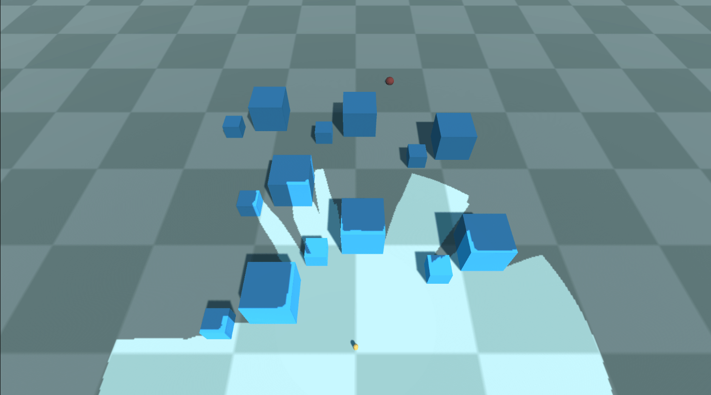{: width="600"}{: .align-center}

## Gaussian Blur Effect

Behind the sentence 'it is rash to consider Gaussian blur here' was that we will definitely cover it later. Now is the time to apply the Gaussian blur post-processing to the fog of war. Although it might be contradictory to what I said in [this section](#interpolating-distances), most RTS games have fog of wars blurry to some extent.  Let's review the instances of Starcraft 2 and Company of Heroes 2 once more.

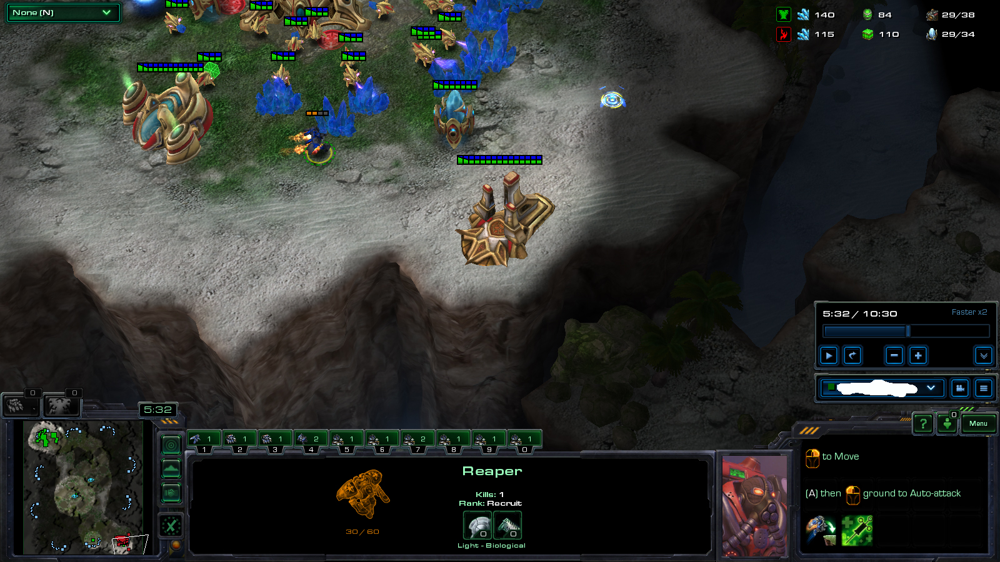{: width="500"}{: .align-center}

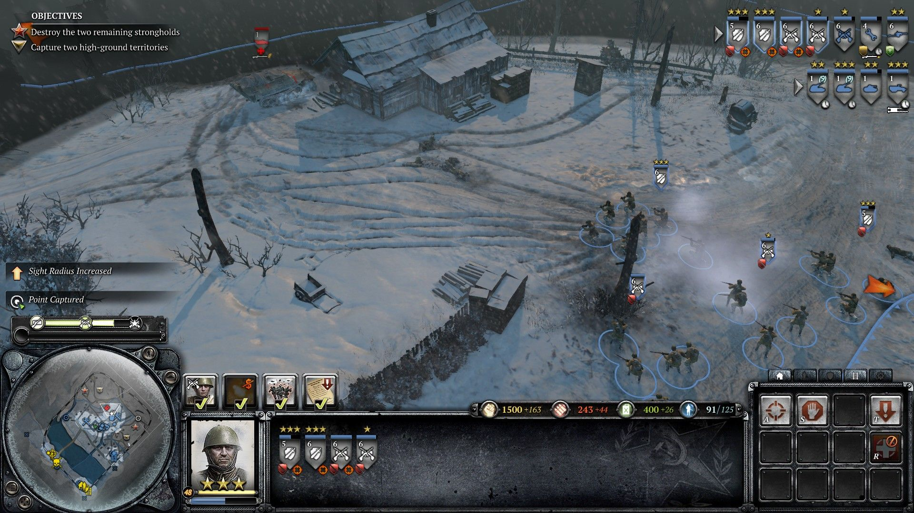{: width="500"}{: .align-center}

Adding a blurring effect to the fog of war during the post-processing stage is essential. This will enhance the gameplay experience and make it more immersive for the players.

I will not cover how Gaussian smoothing works in deep, as the focus is on how to plug it into our pipeline. If you are interested in its details, please refer to [1]. Instead, [2] introduced a very efficient and robust two-way Gaussian shader, convolving the texture with a horizontal kernel and a vertical kernel.

The blurring step begins once the FOV mapping shader has rendered a field of vision on a `RenderTexture`. The `RenderTexture` passes through the Gaussian filter shader, resulting in a final `RenderTexture` that a `Projector` will use. We apply the filter multiple times to optimize performance instead of using a large kernel to achieve the desired effect. `sigma` and `blurIterationCount` controls allow you to fine-tune the blurring effect of the fog of war during the post-processing stage.

```c#
RenderTexture backup = RenderTexture.active;
RenderTexture.active = FOWRenderTexture;
GL.Clear(true, true, Color.clear); // Clear FOWRenderTexture 
RenderTexture.active = backup;

Graphics.Blit(null, FOWRenderTexture, FOVMaterial); // Render FOV to FOWRenderTexture
FOWMaterial.SetTexture("_FOWTexture", FOWRenderTexture); // It will be projected using a Projector.

// Blur
RenderTexture temp = RenderTexture.GetTemporary(FOWRenderTexture.width, FOWRenderTexture.height, 0, FOWRenderTexture.format);
blurMaterial.SetFloat("_Sigma", sigma);

// Apply Gaussian blur shader multiple times
// Render to one another alternately
for (int i = 0; i < blurIterationCount; ++i)
{
    if (i % 2 == 0)
    {
        Graphics.Blit(FOWRenderTexture, temp, blurMaterial);
    }
    else
    {
        Graphics.Blit(temp, FOWRenderTexture, blurMaterial);
    }
}

// If the final result is in temp, copy the content to FOWRenderTexture
if (blurIterationCount % 2 != 0)
{
    Graphics.Blit(temp, FOWRenderTexture);
}

RenderTexture.ReleaseTemporary(temp);
```

It's time to take a look at the outcomes.

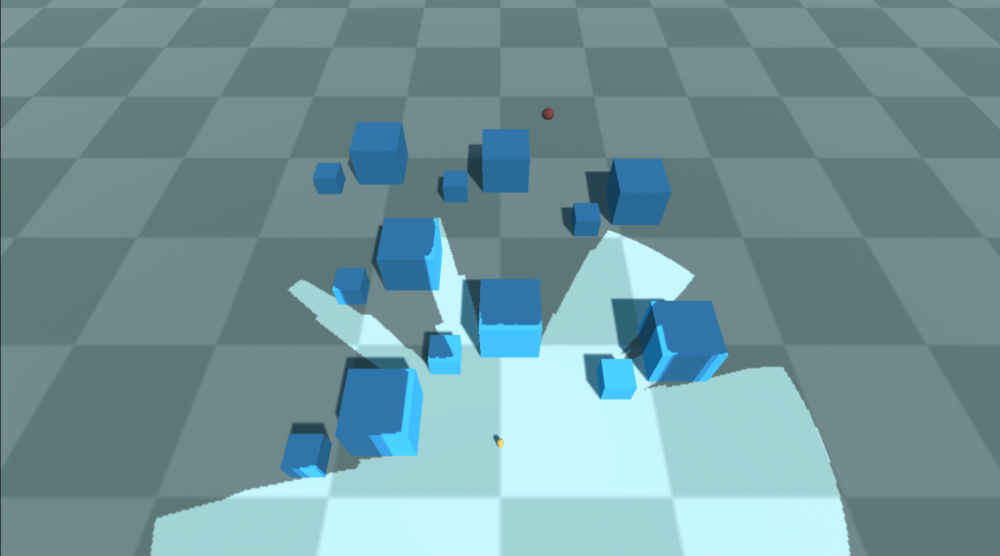{: width="600"}{: .align-center} Sigma = 30, iteration count = 0
{: .text-center}

{: width="600"}{: .align-center} Sigma = 30, iteration count = 1
{: .text-center}

{: width="600"}{: .align-center} Sigma = 30, iteration count = 2
{: .text-center}

{: width="600"}{: .align-center} Sigma = 30, iteration count = 10
{: .text-center}

## Elevation-Adaptive Level Sampling

The outcomes of the blurring effect look good to me. It seems that we can now combine the FOV system into our project, shall we?

Imagine you are dealing with a Terrain that features a lot of steep gradients. You decide to use FOV mapping and try to sample the level. You press the 'Create an FOV map' button, and after waiting two or three minutes later, you finally get an FOV map array. You click the play button and encounter the result like this:

{: width="600"}{: .align-center} Huh...?
{: .text-center}

This is a terrible result. The sight is unexpectedly narrow, as if the agent can't see the topography located higher than his eyes. And yes, he can't actually look up the level, considering our sampling method. To find out the exact cause, we have to go back to the sampling code again.

```c#
for (int directionIdx = 0; directionIdx < directionsPerSquare; ++directionIdx)
{
    float angleToward = directionIdx * anglePerDirection;

    float distanceRatio = 1.0f;
    RaycastHit hitObstacle;
    if (Physics.Raycast(centerPosition, DirectionFromAngle(angleToward), out hitObstacle, generationInfo.samplingRange, generationInfo.levelLayer)) // Sampling only on a horizontal plane!
    {
        distanceRatio = hitObstacle.distance / generationInfo.samplingRange;
    }

    float distanceRatio = maxSight / generationInfo.samplingRange;
```

If you scrutinize the code closely, you might notice that the rays are only projected onto the horizontal plane, precisely at the level of the agent's eye position. Shortly after the departure, a ray will collide with an elevation, restricting the sight toward that direction. By rotating joints, humans can freely look upward or downward to the extent their body flexibility allows. Thus, it is required that the sampling method reflect this own ability possessed by mankind. 

After multiple attempts, I found multisampling for each direction to be the most suitable. Under the examination that one ray cannot represent the entire visibility toward a line of sight, we can conclude that multiple samples are capable of reflecting more various sights toward a direction. The noble way of sampling a direction consists of the following steps.

1. Determine `generationInfo.samplesPerDirection`(how many samples will be considered for a direction?) and `generationInfo.samplingAngle`(for which vertical angle the samples will be fired?)
2. Cast `generationInfo.samplesPerDirection` rays into `generationInfo.samplingAngle` angular range.
3. The value indicating the direction is determined by the maximum value among the distances traveled by such rays.
4. If the surface is standing (almost) vertically and extends above a predetermined line of sight, we judge that it is blocking the entire sight of that direction.

```c#
// Level-adaptive multisampling
float maxSight = 0.0f; // Maximum sight viewed from the center
Vector3 samplingDirection = DirectionFromAngle(angleToward);
float samplingInterval = generationInfo.samplingRange / generationInfo.samplesPerDirection;
for (int samplingIdx = 0; samplingIdx < generationInfo.samplesPerDirection; ++samplingIdx) // Sample toward directions
{
    float samplingAngle = -generationInfo.samplingAngle / 2.0f + samplingIdx * generationInfo.samplingAngle / generationInfo.samplesPerDirection;

    Vector3 samplingLine = samplingDirection;
    samplingLine.y = samplingLine.magnitude * Mathf.Tan(samplingAngle * Mathf.Deg2Rad);

    // Update max sight
    RaycastHit hitBlocked;
    if (Physics.Raycast(centerPosition, samplingLine, out hitBlocked, RAY_DISTANCE, generationInfo.levelLayer)) // Blocking level exists
    {
        Vector3 blockedPosition = hitBlocked.point;

        blockedPosition.y = centerPosition.y; // Align to the same height as centerPosition
        float blockedDistance = (blockedPosition - centerPosition).magnitude;

        // Update maxDistance
        if (blockedDistance > maxSight)
        {
            maxSight = Mathf.Clamp(blockedDistance, 0.0f, generationInfo.samplingRange);
        }

        // If the surface is almost vertical and high enough, stop sampling here
        if (Vector3.Angle(hitBlocked.normal, Vector3.up) >= generationInfo.blockingSurfaceAngleThreshold && samplingAngle >= generationInfo.blockedRayAngleThreshold)
        {
            break;
        }
    }
    else if (samplingIdx <= (generationInfo.samplesPerDirection + 2 - 1) / 2) // Maximum sight only below the eye level
    {
        maxSight = generationInfo.samplingRange;
    }
}
float distanceRatio = maxSight == 0.0f ? 1.0f : maxSight / generationInfo.samplingRange;
```

{: width="600"}{: .align-center}

When the new terrain-adaptive FOV map is applied, the field of view projects on slopes. One problem is that the boundary of the FOV extremely jagged. This is an aliasing resulted from the low sampling count toward a direction. The aliasing can be alleviated by increasing `generationInfo.samplesPerDirection`, but the generation time will increase by a significant amount as well.

[2] provides us with **the edge binary search method**, with which we may amend this problem while restricting the extra generation time. The binary search method is likely to be best explained with an example below. The maximum iteration count for binary search is set to 4.

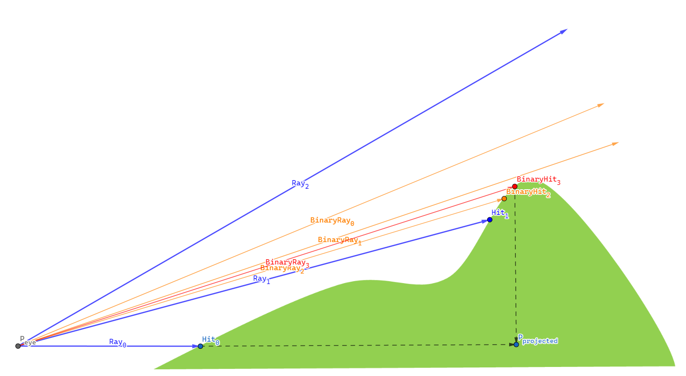{: .align-center}

1. As a normal process of elevation-adaptive level sampling, we fire multiple rays sequentially for a direction at a sampling position - $Ray_{0}$, $Ray_{1}$, $Ray_{2}$.
2. $Ray_{1}$ hits a point located on the level, while $Ray_{2}$ doesn't. This implies that somewhere between the two rays, there is a *point in a silhouette of the terrain*. We must locate this silhouette point, as utilizing the projected distance to this silhouette results in our system producing the most plausible field of view.
3. To find the silhouette point, we stop sampling and start a binary search.
   1. Cast $BinaryRay_{0}$ at the (angular) halfway of $Ray_{1}$ and $Ray_{2}$. It misses the level so we search the lower half divided by $BinaryRay_{0}$.
   2. Cast $BinaryRay_{1}$ at the halfway of $Ray_{1}$ and $BinaryRay_{0}$. It misses the level so we search the lower half divided by $BinaryRay_{1}$.
   3. Cast $BinaryRay_{2}$ at the halfway of $Ray_{1}$ and $BinaryRay_{1}$. This time, $BinaryRay_{2}$ hits the level, so we search the upper half divided by $BinaryRay_{2}$.
   4. Cast $BinaryRay_{3}$ at the halfway of $BinaryRay_{2}$ and $BinarRay_{1}$. We have reached the maximum iteration count of four, so we stop the binary search here.
4. $BinaryRay_{3}$ encounters terrain obstruction at $BinaryHit_{3}$. This hit point, $BinaryHit_{3}$, is then projected onto the X-Z plane, aligning with the elevation of $P_{eye}$, giving rise to $P_{projected}$. The distance $\| P_{projected} - P_{eye} \|$ represents the farthest visual extent in that direction.

The following block translates the aforementioned steps into code.

```c++
else if (obstacleHit) // Previous ray hit an obstacle, but this one hasn't
{
    // Binary search to find an edge
    float angularInterval = anglePerSample / 2.0f;
    float searchingAngle = samplingAngle - angularInterval;
    for (int i = 0; i < generationInfo.binarySearchCount; ++i)
    {
        angularInterval /= 2.0f;

        Vector3 searchingLine = samplingDirection;
        searchingLine.y = searchingLine.magnitude * Mathf.Tan(searchingAngle * Mathf.Deg2Rad);

        RaycastHit hitSearched;
        if (Physics.Raycast(centerPosition, searchingLine, out hitSearched, RAY_DISTANCE, generationInfo.levelLayer))
        {
            searchingAngle = searchingAngle + angularInterval; // Next range is the upper half

            // Update maxSight
            float searchedDistance = XZDistance(centerPosition, hitSearched.point);
            if (searchedDistance >= maxSight)
            {
                maxSight = Mathf.Clamp(searchedDistance, 0.0f, generationInfo.samplingRange);
            }
        }
        else
        {
            searchingAngle = searchingAngle - angularInterval; // Next range is the lower half
        }
    }

    break;
}
```

The application of binary search significantly improves the field of view, particularly when the agent is stepping on slopes as demonstrated below.

{: width="600"}{: .align-center}

## Viewing Angle

**The Viewing Angle** is similar to the sight range in that it determines how much an agent can see. Instead, it controls how much *angle* one can see. A scout infantryman may have a wide angle of sight, while a tank may have a very restricted sight so that it can only look forward.

The implementation is simple. We just replace an angle with a dot product so that the pixel shader can make a judgment of the visibility of a pixel less costly. The gist is that the following identity holds for the dot product of two unit vectors, where $\theta$ is the angle between them.

$$
v_1 \cdot v_2 = \cos\theta
$$

Bearing both sides of the identity in mind, the pipeline flows as following.

1. For each agent, transfer `transform.forward` and  `Mathf.Cos(agent.sightAngle * 0.5f * Mathf.Deg2Rad)` of  an `agent`, from `FOVManager` to `FOVMappingShader` as a uniform variable.
2. Let the vector directed to the unit's forward be $v_{forward}$ and `Mathf.Cos(agent.sightAngle * 0.5f * Mathf.Deg2Rad)` be $C$. To the agent, a pixel is
   1. visible if $\frac{(p_{pixel} - p_{agent}) }{ \| p_{pixel} - p_{agent} \|} >= C$,
   2. invisible otherwise.
3. Of course, this visibility is aggregated for all agents to form an entire field of view.

Below is the implementation and its consequences.

```c++
float obstacleAlphaFactor = distanceToAgent >= distanceToObstacle + _BlockOffset; // Sight blocked by obstacles
float rangeAlphaFactor = distanceToAgent >= agentSightRange; // Sight limited by range
float angleAlphaFactor = agentSightAngleCosine >= dot(agentForward, direction); // Sight limited by angle

float agentAlphaFactor = max(max(obstacleAlphaFactor, rangeAlphaFactor), angleAlphaFactor); // Constrain vision
```

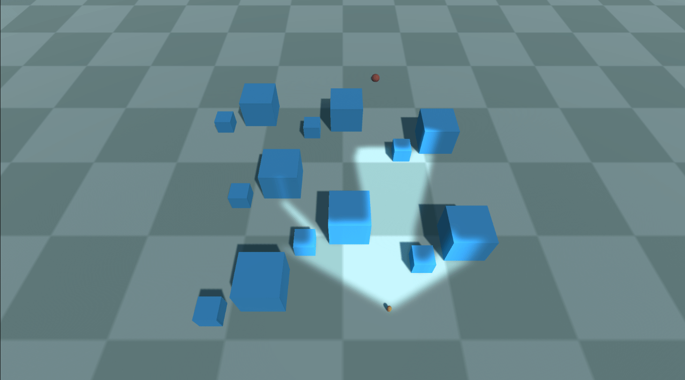{: width="600"}{: .align-center} Viewing angle = 120 degrees
{: .text-center}

{: width="600"}{: .align-center} Viewing angle = 240 degrees
{: .text-center}

## Enemy Visibility

The primary purpose of a fog of war is to veil the status of opposite forces so that each player behaves strategically with a limited amount of information. With the implementations so far, the `Projector` only 'projects' a fog of war onto the enemies' mesh but does not hide the enemies themselves.

The problem is that the `RenderTexture` projected with the `Projector` resides on the GPU, which makes it challenging to handle the FOV information. Bearing this in mind, we may come up with some choices to conceal the enemy units located beyond our sight.

1.  **Stencil shader [4]**: This is a very cheap and visually outstanding way, as it depends entirely on the shader features. However, it merely *masks* enemy units from the viewport, and they are actually not culled from the CPU side. Whenever a player inadvertently clicks an enemy unit hiding in a fog of war, the input must be neglected as if there was no enemy at all. To achieve this, we have to know the visibility on the CPU side. Unfortunately, the stencil shader cannot complete this mission.
1.   **Fetching `RenderTexture` into the CPU**: Then sample the retrieved texture with UV coordinates corresponding to agents' positions. If the sampled texel has a higher alpha value than some threshold, it is judged to be invisible; otherwise, it stays visible. This one is the way to go. I will explain how I optimized the fetching process.
1.  **Calculating on the CPU side**: Otherwise, since reading data from the GPU is costly, we could contemplate doing all the calculations on the CPU side. To achieve this, we have to have another set of the FOV map array on system memory.

The most widely used approach to bring a `RenderTexture` into the CPU is `Texture2D.ReadPixels`. We need not load the entire texture. Instead, we can fetch the texels that correspond to the agents' positions, and this will save us from the bottleneck and stalling of the main thread. Also, since the hostile agents outside the camera's viewport are invisible anyway, we leave them out when finding game objects hidden in the fog of war.  

```c#
// Set visibility of agents according to the current FOV
void SetAgentVisibility()
{
    RenderTexture backup = RenderTexture.active;
    RenderTexture.active = FOWRenderTexture;

    // Agent visibility
    for (int i = 0; i < FOVAgents.Count; i++)
    {
        FOVAgent agent = FOVAgents[i];
        if (agent.disappearInFOW)
        {
            Vector3 agentPosition = agent.transform.position;

            // Process agents inside the camera viewport only
            Vector3 viewportPosition = Camera.main.WorldToViewportPoint(agentPosition);
            if (viewportPosition.x < 0.0f || viewportPosition.x > 1.0f && viewportPosition.y < 0.0f || viewportPosition.y > 1.0f || viewportPosition.z <= 0.0f)
            {
                continue;
            }

            // Convert the agent position to a Projector UV coordinate
            Vector2 agentLocalPosition = FOWProjector.transform.InverseTransformPoint(agentPosition);
            agentLocalPosition.x /= FOWProjector.orthographicSize * FOWProjector.aspectRatio; // Remap to [-1, 1]
            agentLocalPosition.y /= FOWProjector.orthographicSize; // Remap to [-1, 1]
            agentLocalPosition = agentLocalPosition / 2.0f + 0.5f * Vector2.one; // [-1, 1] -> [0, 1]
            Vector2 agentUV = FOWTextureSize * agentLocalPosition;

            // Transfer the RenderTexture from the GPU to the CPU
            FOWTexture2D.ReadPixels(new Rect(agentUV.x, FOWRenderTexture.height - agentUV.y, 1, 1), 0, 0, false);

            // Set visibility
            bool isInSight = FOWTexture2D.GetPixel(0, 0).a <= agent.disappearAlphaThreshold;
            agent.SetVisible(isInSight);
        }
    }

    RenderTexture.active = backup;
}
```

When it comes to reading pixels, one issue with the `ReadPixels` function is that it can only retrieve pixels within a rectangular range. If we are to use `ReadPixels`, we can't help but fetch one pixel at once, otherwise, we have to use a large `Rect` to cover enemies widely spread across the map.

One possible suggestion to improve the efficiency of cherry-picking multiple pixels at once from the entire texture rect is to use the **Compute Shader [5]**. 

1. A script gathers UV coordinates corresponding to the enemy agents.
2. The script transfers them to the compute shader.
3. The compute shader samples `RenderTexture` with the coordinates on the GPU and collect them in a buffer.
4. The CPU reads this buffer to get the intended pixels for all the enemy agents finally.

```c#
// Set visibility of agents according to the current FOV
void SetAgentVisibility()
{
    List<FOVAgent> targetAgents = new List<FOVAgent>();
    List<Vector4> targetAgentUVs = new List<Vector4>();

    for (int i = 0; i < FOVAgents.Count; i++)
    {
        FOVAgent agent = FOVAgents[i];
        if (agent.disappearInFOW)
        {
            Vector3 agentPosition = agent.transform.position;

            // Process agents inside the camera viewport only
            Vector3 viewportPosition = Camera.main.WorldToViewportPoint(agentPosition);
            if (viewportPosition.x < 0.0f || viewportPosition.x > 1.0f && viewportPosition.y < 0.0f || viewportPosition.y > 1.0f || viewportPosition.z <= 0.0f)
            {
                continue;
            }

            // Convert the agent position to a Projector UV coordinate
            Vector2 agentLocalPosition = FOWProjector.transform.InverseTransformPoint(agentPosition);
            agentLocalPosition.x /= FOWProjector.orthographicSize * FOWProjector.aspectRatio; // Remap to [-1, 1]
            agentLocalPosition.y /= FOWProjector.orthographicSize; // Remap to [-1, 1]
            agentLocalPosition = agentLocalPosition / 2.0f + 0.5f * Vector2.one; // [-1, 1] -> [0, 1]
            Vector2 agentUV = FOWTextureSize * agentLocalPosition;

            targetAgents.Add(agent);
            targetAgentUVs.Add(agentUV);
        }
    }

    // Use the compute shader to retrieve pixel data from the GPU to CPU
    pixelReader.SetInt("targetAgentCount", targetAgents.Count);
    pixelReader.SetVectorArray("targetAgentUVs", targetAgentUVs.ToArray());

    pixelReader.Dispatch(kernelID, 1, 1, 1);

    float[] outputAlphaArray = new float[MAX_ENEMY_AGENT_COUNT];
    outputAlphaBuffer.GetData(outputAlphaArray);

    // Set visibility
    for (int i = 0; i < targetAgents.Count; ++i) 
    {
        FOVAgent agent = targetAgents[i];

        bool isInSight = outputAlphaArray[i] <= agent.disappearAlphaThreshold;
        agent.SetVisible(isInSight);
    }
}
```

```c++
#pragma kernel ReadPixels

Texture2D<float4> inputTexture; // Input texture

#define MAX_ENEMY_AGENT_COUNT 128
int targetAgentCount;
float4 targetAgentUVs[MAX_ENEMY_AGENT_COUNT];

#pragma bind_buffer(name: outputBuffer, binding: 0)
RWStructuredBuffer<float> outputBuffer; // Output buffer

[numthreads(1, 1, 1)]
void ReadPixels(uint3 id : SV_DispatchThreadID)
{
	for (int i = 0; i < targetAgentCount; ++i)
	{
		float4 color = inputTexture.Load(int3(targetAgentUVs[i].x, targetAgentUVs[i].y, 0));
		outputBuffer[i] = color.a;
	}
}
```

The CPU issues a single request to identify the visibility of enemy units simultaneously, contrary to `ReadPixels` case where the script had to call `ReadPixels` for each enemy unit. The table below demonstrates framerates as the number of enemy units increases by two times each. The results shows the evident superiority of compute shader over `ReadPixels`, especially when there are a large number of subjects.   

| Enemy Count | `ReadPixels` | Compute Shader |
| :---------: | :----------: | :------------: |
|      1      |  1623.8 FPS  |   1648.7 FPS   |
|      2      |  1563.2 FPS  |   1613.6 FPS   |
|      4      |  1356.3 FPS  |   1564.8 FPS   |
|      8      |  1287.6 FPS  |   1568.2 FPS   |
|     16      |  1035.7 FPS  |   1557.9 FPS   |
|     32      |  759.4 FPS   |   1553.1 FPS   |
|     64      |  481.6 FPS   |   1537.9 FPS   |

Setting `contributeToFOV` property to `true` for friendly agents and `disappearInFOW` to `true` for hostile agents, I got the following result.

{: width="600"}{: .align-center}

# Simulating Projector
## Why is `Projector` Unsuitable?

Instantaneously, I found out that using the built-in  Projector will greatly constrain the applicability of FOV mapping due to its inherent problems.

1. **`Projector` increases the number of draw calls** - Any objects inside the boundary of a `Projector` are redrawn. If the `Projector` touches a tiny portion of the level, it will just increase the draw call count by less than 10. However, our fog of war encompasses the entire map, and the `Projector` for the fog of war will end up doubling the total draw call count, deteriorating the performance even more. 
2. **`Projector` does not cast its texture images upon terrains with 'draw instanced' enabled** - Well, we could accept the doubling-up of the draw call count, although it is a little bit pessimistic. What makes it even worse is the long-running bug of Unity; a `Projector` never works with your 'instanced terrain' [6]. When you use 'draw instanced', each terrain patch is combined into a single mesh and instanced by the GPU, which results in an enormous saving of draw call count.  Uncovering this option and using the `Projector` will present you with an unendurable pain and a skyrocketing draw call count..      

So, a new method to replace `Projector` component was desperately required.

## Simulating `Projector`

### Basic Idea - Parallax Mapping

We once looked into [**Parallax Mapping**](../2023-03-19-ParallaxMapping.md), with which the surface can made look more 'extruded' than when normal mapping is used solely. Parallax mapping aims to shift texture coordinates according to the height of each point on a surface. All details behind it aside, below demonstrates the gist of parallax mapping.

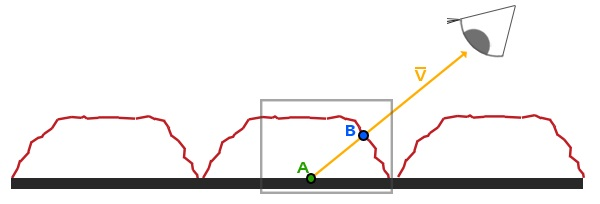{: width="600"}{: .align-center}

1. The shader is processing the thick, black surface.
2. If parallax mapping didn't apply, the texture would be sampled at A.
3. We know that the correct texture coordinates, considering the bump of the surface, is B. The way to go is crystal clear; find B **one way or the other** and sample the texture there.

Unlike the Unity built-in `Projector` component that gets into the rendering pipeline and redraws lit meshes, the simulated (fog of war) projector adopts the idea of parallax mapping. The only difference is the **one way or the other** part. In the [parallax mapping post](2023-03-19-ParallaxMapping.md), we were only able to approximate the location of $B$ with a height map and a normal map. This time, we will acquire the precise shifted texture coordinates using depth information from the camera.

### Rendering the Depth Buffer into a Texture

Unity `Camera` can render the depth buffer into a texture, which the shader can hire to implement diverse effects.

To acquire a depth texture from the main camera, you have to enable it in your C# script.

```c#
private void OnEnable()
{
    Camera.main.depthTextureMode = DepthTextureMode.Depth;
}
```

Afterward, you can access the depth texture in the shader through the built-in `_CameraDepthTexture` uniform variable and supporting functions.

``` c++
...
uniform sampler2D _CameraDepthTexture;
...
// Linear01Depth adjusts the depth value into the range [0, 1]
float depth = Linear01Depth(UNITY_SAMPLE_DEPTH(tex2Dproj(_CameraDepthTexture, UNITY_PROJ_COORD(i.screenPos))));
```

For more details, you may refer to the [Unity reference about a camera and depth textures](https://docs.unity3d.com/Manual/SL-CameraDepthTexture.html) [8]. With the rendering depth texture feature enabled and after multiplying by an adjustment value to enhance contrast, I got the following result: pixels close to the camera are darker, while distant pixels are shaded bright.

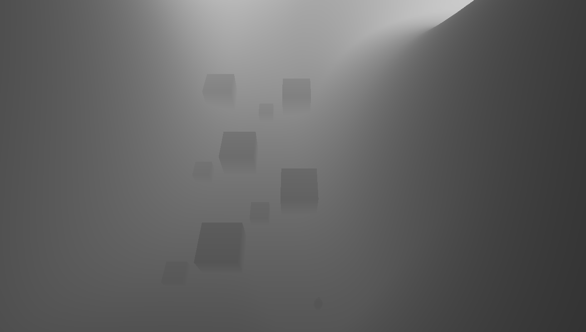{: width="600"}{: .align-center} Depth texture captured by the main camera
{: .text-center}

### Reconstructing a World Position from Depth

If we can acquire the world position corresponding to each pixel, finding the correct texture coordinates is extraordinarily simple; sample the texture right at the world position—no more complicated, sometimes inaccurate approximation. But we cannot derive the world position directly from the depth information; we ought to process the depth. This technique was offered by *bgolus* on a [post on Unity Forum](https://forum.unity.com/threads/reconstructing-world-space-position-from-depth-texture.1139599/) [9].

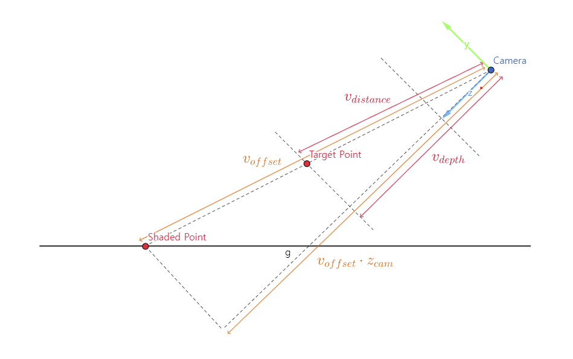{: width="600"}{: .align-center}

From the similarity between two triangles demonstrated in the figure above, we can derive and solve a proportional expression for $v_{distance}$. 
$$
v_{offset} : v_{offset} \cdot z_{cam} = v_{distance} : dz_{cam} \\
v_{distance} = \frac{dz_{cam}}{v_{offset} \cdot z_{cam}}
$$
Finally, we can find the world position by adding $v_{distance}$ to the world-space camera position.

### Shader

The shader code is a mere translation of the expression from the previous section.

```c++
// Vertex shader
v2f vert(appdata_full v)
{
    v2f o;

    o.pos = UnityObjectToClipPos(v.vertex);
    o.uv = v.texcoord;
    o.offsetToPlane = mul(unity_ObjectToWorld, float4(v.vertex.xyz, 1.0)).xyz - _WorldSpaceCameraPos; // Position relative to the camera of the shaded point on the plane (depth not considered)
    o.screenPos = ComputeScreenPos(o.pos);

    return o;
}

// Find the world position, this time with the depth considered.
float3 GetWorldPosFromDepth(v2f i)
{
    // Get the depth value from the camera (note that this is not the distance traveled by the ray)
    float depth = LinearEyeDepth(UNITY_SAMPLE_DEPTH(tex2Dproj(_CameraDepthTexture, UNITY_PROJ_COORD(i.screenPos))));

    // We can derive the following proportional expression from the similarity of triangles.
    // offsetToPlane : dot(offsetToPlane, camNormal) = offsetToPos : depth * camNormal
    // Solve this for offsetToPos.
    float3 offsetToPos = (depth * i.offsetToPlane.xyz) / dot(i.offsetToPlane.xyz, unity_WorldToCamera._m20_m21_m22);
    float3 worldPos = _WorldSpaceCameraPos + offsetToPos;

    return worldPos;
}

// Given a world position, convert it to UV coordinates projected upon the plane 
float2 WorldPosToPlaneUV(float3 targetPos, float3 planePos, float3 planeRight, float3 planeForward, float3 planeScale)
{
    float3 relativePos = targetPos - planePos;
    float u = dot(relativePos, planeRight) / planeScale.x;
    float v = dot(relativePos, planeForward) / planeScale.z;

    return float2(u, v);
}

float4 frag(v2f i) : SV_Target
{
    float3 pointPos = GetWorldPosFromDepth(i);
    float2 pointUV = WorldPosToPlaneUV(pointPos, _PlanePos, _PlaneRight, _PlaneForward, _PlaneScale);
    return tex2D(_MainTex, pointUV);
}
```

## Result

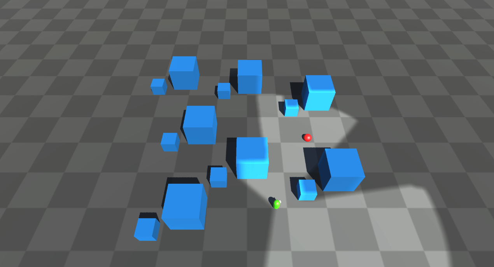{: width="600"}{: .align-center}

Our simulated projector performs as admirably as the built-in `Projector`, rendering images with such precision that it becomes nearly impossible to distinguish between the two. What sets my simulated projector apart is its efficiency in comparison to the standard `Projector`. Remarkably, it adds only one draw call count and significantly reduces the computational load without compromising on visual quality. On average, the draw call count is halved, resulting in a much leaner process that enhances overall performance. The 'depth-based parallax projector' approach successfully replaces the built-in `Projector` when it comes to visualizing the fog of war in our system.

# Conclusion

After months of dedicated efforts and countless hours of work, we have successfully completed the arduous and intricate task of constructing the Field of View (FOV) mapping. FOV mapping didn't work well initially. However, as a result of continuous revisions and elaborations, we were able to construct a reliable and adjustable field-of-view system.

At this moment, with the construction phase behind us, we eagerly look forward to the next post, where we will embark on an exciting new chapter - the evaluation of our FOV mapping system. This evaluation process will provide us with a valuable opportunity to thoroughly examine and analyze our system's performance and compatibility from a multitude of perspectives.

You may find the entire source code [here](https://github.com/StupaSoft/FOVMapping).

# References

[1] https://en.wikipedia.org/wiki/Gaussian_blur

[2] https://github.com/remibodin/Unity3D-Blur/tree/master/UnityProject/Assets/Blur/GaussianBlur

[3] https://www.youtube.com/watch?v=rQG9aUWarwE

[4] https://forum.unity.com/threads/use-a-projector-to-cull-pixels-with-alpha-transparency.533549/

[5] https://dev.to/alpenglow/unity-fast-pixel-reading-cbc

[6] https://discussions.unity.com/t/projector-stops-working-on-terrain-with-draw-instanced-enabled/218494

[7] https://blog.unity.com/kr/technology/2018-3-terrain-update-getting-started

[8] https://docs.unity3d.com/Manual/SL-CameraDepthTexture.html

[9] https://forum.unity.com/threads/reconstructing-world-space-position-from-depth-texture.1139599/