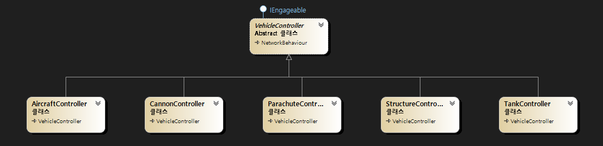
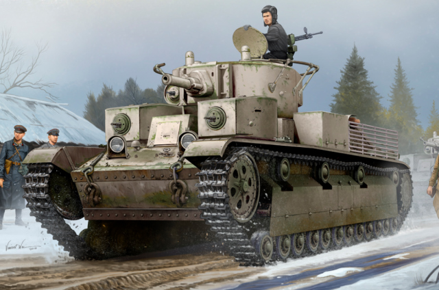
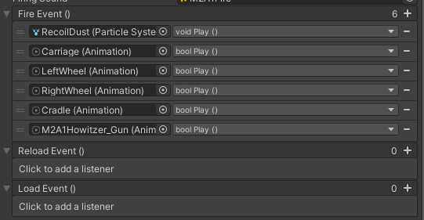

I have engaged mainly in *programming* from the beginning of the project. The fact that I am a professional software engineer is not the only reason contributing to the focus on programming; rather, it is attributed to my belief that programming is what actually determines how a game will look like. Programmers are not a mere materializers of specifications suggested by designers, but they rather actively determine the overall structure of games and can directly influence the players' gameplay experiences.

There is no panacea that can cover all the games with different genres and platforms. Peninsula is a real-time tactics with 3D, top-view and multiplayer system targeted for mobile. These characteristics have determined what the project code looks like today. Peninsula is being developed using Unity and C#, Mirror framework for mobile, and other libraries either purchased from Asset Store or crafted by my own.

As stated in the previous post, Peninsula is aiming for commercial success and is not a demo for showing off my skills. This philosophy is best demonstrated through the reasonings behind the code of the project. Basically, I have constructed the project following predetermined coding rules and practices. Moving one step further, the overall structures are also fine-tuned in order to enhance software maintainability and scalability. Although the codebase expanding beyond the average scale of a personal project, planning and following principles has facilitated continuous growth of the project.

This article introduces not only the overall structure of the game as a software, but also my beliefs and attitudes toward software engineering in general. Along with other posts introducing modules and techniques, you will be able to grasp which objectives Peninsula project has been striving to accomplish.

# Programming in Peninsula

## Development Environment

### Game Engine - *Unity*

Nowadays, there are numerous game engines with their own strengths, but leading engines occupying the market are Unity and Unreal. I opted for **Unity** over Unreal due to its suitability for an indie project. Compared to Unreal, Unity offers a simpler interface, a vast asset store, and a supportive community, streamlining development for a solo endeavor. Unreal's power is undeniable and overwhelming that of Unity when it comes to AAA projects. Nonetheless, Unity's ease of use and cost-effectiveness better suit the scale and resources of my indie venture.

I admit, the emphasis is solely focused on the easiness of carrying on the project by my own. But here is a lame excuse. Let's suppose that during the development process, I have just encountered a malfunctioning that figure out what the root cause of is impossible, or even diagnosing what the problem is hopeless. If I belonged to a large team and were cooperating with other programmers, it would be possible to ask them a solution and get some help from them. In this case, however, I am the only developer of this project so what I can do is to google the keywords, hoping for someone has asked the same question and another one has offered a relevant answer.

Unity boasts a large community where users with different backgrounds share their knowledge and debate about a variety of topics. [Unity Forum](https://forum.unity.com/) is a forum officially managed by Unity Technologies, where you may find an exactly the same solution to your issues, or post your own question if you end up finding no suitable one. Of course, Unreal has an analogous community named [Unreal Engine Forum](https://forums.unrealengine.com/?tag=unreal-engine) too, but due to the nature that large teams rarely share their know-how externally, the volume of accumulating information is unparalleled.

Aside from the accessibility to a large solutions pool, Unity offers another attractive point when it comes to its scripting language: C#.

### Programming Language - *C#*

C# is a general purpose high-level managed programming language designed by Microsoft. Some key features of C# is *Object-Oriented Programming (OOP)*, *static and strong typing*, *generic*, and *metaprogramming* [2]. 

The most siginificant principle supporting C# is *pragmatism*. Contrary to C++, a (relatively) low-lvel *unmanaged* language, which carries a bunch of heritages from ancient days, C# was designd from the ground,  thus accommodating diverse demands from users and being capable of polishing the language rapidly upto the current version of 11.0. As the version goes up, Microsoft has armed C# with handy features supported by powerful syntaxes such as LINQ (which stands for Language-INtegrated Query), generic programming, and lamda expression. Eventually, C# accomplished an *empire* of programming methodology where people from different nationality communicating with different native tongues.

Unity adopted **C#** (pronounced as see-sharp) for its scripting language exposed to game developers and C++ for its internal implementation. Unity has favored C# for its simplicity and the strength of JIT compile, and have been trying to maximize its functionality continuously through IL2CPP, DOTS, and many others. This turns out to be a reasonable strategy to boost productivity for game developers. Leveraging the strength of C# *Reflection*, Unity avoids boilerplate code appearing in Unreal that often leads to malfunctioning of Visual Studio Intellisense.    

 I have experienced several C++ projects, one of which was an AAA project with in-house engine (to be honest, it was not an engine, but just a stack of Win32 and DirectX 9). They were all full of macros and Python scripts for metaprogramming and suffered a long build time. If I could design my own game engine in the future, I would provide *future* C++ (compared to the *modern* C++) as a scripting language, only if it promises to be a programming language that can be directly used without significant amount of modification. If that is not the case, I would still opt to add a C# layer for scripting upon the C++ engine core.   

### Other Development Tools

- **Visual Studio** for Integrated Development Environment (IDE)
- **Git** for version control 
-  **GitHub** for Git hosting service
-  **RenderDoc** for debugging shaders
-  **Google Drive** for sharing resources

## How Peninsula is Programmed

### Combined battlefield 
As stated in the [previous post](2023-11-19-ProjectOverview1.md), project Peninsula seeks the **Combined Battlefield** in which various combat units compose a large-scaled warfare scene. Followings are those combat units.

- Infantry
- Vehicles
  - Tanks
  - Other ground vehicles 
  - Aircraft
  - Emplaced weapons (AA guns, howitzers, ...)

- Structure (bunker, building, ...)

As you can see, these group are different from each other in every aspect. As to mobility, for example, infantrymen run on their legs; tanks advance by looping their tracks ; fighters propels either by rotating their propellers or bursting jet engines. The matter gets even more complicated when interaction between different unit category is taken into account. What should happen if a tank dives into a crowd of infantry? Should tanks be able to run over soldiers? If it should, what about armored cars? 

It is no exaggeration that handling this complexity properly is the keystone to the successful development. From the perspective of OOP, it is a matter of grouping entities into classes, encapsulating and providing a common interface. As to the game architecture, it concerns segregating the code and the data. When it comes to the general programming concepts, applying right design patterns for right situations counts.         

### Data-Driven Programming

In computer programming, **Data-Driven Programming** is a programming paradigm in which the code describes the data to be matched and the processing required rather than defining a sequence of steps to be taken directly. Discussions on [4] explain what data driven programming is using pseudocode. Let's apply this to a real-time strategy to compare a non-data-driven version and a data-driven version.

The very first code block demonstrates a non-data-driven way of movement of a tank with `if` statements.

```python
if tank.name == "M26Pershing":
	speed = 30
else if tank.name == "M4Sherman":
	speed = 35
else if tank.name == "Tiger1":
	speed = 25
	
tank.Move(speed)
```

Someone might point out that this is ill-formed from the perspective of OOP, so polymorphism with overriden functions is the right way to go.

```python
speed = tank.GetSpeed()
tank.Move(speed)
...
class M26Pershing:
	function GetSpeed():
		return 30
		
class M4Sherman:
	function GetSpeed():
		return 35
		
class Tiger1:
	function GetSpeed():
		return 25
```

This solution follows the principle of OOP, but the side effect is that we have to add a new class to our project every time we extend the slot by one. Applying even more strict coding rule, we will have to segregate each class just for granting each tank a different speed.

We now come up with a better idea: storing speed data a key-value map (`Dictionary` in Python and C#, `std::unordered_map` in C++, ...)

```python
speedMap = {M26Pershing: 30, M4Sherman: 35, Tiger1: 25}
speed = speedMap[tank.name]
tank.Move(speed)
```

Yes! Adding a tank is done by modifying just `speedMap` and is much easier than before. However, we still need to recompile the entire code after the modification. Depending on the codebase's architecture, recompilation should not be overly time-consuming. However, it's essential to restart game, and this is critical when we want to modify and test the value simultaneously. Additionally, it is very likely that the modification is derived from a designer's intention. However, in this case, it is a programmer who actually changes the value. The workflow would be better if the one who wants to modify data and the one who fixes the data coincides. 

**Data-Driven Programming** addresses all the previously stated issues. In data-driven programming, the program logic only defines how a stage is executed. The actual control flow is described in, roughly speaking, a text file. The program logic is given an input file and carries out whatever written in the text. With data-driven programming, the code is relatively simple.

```python
speed = tank.ReadFromFile("speed")
tank.Move(speed)
```

Instead, the details are stored in a separate input file.

```
M26Pershing
	speed: 30
	...

M4Sherman
	speed: 35
	...

Tiger1
	speed: 25
	...
```

Peninsula stores data in JSON format. JSON format facilitates a highly organized structure with object and array. The syntax with key-value structure is readable and convenient to be edited in Microsoft Excel. Unity has a built-in utility to serialize and deserialize JSON format named `JsonUtility`.

The data for all tanks in Peninsula are stored in `` as below.

```json
...
{
    "name": "Tiger",
    "capacity": 5,
    "minimum": 4,
    "maxHealth": 2000,
    "frontArmor": 1.0,
    "rearArmor": 1.0,
    "turretProperties": 
    [
        {
            "horizontalAimSpeed": 10.0,
            "maxLeftAngle": 10.0,
            "maxRightAngle": 10.0,
            "verticalAimSpeed": 10.0,
            "maxUpAngle": 10.0,
            "maxDownAngle": 10.0
        }
    ],
    "moveForce": 50000.0,
    "turnTorque": 6.0
},
{
    "name": "M4A2_75mm",
    "capacity": 5,
    "minimum": 4,
    "turretProperties": 
    [
        {
            "horizontalAimSpeed": 10.0,
            "maxLeftAngle": 180.0,
            "maxRightAngle": 180.0,
            "verticalAimSpeed": 10.0,
            "maxUpAngle": 10.0,
            "maxDownAngle": 10.0
        }
    ],
    "moveForce": 50000.0,
    "turnTorque": 6.0
},
{
    "name": "M26Pershing",
    "capacity": 5,
    "minimum": 4,
    "maxHealth": 2000,
    "frontArmor": 1.0,
    "rearArmor": 1.0,
    "turretProperties": 
    [
        {
            "horizontalAimSpeed": 10.0,
            "maxLeftAngle": 10.0,
            "maxRightAngle": 10.0,
            "verticalAimSpeed": 10.0,
            "maxUpAngle": 10.0,
            "maxDownAngle": 10.0
        }
    ],
    "moveForce": 50000.0,
    "turnTorque": 6.0
},
...
```

This data is in turn deserialized into an instance of `Data` which is a thin wrapper of a list of instances of type `T`. `LoadJsonFile` loads a JSON file and returns an instance of type `Data<T>` converted from the content of the JSON file. 

```c#
public static Data<T> LoadJsonFile<T>(string path, string fileName)
{
    TextAsset jsonData = Resources.Load($"{path}/{fileName}") as TextAsset;
    Data<T> data = JsonUtility.FromJson<Data<T>>(jsonData.ToString());
    return data;
}
```

In this case, `T` is `TankProperty`, as we are loading data for tanks. `TankProperty` looks like this.

```c#
[Serializable]
public class VehicleProperty
{
	public string name;
	public int capacity;
	public int minimum;
	public float maxHealth;
	public float frontArmor;
	public float rearArmor;

	public TurretProperty[] turretProperties;

	public override string ToString()
	{
		return name;
	}
}

[Serializable]
public class TurretProperty
{
	// For the turret
	public float horizontalAimSpeed;
	public float maxLeftAngle;
	public float maxRightAngle;

	// For the gunshield;
	public float verticalAimSpeed;
	public float maxUpAngle;
	public float maxDownAngle;
}
```

Finally, `TankController` directly references these to determine the engine power of a tank.

```c#
rgdbody.AddRelativeForce(Vector3.forward * controlVector.y * tankProperty.moveForce);
```

### Designing `VehicleController` Class

Most game engines are recently empowered by *visual scripting system*. Unreal Blueprints provide an intuitive way for designers and artists to contribute to the game development process without requiring deep coding knowledge. The intention behind this is to make it easier for developers other than programmers to build a game logic, thus dividing fixed code and design-oriented behavior once again. 

Storing and loading data from a JSON file occupies only a very small portion of data-driven aspects of Peninsula. There are still a large portion of gameplay data that can't be presented in numbers: behaviors specific to each tank. Unity provides an *inspector* to which members can be serialized, allowing designers to control not just numerical values of components, but also behaviors through GUI! Let me explain the process of designing `VehicleController` class to make it clear what the interaction with the inspector looks like.

The first thing we have to consider is the class hierarchy of vehicles. The requirements are followings.

- Vehicles have many common characteristics; that's why they are categorized into 'vehicle'! Therefore, it sounds reasonable that we define a super class `VehicleController` and let specific kind of vehicle classes (tank, aircraft, ...) be derived from it.
- `VehicleController` must be an abstract class. That's because every vehicle in the reality falls into one of the concrete categories of vehicle, rather than existing as a pure notion of 'vehicle'.
- Finally, I would like to refrain from deepening the hierarchy, we will end up with a deep, dark, and endless mine of classes at the end of continued vertical extensions. 

The class diagram for the vehicle system reflecting these requirements emerges as follows.

{: width="800"}{: .align-center}

Once the hierarchy is determined, we may now pay attention to the design of `VehicleController` itself. Being one of the basic concepts for the in-game combat system, designing the turret component properly is our primary concern. The types of turrets being as diverse as types of vehicles, our strategy is to embed common core features into the code and allow customization so that we can reflect the variance among vehicles in the inspector. 

Through a case study, I came up with a few considerations before outlining the code.

{: width="600"}{: .align-center} 
The T-28 was a Soviet multi-turreted medium tank used during WWII. A T-28 had three turrets in total, including one main turret with a 76.2mm gun.
{: .text-center}

- **Turrets behaves independently from each other and from the hull.** That is why modern vehicles are armed with turrets. A vehicle can attack multiple enemies at once by operating each turret separately.
- **Turrets are heterogeneous**. Tanks, for example, are generally installed with a single main turret and a few machinegun turrets.
- **Turrets have the capability to rotate horizontally and vertically.** The turret itself takes charge of horizontal rotation. Vertical rotation is achieved through a gun shield attached to the turret (in reality, it's mount that actually acts as a hinge).
- **A turret can be armed more than one weapons.** Tanks usually have coaxial machineguns for measuring distances along with their main guns.

These two are rationales for the presence of `TurretController`. One `TurretController` instance represents one turret of a vehicle and is directly attached to each turret `GameObject`. Eventually, this also affects the way a player controls a vehicle; a turret plays a role as an atomic controllable component. There is an analogy between 'turret - vehicle' and 'squad member - squad'.

`weapons` field is serialized to the inspector to allow designers select which weapons belong to this turret. Why shouldn't we get all the `WeaponController` components from children? That's because a turret can have another turret as a child, so retrieving all the `WeaponController`s from children will in turn retrieve weapons from its child turret, too. This is not what we intended, so we have to clarify which weapon belongs to which turret manually through the inspector.

```c#
public class TurretController : MonoBehaviour
{
   	[SerializeField] private Transform _gunShield;
	public Transform gunShield { get => _gunShield; }
	...
    [SerializeField] private WeaponController[] weapons;
    ...
    public Transform aimTarget { get; private set; }
    
}
```

There is a *has-a* relationship between `VehicleController` and `TurretControllr`s, which reflects the fact that a vehicle can have multiple turrets under control.

```c#
public abstract class VehicleController : NetworkBehaviour, IEngageable
{
    ...
    public TurretController[] turretControllers { get; private set; }
    ...
}
```

Delving more into the turrets, we finally reach weapons handled by them. Weapons entail several events upon firing, reloading, or loading, which differ weapon by weapon. Being variant among weapons, it is better to give designers options to customize those actions. I personally use *UltEvents* [5] asset which provides more functionality than the Unity built-in `UnityEvent`, in order to expose events to the inspector.  

```c#
public abstract class WeaponController : MonoBehaviour
{
    ...
    [SerializeField] private UltEvent _fireEvent = new UltEvent();
    public UltEvent fireEvent { get => _fireEvent; set => _fireEvent = value; }
    [SerializeField] private UltEvent _reloadEvent = new UltEvent();
    public UltEvent reloadEvent { get => _reloadEvent; set => _reloadEvent = value; }
    [SerializeField] private UltEvent _loadEvent = new UltEvent();
    public UltEvent loadEvent { get => _loadEvent; set => _loadEvent = value; }
    ...
}
```

Using these callbacks exposed to the inspector, designers may customize which events to invoke according to their intent. The moment M4A2 fires a shell, dust erupts and the whole body retreats violently. The barrel . All the customizable events are figured through the GUI instead of the fixed script, eventually bringing more flexibility to the development process.

{: width="600"}{: .align-center}

Combining all these considerations, various vehicles can demonstrate their own maneuvers as in the linked trailer (M4A2 howitzers appear from to).

 

## Design Principles

### Why Is It Needed?

In software engineering, **Design Principles** are fundamental guidelines and best practices that guide programmers to design good software structures. In fact, you can write a software without knowing design principles. Roughly speaking, a program is just a set of loops and branches. When we were a novice programmer, we didn't have a room for considering what good design is. We were not good enough just to make our code run in time.

As we grow up as a software engineer, we read and write larger and larger program, often encountering spaghetti code. Then, we start to deliberate which one is the correct way to write a program among many paths; to make a member private or public? polymorphism or branch? to copy or to functionize? The time flows on and on and we finally get a professional software engineer position. The codebase goes beyond millions of lines. It isn't possible anymore for a single programmer to understand the entire. In this circumstance, we can't maintain the product without founding a common rule.

Design principles are not something completely new. We know them *a priori* as we develop as a software engineer. They are standardized principles that many ancestors found valuable so that it is worth naming them. Following design principles enhances readability; reduces bugs; troubleshooting is made easier. But best of all, design principles help us preserve the unity of the codebase. Building a software together with others is a tough task inherently. Nonetheless, we can alleviate the difficulties by studying and applying design principles.

To enjoy all the benefits design principles bring, I have considered design principles during planning steps before I actually type code. Of course, this pertains to project Peninsula. The two most critical patterns applied to the project are SOLID principle and DRY principle.

### DRY
**DRY Principle**, which stands for **Don't Repeat Yourself,** is a programming concept advocating for the avoidance of code duplication. The principle emphasizes that each piece of knowledge or logic within a system should have a single, unambiguous representation. In other words, any piece of functionality or information in a software project should be implemented in just one place.

DRY principle is a materialization of the famous saying, "Do not write duplicated code". The necessity of modularizing duplicated code arises as the codebase enlarges. Suppose that we are trying to modify all the 'duplicated' parts in the code. For a tiny toy project, we know where all those parts are, and we can properly catch them up, although the danger of missing one still remains. With a gigantic commercial project, we will miss *a lot*, yielding fragmented revisions.

Therefore, we conclude that we refrain from producing repetitive code according to the DRY principle. But... to which extent? Should we modularize every single duplication appearing? DRY principle, like many other programming principles, should not be taken absolute. Here is an example where modularization impeded debugging. While developing Peninsula, I made a few mistakes of over-modularization by writing this kind of method.

```c#
public void ActionMoveAction(Action doBeforeMovement, Action doAfterMovement) // Delay - Invoke doBeforeMovement - Move until the breaking distance - Invoke doAfterMovement
{
    StartCoroutine(OrderDelayCoroutine());

    IEnumerator OrderDelayCoroutine()
    {
        doBeforeMovement?.Invoke();
        yield return new WaitUntil(() => agent.hasPath && agent.remainingDistance <= BRAKING_DIST); // Wait until the infantryman reaches the destination
        doAfterMovement?.Invoke();
    }
}
```

`ActionMoveAction` takes two delegates: `doBeforeMovement` and `doAfterMovement`. After invoking `doBeforeMovement`, it waits until the `agent` has reached the destination. Then, it invokes `doAfterMovement` action. `ActionMoveAction` was given birth because this kind of 'do something - move - do something' patterns emerge occasionally. `Embark` is one such example.

```c#
public void Embark(VehicleController vehicleToEmbark, int seatID)
{
    SetDestination(vehicleToEmbark.GetEntrance(seatID).position);

    // Stop engaging
    Action before = () =>
    {
        if (!engaging) return;
        CeaseFire();
        Ease();
    };
    Action after = () =>
    {
        vehicleToEmbark.GetOn(this, id);
    };

    DelayedAction(() => { ActionMoveAction(before, after); });
}
```

However, it turns out that I managed to remove duplicated logic, but not in a meaningful way.  `Embark` makes a squad member stop engaging, run, and then embark on a vehicle upon arriving. However, realizing that this method does so at a glance is difficult, as `SetDestination` is apart from `yield return new WaitUntil(() => agent.hasPath && agent.remainingDistance <= BRAKING_DIST);` inside `ActionMoveAction`. Instead, the unrolled, plane expressions are much more easy to understand.

```c#
public void Embark(VehicleController vehicleToEmbark, int seatID)
{
    StartCoroutine(EmbarkCoroutine());

    IEnumerator EmbarkCoroutine()
    {
        // Stop engaging
        if (engaging)
        {
            CeaseFire();
            Ease();
        }

        SetDestination(vehicleToEmbark.GetEntrance(seatID).position); // Move to the vehicle
        yield return new WaitUntil(() => agent.hasPath && agent.remainingDistance <= BRAKING_DIST); // Wait until the infantryman reaches the destination

        vehicleToEmbark.GetOn(this, id);
    }
}
```

DRY principle often collides with *expressiveness* in many cases [6]. Sometimes, plane, explicitly unrolled statements are easier to understand and maintain than modularized, despite the danger of duplication. It really depends when to apply and when to not apply DRY principle, and here is a rule of thumb; it is better to modularize only if doing so is meaningful and makes sense.

### SOLID

**SOLID** is an acronym that represents a set of five concrete rules of object-oriented programming. These principles were introduced by Robert C. Martin and are widely adopted by practitioners. The SOLID principles are [7]:

- **Single Responsibility Principle (SRP)** - A class should have only one reason to change.
- **Open/Closed Principle (OCP)** - Software entities should be open for extension but closed for modification.
- **Liskov Substitution Principle (LSP)** - Subtypes must be substitutable for their base types without altering program correctness.
- **Interface Segregation Principle (ISP)** - No code should be forced to depend on methods it does not use.
- **Dependency Inversion Principle (DIP)** - High-level modules should not depend on low-level modules. Both should depend on abstractions, and abstractions should not depend on details.

Project Peninsula adheres to SOLID principles. Rather than direct application, adherence to rules is achieved through the integration of **Design Patterns**. Design patterns are a toolkit of solutions to common problems in software design. Whenever we are about to fall into temptation of spaghetti code, design patterns suggests us orthodox solutions that accords with principles.

**Strategy Pattern** is the most frequently used pattern in project Peninsula. The strategy pattern is a behavioral design pattern where algorithms are encapsulated into separate classes, allowing clients to interchange algorithms dynamically without modifying the structure. The weapon system in Peninsula was implemented with the strategy pattern to benefit from the flexibility of switching the mechanism used by weapons.

Weapons in Peninsula are categorized into three types according to their actions: full-auto, semi-auto, and single-action. Each type comprises a class that inherits from `WeaponController`, an abstract class that presents a general weapon.

```c#
public abstract class WeaponController : MonoBehaviour
{
    ...
    protected abstract IEnumerator Fire(); // Override this with a concrete internal firing mechanism
    ...
}
```
```c#
public class FullAutoWeaponController : WeaponController
{
    ...
	protected override IEnumerator Fire()
	{
        // Internal firing mechanism of a full-auto weapon
        ...
    }
}
```
```c#
public class SemiAutoWeaponController : WeaponController
{
	protected override IEnumerator Fire()
	{
        // Internal firing mechanism of a semi-auto weapon
        ...
    }
}
```

```c#
public class SingleActionWeaponController : WeaponController
{
	protected override IEnumerator Fire()
	{
        // Internal firing mechanism of a single-action weapon
        ...
    }
}
```

Firearm prefabs are attached either one of `FullAutoWeaponController`, `SemiAutoWeaponController`, or `SingleActionWeaponController` depending on the historical fact. Upon a solider is armed with a firearm, he is granted nothing more than an instance of `WeaponController`. The actual behavior is abstracted from the shooter. All that a shooter does is to invoke `PullTrigger` on `WeaponController`.

```c#
public class InfantryController : MonoBehaviour
{
	...
	public void SetFirearm(WeaponController _weaponController)
	{
		// ========== Set firearm information ==========
		weaponController = _weaponController;
		...
	}
	...
    private IEnumerator FireCoroutine()
	{
		while (true)
		{
			weaponController.PullTrigger(remainingHorizontalAngle < AIM_ROTATION_THRESHOLD);
			
			yield return new WaitForSeconds(TRIGGER_CHECK_CYCLE);
		}
	}
    ...
}
```

Although there is no judgement made whether the weapon is full-auto, semi-auto, or single-action, soldiers can be armed with various weapons of different behaviors through a single call to `SetFirearm`.

From the perspective of SOLID,

1. The strategy pattern adheres to the Single Responsibility Principle (SRP) by separating the responsibility of object usage and implementation.

2. It follows the Open-Closed Principle (OCP) by being open for extension and closed for modification in functionality.

3. By allowing substitution of implementations (overrides) in subclasses for the `Fire` method of the parent type, it obeys the Liskov Substitution Principle (LSP). In fact, `WeaponController.Fire` is an abstract method, therefore greatly reducing the risk of violating the LSP.

4. The Interface Segregation Principle (ISP) is observed as the interface defines a method for firing a weapon, without including unnecessary methods used by other clients.

5. Avoiding direct dependency on implementations by abstracting types through interfaces ensures loose coupling, supporting the Dependency Inversion Principle (DIP) and allowing runtime method changes without strong coupling between objects.

There are many more beneficial design patterns yet to be discussed, but I can't enumerate all of them here. Another favorite design pattern of mine is **Observer Pattern**. Please refer to [this post](2023-04-09-AnimatorEvent.md) to know more about the observer pattern applied to our project. 

## Optimization

When to take the optimization stage is a concern of all software engineers. One of the major concerns is when to optimize. Optimizing early is likely to be too rash; it might be overwritten later or could even bring backfire to the performance. On the other hand, optimizing at the very final stage is likely to be too late; it would require the entire code to be rewritten. Rather than selecting a specific timing, we ought to draw optimization strategies.

- **The reason for planning arises here again. **
  - Fortunately, serious bottlenecks are evident enough to be predictable from the planning step. 
  - For instance, if you anticipate an occurrence of nested triple `for` loop, it is high time you searched for an alternative algorithm. 
  - If you expect an IO every frame, you have to expect caching too.
- **Keep general optimization rules in mind.**
  - There are numerous advises about optimization. They could be specific to C# or Unity, or belong to the domain of software engineering in general.
  - *General rules* are called such because they are easily applicable and effective for various situations. By recalling and subsequently applying general rules, we can mitigate the risk of mature or belated optimization.   
  - Here are some optimization keywords shared among software engineers.

    - Caching repetitive actions
    - Reducing garbage to be collected by GC
    - Restricting draw calls by batching
    - Maximizing cache locality
    - Utilizing profilers (Unity Profiler, for example) to search for bottlenecks
    - Graphics optimization (lightmapping, light probing, ...)

- **Hierarchical approach works for optimization.** 
  - The approach begins from realizing the weights of timings in a game are not equivalent. There are four timings in a game: initial loading, stage loading, occasionally or every frame during a gameplay.
  - One second of delay during the initial loading is negligible; the same amount of delay during a stage loading is noticeable. Again the one-second delay occasionally during a gameplay is sufficient to completely spoil the gameplay experience; with the same delay per every frame, would you still call it a 'game'?
  - This discrepancy between timings mandates that we put emphasis on more frequent tasks. Whenever possible, we can present players more pleasant play experiences by bringing forward tasks during a gameplay to the loading step, or prefetching required data, saving IOs at playtime.
  - *Object pooling* is a technique where reusable game objects are pre-instantiated and kept in a collection, allowing them to be efficiently reused instead of repeatedly creating and destroying instances during playtime.
  - As a matter of course, pre-instantiated objects occupy memory space. If the pool size is set too high, it might lead to unnecessary memory consumption. It is crucial to carefully pick pooled targets in this scenario.

- **Novel techniques!**
  - Hiring novel techniques is a point where we can dramatically skyrocket the performance 
  - One kind of 'novel techniques' is *compute shader*, which is often employed to offload certain computational tasks from the CPU to the GPU, taking advantage of the parallel processing capabilities of modern graphics hardware. [*FOV Mapping*](2023-05-14-FOVMapping1.md) takes advantage of the GPU computing.


## Multiplayer

The multiplayer system of project Peninsula is being implemented using [Mirror Networking](https://mirror-networking.com/). Unity Mirror is a high-level, open-source networking solution for Unity game development. It simplifies multiplayer implementation by offering features like replication, RPCs, and support for various network topologies via attributes and components.

The project aims to utilize dedicated servers. Dedicated servers replicate game environments without handling direct input or output beyond administrative needs. To engage with the game, players need to connect using distinct client programs, establishing a connection to the server for viewing and interacting with the gaming experience. To support singleplayer and to mitigate hosting cost, Peninsula also provides listen servers.

Most gameplay logics that should be synchronized among players takes roundtrips with three major stages:

1.  Client-side method reacts to a player's input. Then, the input data is transferred to the server.
2. The server undertakes critical logics with the processed input, ensuring fairness among users. It returns the consequences of the execution to the client.
3. The client reflects the outcomes sent by the server to the components shown to the player.

Below, we'll briefly outline how a squad start engagement with the enemy across the server.

1. The client detects a tapping input from the player's device. The `[Client]` attribute denotes that `OnSingleTap` is executable only on clients. `OnSingleTap` in turn invokes `EngageCommand`, passing a *net ID* to identify the target unit.  
   ```c#
   [Client]
   private void OnSingleTap(InputAction.CallbackContext context)
   {
       ...
           
       EngageCommand(-1, engageableSquad.GetNetID(), -1);
       
       ...
   }
   ```
   
2. `EngageCommand` is marked as `[Command]` which allows **Remote Procedure Call (RPC)** from the client to the server. `EngageCommand` initializes the engagement status and propagates throughout with a call to a set of `...RPC` methods.    

   ```c#
   [Command]
   public void EngageCommand(int memberID, uint enemyID, int enemyMemberID)
   {
       ...
           
       // Find the enemy corresponding to enemyID
       IEngageable enemy = NetworkServer.spawned[enemyID].GetComponent<IEngageable>();
       
       ...
           
       // ===========Set the status on the server ===========
   	SetEngageStatus(myMemberIDs, enemy, targetEnemyMemberIDs);
       
       ...
           
       // =========== Order on the members ===========
       SetTargetOrderRPC(myMemberIDs, enemyID, targetEnemyMemberIDs);
       AimOrderRPC(myMemberIDs);
       CommenceFireOrderRPC(myMemberIDs);
   }
   ```

3. Again, we labeled `SetTargetOrderRPC` as `[ClientRpc]`, hoping that we could invoke an RPC from the server to the client with it. `SetTargetOrderRPC` conveys the server's processing outcome to the game's 'motional' status.
   ```c#
   [ClientRpc]
   private void SetTargetOrderRPC(int[] myMemberIDs, uint enemyID, int[] targetEnemyMemberIDs)
   {
       ...
   
       else
       {
           for (int i = 0; i < myMemberIDs.Length; ++i)
           {
               IEngageable enemy = NetworkClient.spawned[enemyID].GetComponent<IEngageable>();
               Transform[] targetTransforms = enemy.GetTargetTransforms(targetEnemyMemberIDs);
               squadMembers[myMemberIDs[i]].SetTarget(targetTransforms[i]);
           }
       }
   }
   ```

# Conclusion

It was a long story, wasn't it? The development of project Peninsula has not been completed yet. There is still a lot of modules waiting for to be programmed, including the game management system. It has not been prepared matchmaker, community features, and other server infrastructures. And we can *easily* predict that they cannot *easily* be written. Honestly, I can't anticipate the number of obstacles I'll be facing in the software engineering aspect.

Nonetheless, the project adheres to established coding rules, design patterns, and principles, ensuring not only immediate functionality but also long-term maintainability and scalability. Despite surpassing the typical scale of a personal project, I believe the project has been established upon the stalwart bedrock so that the growth of the project charged with a sufficient amount of fuel.

Project Peninsula is continuing to advance, as I enlarge my experience as a software engineer. Especially, the client and server logics are expanding and being optimized at the same time. The visual effects are also getting more stylish, drawing more potential strength of evolving graphics hardware of recent mobile phones. More surprisingly, these accomplishments are being shared via Unity Asset Store, getting popularity every day. I believe distributing project modules will, in turn, drive the project to be composed of more modular compositions.

There are a number of tales I haven't addressed. More detailed discussions will be in separate posts, so please keep eyes on [my website](https://objectorientedlife.github.io/). Thanks for reading!

# References

[1] https://blog.unity.com/engine-platform/unity-and-net-whats-next

[2] https://en.wikipedia.org/wiki/C_Sharp_\(programming_language\)

[3] https://en.wikipedia.org/wiki/Data-driven_programming

[4] https://stackoverflow.com/questions/1065584/what-is-data-driven-programming/

[5] https://assetstore.unity.com/packages/tools/gui/ultevents-111307

[6] Grimm, R. (2022). C++ Core Guidelines Explained: Best Practices for Modern C++ (1st ed.). Addison-Wesley Professional.

[7] Joshi, B. (2016). Beginning SOLID Principles and Design Patterns for ASP.NET Developers (1st ed.). Apress.

[8] https://en.wikipedia.org/wiki/Game_server

