I enjoy crafting code and building digital landscapes as a software engineer. Beyond my profession, I am pleased when I manufacture artwork for my own project. It isn't just a hobby; it's a canvas for my creative expression. Being able to bring my intention to reality by myself, the in-game visual expressiveness is enhanced by a large margin as I don't have to search through Unity Asset Store or SketchFab all day long just to find an adequate art asset. Ultimately, it is the converging point where the worlds of technology and art encounter one another!

As a programmer collaborating with designers and 3D artists, it is also extremely helpful for me to have art experiences. I get to know how to convey my intention to them, and I can read their mind, too. Having tangible experiences with 3D art leads to a great advantage when it comes to analyzing and debugging troublesome issues in the visual components of a game. Moreover, 3D geometry knowledge from an artist's point of view lets me understand computer graphics more in-depth.

# Art in Peninsula

## 3D Modeling

As to the production of 3D models, I have classified them into two: ordinary objects with solid surfaces and deformable humanoids with their clothing. In this section, let me focus on the former class as it reveals more details about the 3D asset production pipeline. In fact, creating a humanoid shares many common procedures with producing normal objects, with only minor differences.

The pipeline consists of three steps (*modeling* - *sculpting* - *texturing* - *importing to Unity*), each of which requires a distinct skillset and software. I will demonstrate the entire process with M36 Jackson as an example.

### **Blender**

*Blender* is a powerful and open-source 3D computer graphics software for creating animated films, visual effects, art, 3D games, and more. The Blender Foundation publishes it available for free, making it widely accessible to artists, designers, hobbyists, and indie game developers, including me. I am a big fan of Blender since it provides almost every feature mandatory for 3D asset production despite charging no price! Furthermore, Blender is outfitted with a convenient user interface that greatly boosts productivity.

In Blender, I create a low-poly mesh by applying various operations. Since the project is targeting mobile platforms, reducing polygon count is the primary concern. Some edges are assigned sharpness values to be kept sharp after subdivision and importing to the game engine. Maintaining quads on the surface is also important as n-gons other than quads deform the mesh when we subdivide it with *the Catmull-Clark method*. Axis alignment, scaling, origin allocation, and UV map need attention, too. For tanks, all the parts of the tracks share a single material (and texture maps). Tracks require special treatment since a morphing animation comes into play as a tank maneuver.

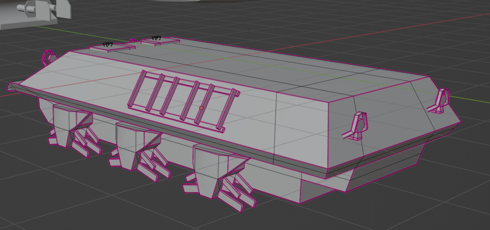{: width="600"}{: .align-center} The surface must be composed of quads only.
{: .text-center}

The final mesh must have its composing loose parts separated so that they do not interrupt each other when baking textures. Never mind, they will be assembled later on.

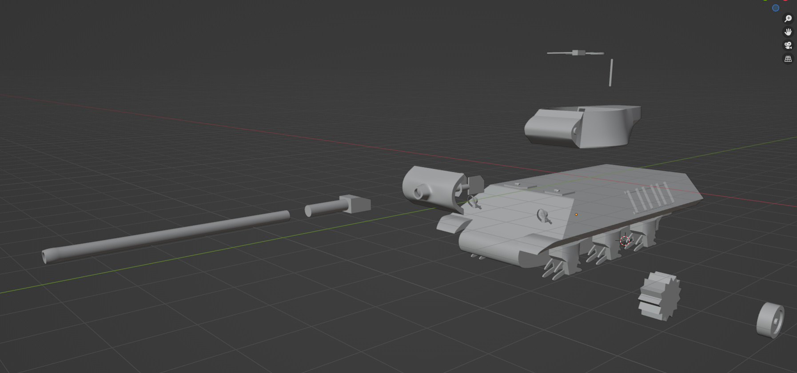{: width="600"}{: .align-center} A low poly model of M36 Jackson created with Blender
{: .text-center}

### ZBrush

We used to be *imperative* in Blender, modifying meshes by invoking extrude, flip, and mirror commands for vertices, edges, and faces. The steps taken in ZBrush flow completely differently from those in Blender. ZBrush lets you sculpt the mesh just like a real sculptor does. You may rub brushes to erode or extrude a surface naturally. This ability gives artists a more intuitive way to engrave details upon meshes that were previously absent in the low poly model brought from Blender. In Although it is possible to sculpt a model directly in Blender, *ZBrush by Pixologic* (which was taken over by Maxon later)  facilitates easier sculpture with a larger pool of functionality.

You can figure out additions through sculpting in ZBrush by comparing the screenshots taken in Blender and ZBrush, respectively. M36 might have looked tedious without rivets, hinges, frills, and grips, whereas materializing these in Blender would have increased the polycount by a power of ten. We avoid these problems by baking a normal map and subsequently assigning it to a low poly model. The normal map is generated through the projection of a high poly model with details from ZBrush onto a plane low poly model from Blender.

{: width="600"}{: .align-center}

Some might wonder about the colors painted on some parts. They are markers for material groups that let us assign different materials to each group inside *Substance Painter* (which will be covered shortly).

### **Substance Painter**

Before I learned about Substance Painter, I used to finalize the entire process, including texturing in ZBrush. Painting a mesh in ZBrush is a series of handworks. With **Substance Painter**, it is very easy to create textures on 3D models in procedural ways.

Using brushes to directly paint on surfaces resembles that of ZBrush. Yet, the real strength of Substance Painter reveals itself in its automatic material assignment capabilities. Substance Painter intelligently assigns realistic materials that are adjusted according to a mesh by detecting the curvature and normals of surfaces. Scarring armor, weathering paintings on edges, and splashing mud onto wheels and tracks are all handy with just a few clicks, reducing the times taken by a large amount.

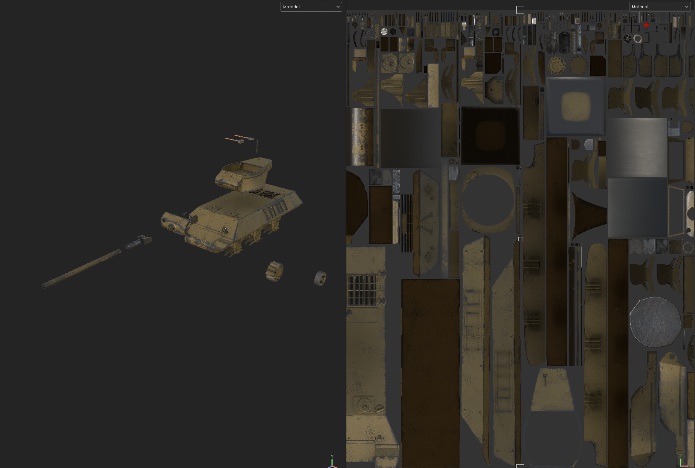{: width="600"}{: .align-center} M36 Jackson textured in Substance Painter. Note the erosions added to curved surfaces by Substance Painter.
{: .text-center}

### Unity

All design process has ended up. What we have to do is to import the produced meshes and textures into Unity and organize them into a game object. I generally bring a mesh, diffuse map, and normal map; the mesh determines the overall shape of the game object; the diffuse map colors the exterior; the normal map appends geometric illusion.

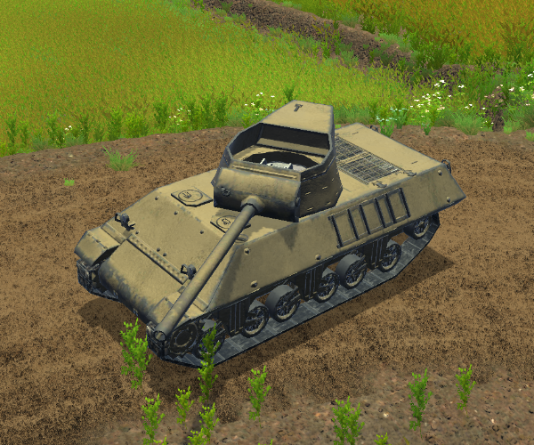{: width="600"}{: .align-center}

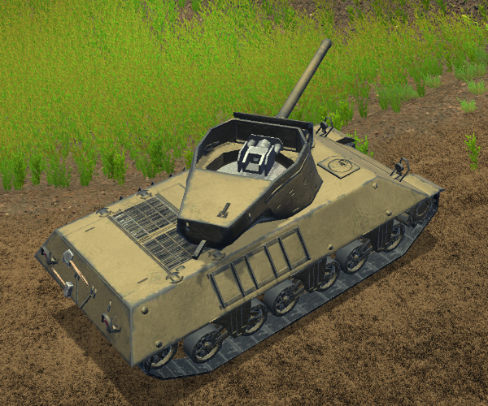{: width="600"}{: .align-center} M36 Jackson set up in Unity 
{: .text-center}

## Humanoid

The artworks are not confined to static props; our game project demands active humanoid characters. In our project, infantrymen act as the fundamental unit on battlefields. During the gameplay experience, players almost always prioritize the movement of their infantry units over other background props. Hence, it is natural to emphasize creating a seamless and immersive humanoid motion.

As previously explained, modeling a humanoid is similar to that of ordinary objects. Modeling a mesh follows almost the same steps through Blender - ZBrush - Substance Painter, as we did before. One subtle difference is that the body, clothing, and gadgets are materialized separately to achieve modularity, with which we can produce soldiers with various appearances through combinations.

We encounter large differences when bringing life to those static meshes. Humanoids in Unity are activated through `SkinnedMeshRenderer` component, in contrast to `MeshRenderer` of static objects. They are deformed according to the gesture of bones. What facilitates this is the rigging, skinning, and animating, where we make a humanoid mesh deformable and imbue motions into the rigged body structure.

**Rigging** refers to creating a skeleton (armature) for 3D models, enabling them to move and animate according to the skeletal structure. In Blender, rigging involves adjusting the complexity of the overall structure (including the number of bones), assigning bones to specific parts of the model, setting up constraints (for example, IK and joint angle constraints), and defining how these compositions interact.

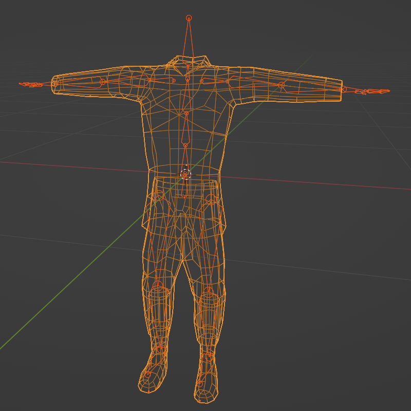{: width="500"}{: .align-center} Cloth mesh rigged in Blender
{: .text-center}

**Skinning** involves associating a 3D model's vertices with an armature's bones during rigging. In Blender, this is done through *weight painting mode* in which we adjust bone influence on vertices, achieving smooth deformation for lifelike movement in animations.

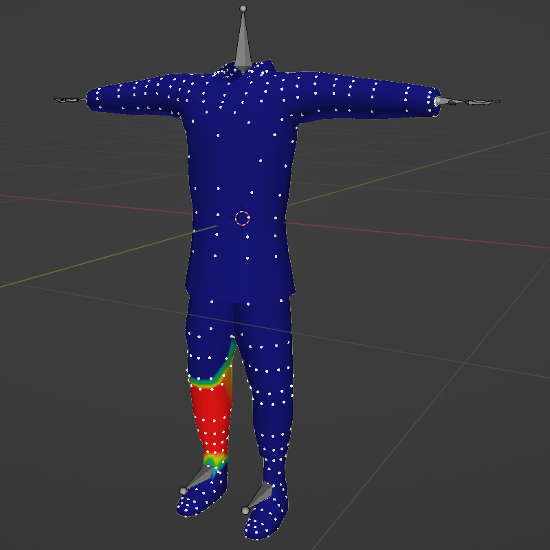{: width="500"}{: .align-center} Skinning a cloth mesh in Blender weight paint mode
{: .text-center}

### Animating

The animation process unfolds after rigging and skinning a humanoid character in Blender. I set keyframes at relevant timings, manipulating the rig in the *pose mode* to create movements. All the motions are used only once and retargeted for other rigged humanoids in Unity. By doing so, we can share animations for all humanoid characters. 

Exploiting additional features offered by Blender saves a lot of time and dramatically enhances animation quality. The *action* feature in Blender provides a convenient way to segregate animations into relevant clips and manage them separately. In the *graph editor*, you can smooth the motion curves and achieve more realistic movements. Repeating animations like walking and running require adjustment in the graph editor to loop seamlessly. Otherwise, the *stumbling* between repetitive clips would be noticeable.

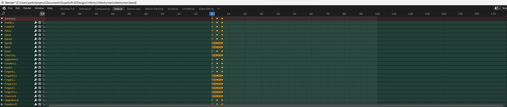{: width="800"}{: .align-center} Keyfram editor in Blender
{: .text-center}

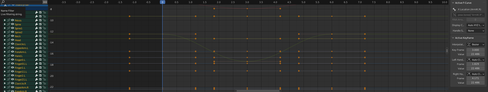{: width="800"}{: .align-center} Graph editor in Blender
{: .text-center}

Interaction with firearms, its composing parts (magazine and bolt), and other props also need special attention. For example, when you take a closer look, you might realize that a reloading motion consists of multiple steps: grabbing a magazine, changing the magazine with a new one, loading it, and finally grabbing the weapon again. To implement the reloading fully in Unity, they must be separated into each action but continuous with each other. Therefore, it is important to figure out what subclips compose a motion and partition them properly.

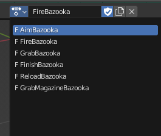{: width="400"}{: .align-center} Reloading motions for Bazooka is separated into several actions (subclips)
{: .text-center}

One tip for better motions is to use *inverse kinematics* to enhance control over limb dynamics. For instance, it is easier to position a hand onto the grip of a rifle than when sticking to *forward kinematics* only.

### **Importing to Unity**

The humanoid is finally imported into Unity in FBX format. The bones are matched with those of Unity to compose a humanoid. Animation actions are brought intact, each as a Unity animation clip. Combining all together, we can set up a complete humanoid character in Unity. Other details are better explained in the next and other posts dedicated to each component.

{: width="500"}{: .align-center} Various motions applied in Unity
{: .text-center}

## Gallery

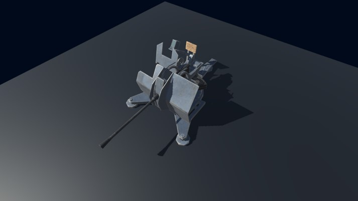{: width="500"}{: .align-center}

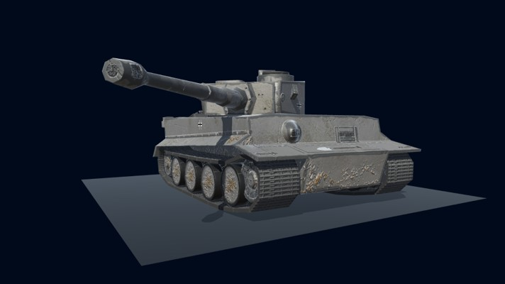{: width="500"}{: .align-center}

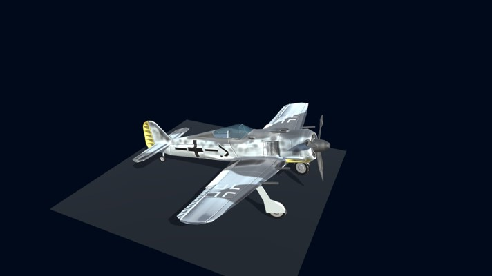{: width="500"}{: .align-center}

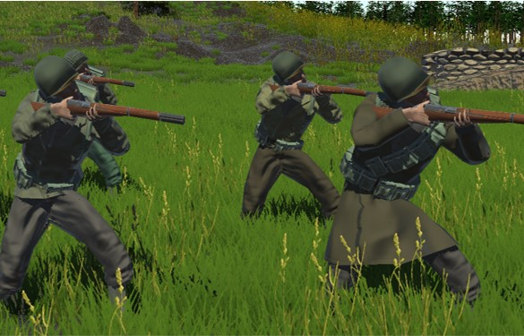{: width="500"}{: .align-center}

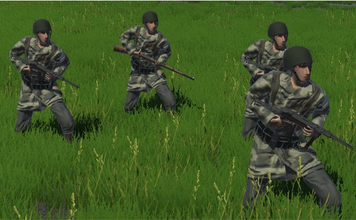{: width="500"}{: .align-center}

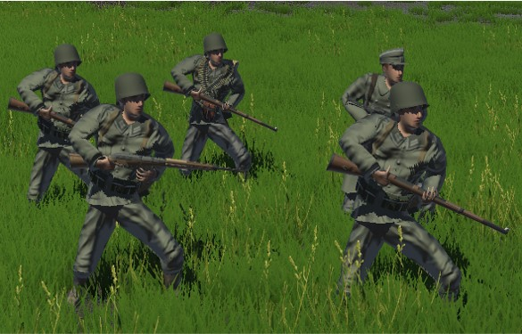{: width="500"}{: .align-center}

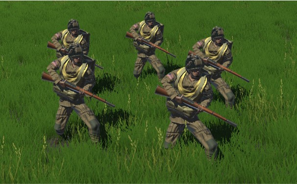{: width="500"}{: .align-center}