I obtained a **B.A. in Geography** and **a B.S. in Computer Science** from **Seoul National University**. Committing myself to several courses provided by the two majors, I applied my geography and computer science knowledge to real-world problems and gain insights from two distinct fields.

Not to mention, the computer science projects provided me with essential technical skills and development processes crucial for a programmer. The projects covered a wide range of topics: writing compiler pass (software development process), hardware system design (logic design), assembly programming (computer architecture), object detection (computer vision), ray tracing (computer graphics), and even computability problem (automata theory).

Besides, geography taught me statistical approaches, including basic statistics, time series analysis, spatial statistics, and machine learning. Having the characteristic of both social and nature science, geography requires students to view phenomena through models; the phenomenon itself is meaningless; it stands once it is modeled; a good model is what describes the phenomenon insightfully. Considering that many techniques in software engineering are actually a good approximation of the real world (Phong shading, for example), the **Statistical Thinking** I learned from geography supports me greatly as a software engineer. 

I have committed more projects during my college year than was introduced here, but listing every single item in this post is unwieldy. Instead, I would like to cherry-pick a few impressive projects and state the tools used, how it went, and the consequences. So, let's begin!

# Transportation Geography

## Traffic Prediction With Entropy Maximization And Bayesian

### Keywords

- Transportation planning
- Bayesian statistics
- Poisson distribution
- Knapsack algorithm

### Tools

- R
- Python
- Pyplot

### Details

Among traffic prediction techniques, **Entropy Maximization [1]** is founded upon a well-established theoretical background regarding incoming and outgoing traffic forecast. This project aimed to elaborate the traffic prediction method based on the principle of maximum entropy by applying Bayesian inference. I proposed a new technique to enhance transportation planning that facilitates additional analysis with distribution. 

As a prior distribution, we set the **Poisson distribution** (whose means are acquired by maximizing entropy) of traffic prediction between regions. During the Bayesian process, the distribution for each traffic zone progressively converges toward a more precise point.

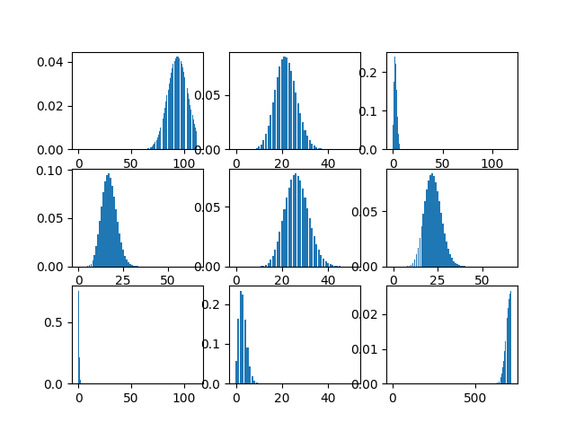{: width="600"}{: .align-center} Viewing multiple threads in Visual Studio Parallel Stack
{: .text-center}

Then, apply Bayes' theorem with actual observations.
$$
p(H|D) = \frac{p(H)p(D|H)}{p(D)}
$$
The observed data gradually updates the distribution. 

{: width="600"}{: .align-center} Distribution after undergoing the Bayesian update once
{: .text-center}

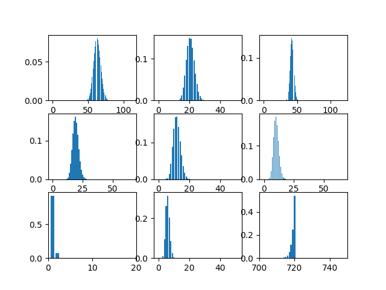{: width="600"}{: .align-center} Distribution after undergoing the Bayesian update twice
{: .text-center}

Finally, we utilize the updated distribution to plan transportation lines between regions. To pick region pairs (traffic zones) connect, our strategy hires **the Knapsack Algorithm** under the constraint of construction expenses. The illustration below showcases the summation of distributions of connected traffic zones.

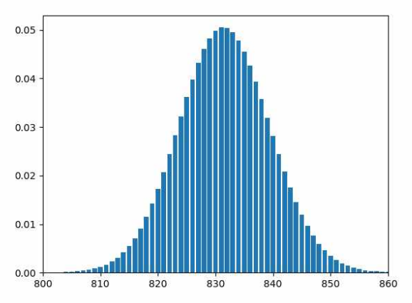{: width="600"}

# Geographic Information System

## K-Means Decimation

### Keywords

- Decimation
- Level of Detail (LOD)
- K-means clustering

### Tools

- Python
- Pygame
- OpenGL
- R

### Details

The topic of the project was to understand and apply various statistical techniques, including [*K-means clustering*](https://en.wikipedia.org/wiki/K-means_clustering) [2]. **K-means Clustering** is a machine-learning algorithm that partitions data into distinct groups based on similarity. It's widely used in data analysis, pattern recognition, and image segmentation for grouping similar data points. 

**Geographic Information Systems (GIS)** usually adjusts *the Level of Detail (LOD)* on terrain meshes for performance. I was inspired to apply K-means clustering to decimation, a technique that reduces the vertex count of a model, to implement automatic LOD control.

1. Each row corresponds to a single vertex point and a column to a coordinate.
   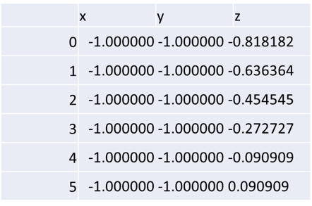{: width="500"}
2. We assign the target vertex count to the number of clusters ($k$).
3. Cluster vertices using K-means clustering.
   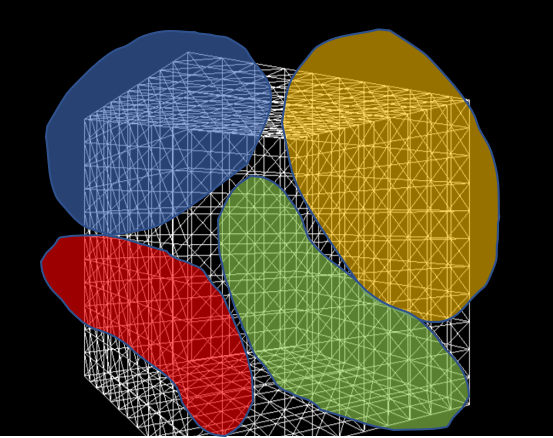{: width="500"}
4. The resulting clusters become new vertices that compose a decimated mesh.
5. Using OpenGL and Pygame, visualize the processed mesh.

Meshes before and after K-means decimation are demonstrated below. Compare how they differ in terms of vertex count!

****

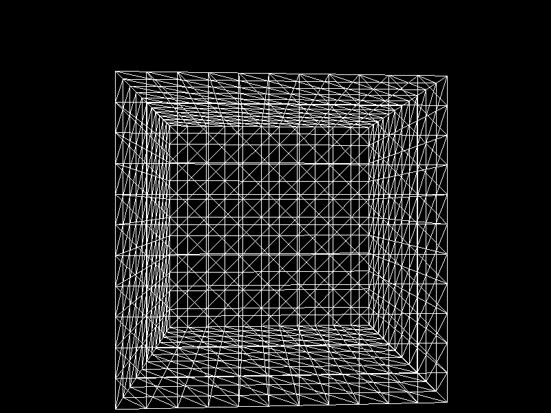{: width="500"}

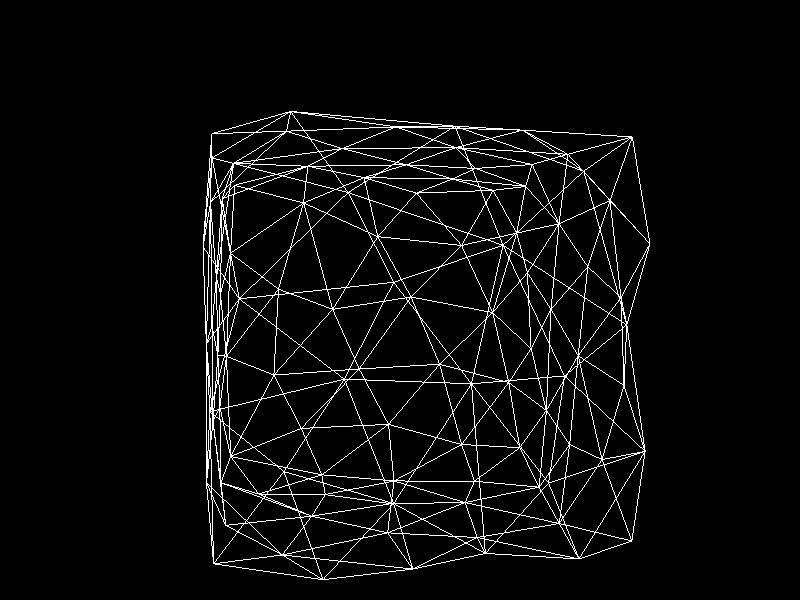{: width="500"}

****

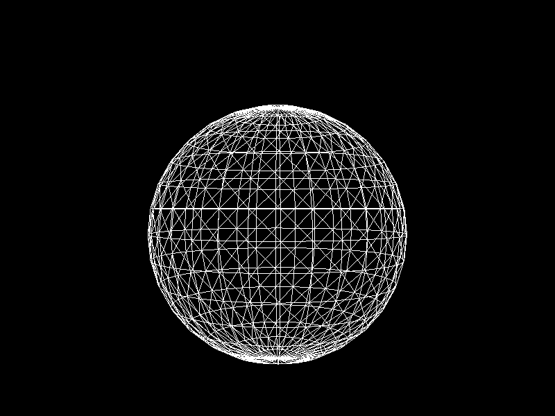{: width="500"}

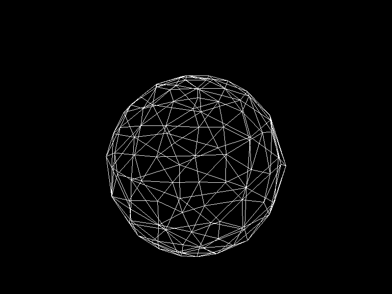{: width="500"}

****

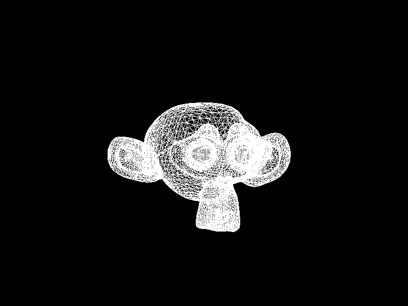{: width="500"}

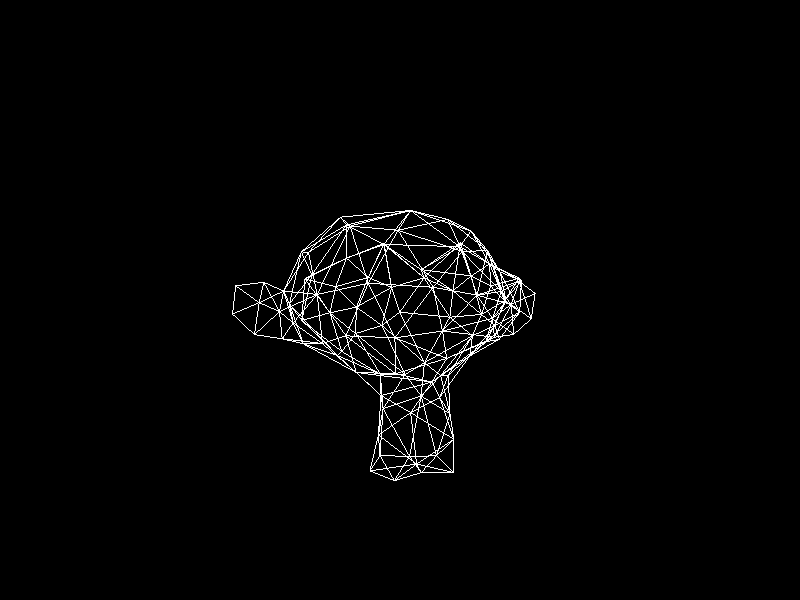{: width="500"}

****

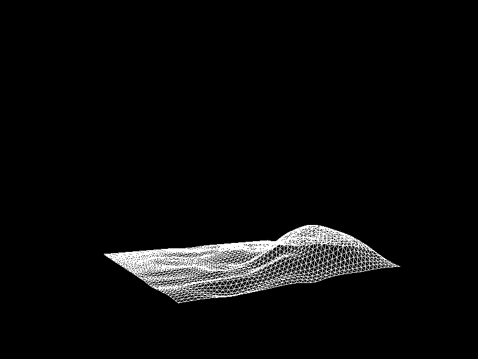{: width="500"}

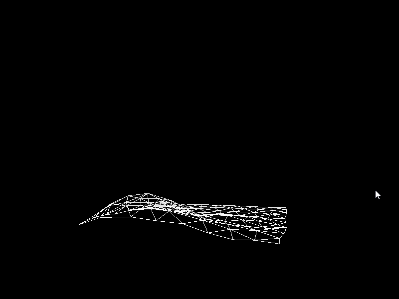{: width="500"}

The advantage of this **K-means decimation** is that we can acquire a mesh with exactly the same vertex count as the initial objective. By exercising precise control over the vertex count, users can enhance their ability to manage their experience effectively.

# Software Development Process

## LLVM Optimization Project

### Keywords

- LLVM
- Compiler backend
- Project management

### Tools

- C++
- LLVM IR
- LLVM pass framework
- [Compiler Explorer](https://godbolt.org/)
- Git & GitHub

### Details

The project had two purposes: a technical objective and the process through which we achieved the goal. Technically, the project aimed to optimize the LLVM backend that translates LLVM IR to a virtual assembly under the following conditions.

- We were given a virtual assembly language that executes on a *bizarre* virtual machine.
- The bizarre virtual machine behaves in the opposite way of the conventional computers in reality.
  - Spatial and temporal locality penalizes performance.
  - Vector instructions 
  - Arithmetic operations have costs completely different from reality (expensive shift, cheap multiplication and division)
  - Other cost specifications about statements

The collaboration process was another highly-valued key point.

- Four members composed a team.
- Each team was given three sprint opportunities - each member appends one pass during a sprint.
- Members forked the project repository and posted pull requests to merge their contributions into the main branch.

We had weekly meetings to plan which optimization passes to develop and include in the LLVM backend. I contributed three passes using C++ and the LLVM pass framework.

- **Merging Basic Blocks** - Merged unnecessarily divided basic blocks [3], as jumping to basic blocks adds up cost.
- **Reversing If Statements** - The specification stated that if statements were more performant when the condition is not met. As loops are more likely to repeat themselves, negating conditions inside loops saved a lot of branching overhead.
- **Vectorizing Memory Access Operations** - As vectorized memory access operations such as `vload` and `vstore` cost less than non-vector versions, it was better to vectorize consecutive memory access instructions.

A function from the vectorization pass looks like the following:

```c++
// Get sequential memory access
void AbbrMemPass::getSequences(const vector<Instruction*> &instList, vector<vector<Instruction*>> *sequences) {
    vector<Instruction*> sequence; // A sequence consists of elements in a memory in a row
    int sz = instList.size();
    vector<bool> isRemaining(sz, true); // To prevent repetitive sequences
    // Combine each sequence into a vector then push into the sequences vector
    for (int i = 0; i < sz; ++i) {
        if (!isRemaining[i]) { // If the instruction has been accessed
            continue; // Skip this instruction
        }

        Instruction *I1 = instList[i];
        sequence = vector<Instruction*>(MAXSEQ);
        sequence[0] = I1;

        for (int j = i + 1; j < sz; ++j) {
            if (!isRemaining[j]) {
                continue;
            }
            Instruction *I2 = instList[j];
            int i = 0;
            int *diff = &i;
            // Are these two instructions in sequence?
            bool isSequence = inSameSequence(I1, I2, diff);
            // If they are in a row and their difference is less than MAXSEQ
            if (isSequence && *diff < MAXSEQ) {
                sequence[*diff] = I2;
                isRemaining[j] = false;
            } else {
                continue;
            }
        }
        // Determine as a sequence only if if has more than one instruction
        // in each vector
        if (std::count(sequence.begin(), sequence.end(), nullptr) <= MAXSEQ - 2) {
            sequences->push_back(sequence);
        }
    }
}
```

In this project, I gained practical experience in how the LLVM operates to output instructions optimized for specific machines. Furthermore, the collaboration process emphasized effective teamwork and structured cooperation, involving pull request and code review steps. This experience continues to significantly benefit me when engaging in collaborative projects as a professional software engineer.

# Computer Architecture

## RISC-V Assembly Programming

### Keywords

- Machine level programming
- RISC-V
- Hardware dependent language

### Tools

- C++
- RISC-V assembly

### Details

The task was to write an assembly code that performed convolution operations. Since programming directly in RISC-V assembly was highly challenging, I first wrote the program in C++ and translated it afterward. Through this endeavor, I gained a nuanced understanding of the RISC-V architecture, including its instruction set and execution processes.

```assembly
# -------------------- End of one convolution --------------------
END_CONV_1:
	add t3, t0, x0
	jal ra, SAT_HIGH
	jal ra, SAT_LOW
	add t0, t3, x0

	add t3, t1, x0
	jal ra, SAT_HIGH
	jal ra, SAT_LOW
	add t1, t3, x0

	add t3, t2, x0
	jal ra, SAT_HIGH
	jal ra, SAT_LOW
	add t2, t3, x0

	# Store t0, t1, t2, and (padded zero)
	lw t3, 0(a4) 
	slli t4, t0, 8
	or t3, t3, t4 # t0, 0000 0000 0100

	slli t4, t1, 16
	or t3, t3, t4 # t0, 0000 0000 0010

	slli t4, t2, 24
	or t3, t3, t4
	sw t3, 0(a4) # t0, 0000 0000 0001

	# Check whether we should go to the next line
	lw t0, 40(sp) # Current pixel index
	lw t1, 48(sp) # Not padded pixel width
	addi t2, t0, 3 
	bge t2, t1, MOVE_NEXT_LINE

	# Move within the line
	addi t0, t0, 1
	sw t0, 40(sp) # Increment the current blue bit index by 3

	lw t1, 36(sp)
	sub a0, a0, t1
	sub a0, a0, t1 # Restore the address

	addi a0, a0, 12 # Proceed the address
	addi a4, a4, 4 # Proceed the destination byte
	jal x0, REMAINDER_0
```

The RISC-V convolution underwent performance testing, measured in terms of execution time, and compared against others. In this evaluation, I secured the fifth position out of 60 participants, demonstrating competitive performance in efficiency. The hands-on experience facilitated a deeper comprehension of how modern computer architecture performs arithmetic operations, memory access, and modifying the control flow.

# Computer Graphics

## Binary Space Partitioning (BSP)

### Keywords

- Computer graphics
- Depth ordering
- Spatial data structure
- OBJ parser

### Tools

- C++
- OpenGL (with extensions)
- OpenGL Mathematics (GLM)

### Details

In computer graphics, **Binary Space Partitioning (BSP)** is a method for space partitioning that subdivides 3D space recursively using planes as segregators. The project implements the construction and traversal of the BSP tree, rendering a scene with translucent objects correctly from all perspectives, which is unfeasible with the OpenGL built-in depth testing.

You may find the source code and more detailed explanations on [my repository](https://github.com/ObjectOrientedLife/BinarySpacePartitioning).

{: width="600"}{: .align-center} How BSP tree is constructed?
{: .text-center}

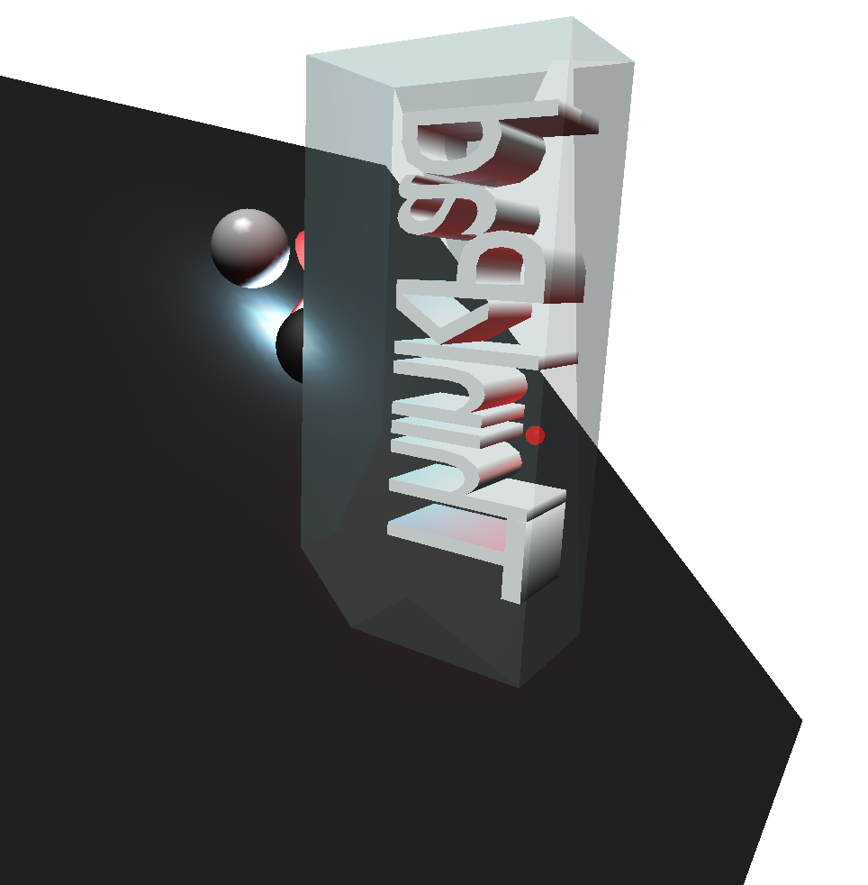{: width="600"}{: .align-center} Without BSP, the objects are culled by the translucent mesh.
{: .text-center}

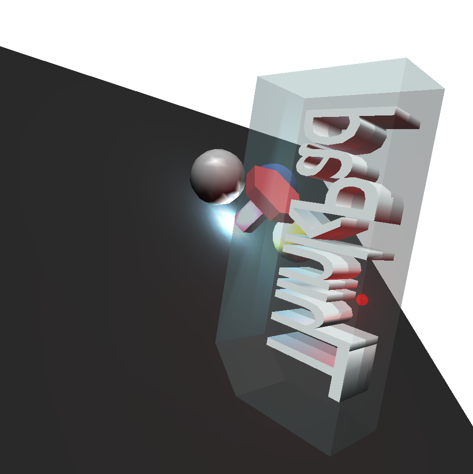{: width="600"}{: .align-center} With BSP, the objects beyond the translucent mesh are visible.
{: .text-center}

## Ray Tracing

### Keywords

- Computer graphics
- Rendering
- Ray tracing
- Stochastic ray tracing
- Reflection and refraction

### Tools

- C++
- OpenGL Mathematics (GLM)

### Details

**Ray Tracing** is a popular rendering technique that simulates the way light interacts with objects in a virtual environment to produce realistic images with accurate lighting, reflections, refractions, and shadows. This project implements Whitted ray tracing based on Phong shading from scratch, using only vanilla C++ and GLM for mathematics. The application boasts diverse features, ranging from fundamental components like texture mapping to sophisticated techniques such as stochastic ray tracing. This enables us to showcase advanced effects like motion blur and smooth shadows, imbuing the rendered scene with great reality.

[One of repositories of mine](https://github.com/ObjectOrientedLife/RayTracing) describes how it works in depth along with the source code.

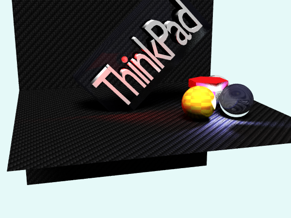{: width="700"}

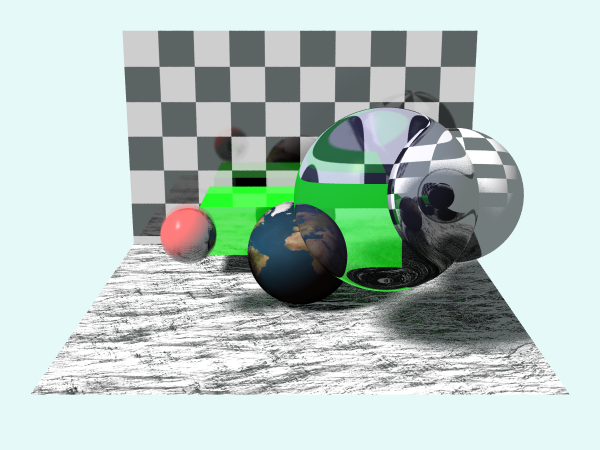{: width="700"}

# References

- [1] https://en.wikipedia.org/wiki/Principle_of_maximum_entropy
- [2] James, G. Witten, D. Hastie, T. Tibshirani, R. (2021). An Introduction to Statistical Learning with Applications in R. Springer.
- [3] https://llvm.org/doxygen/group__LLVMCCoreValueBasicBlock.html
